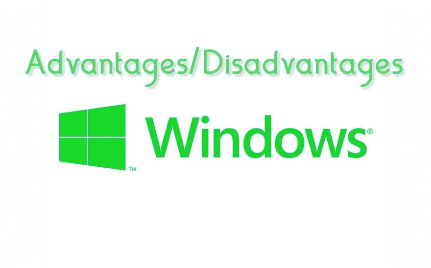

# Windows 操作系统的优缺点

> 原文:[https://www . geesforgeks . org/windows 操作系统的优缺点/](https://www.geeksforgeeks.org/advantages-and-disadvantages-of-windows-operating-system/)

**Windows 操作系统**由微软制造，已经交付了众多变体。微软视窗最著名和最常用的版本是视窗 7。微软创建的主要工作框架是微软操作系统。微软操作系统是一个基本操作系统，有一个订单行接口。微软操作系统的新形式同样具有微软操作系统的效用。微软操作系统还被用来做一些常规的工作，比如制作记录、信封、在一些产品中引入模块、利用 GIT 以及其他不同的用途。

Windows 7 之后，微软出动了 Windows 8。由于新的界面和缺少开始菜单，Windows 8 并没有太大的成就。在 Windows 10 到来后，该组织再次添加了 Windows 8 中没有的开始菜单。Windows 10 中的开始菜单是 Windows 7 和一点点 windows 8 的混合。在 Windows 10 中，出现了一个时髦的查询工具 Cortana。Cortana 还有一些 bug 需要修复。谷歌语音搜索活跃了 Cortana。你可以通过 Cortana 在 windows 10 中进行语音搜索。这个互联网搜索者存储了大量关于个人的信息，这给框架带来了很大的负担。如果你不想使用它，你可以选择杀死科尔塔纳。

**示例–**
Windows 操作系统示例如下。下面是 windows 操作系统的几个实例。

*   Windows 95
*   Windows 98
*   Windows XP
*   Windows vista 作业系统
*   Windows 7
*   Windows 8
*   Windows 10

**Windows 操作系统优势:**

*   **支持所有设备–**
    由于 95%的客户端使用 windows 操作系统，因此大多数设备商都为 windows 制作驱动程序。
*   **便利性–**
    所有形式的微软视窗都有一些常规的东西，这使得客户端可以简单地从一个形式开始，然后进入下一个形式。鉴于 Windows 10 的大部分亮点相当于 Windows 7，Windows 7 客户端迁移到 Windows 10 没有问题。窗口的用户界面比 UNIX 和 MAC 更容易使用。
*   **编程支持–**
    Windows stage 最适合游戏和编程工程师。Windows 有大量的人群，所以设计师想为 windows 操作系统制作实用程序、游戏和编程。Linux 客户端无法制作 windows 应用程序，因此利用 windows 创建应用程序更明智。
*   **试衣玩法亮点–**
    大部分装备可以通过附着和玩法自然区分包括。您不需要实际介绍设备，但是它可以在连接时使用，例如网络摄像头、控制台、鼠标、手机等。
*   **工作区和接触屏–**
    Windows 10 是为触屏小工具和个人电脑打造的。视窗 10 的用户界面是这样制作的，它对视窗小工具来说更好。

**Windows 操作系统的缺点:**

*   **感染攻击–**
    Windows 有大量程序员攻击。程序员可以在没有太多安全措施的情况下打破窗户。因此，windows 客户端依赖于感染编程的敌人，需要每月向组织支付费用以确保他们的信息。此外，windows 客户端需要刷新操作系统以跟上最新的安全补丁。
*   **大部分产品是付费的–**
    大部分 windows 程序都是付费的例如游戏、设计编程(Photoshop)、下载首席(IDM)等著名编程都是付费的。您需要购买这些产品或支付每月费用来使用它们。
*   **重启一个框架–**
    如果你的框架被延迟执行，那么你需要重启它。如果您同时加载多个项目，那么您的框架很可能会放松下来并挂起。唯一的答案是重启。
*   **过度成本–**
    Linux 操作系统是开源的，除了 windows 操作系统有付费许可外，任何人都可以使用，你不能合法免费使用 windows 操作系统。购买 windows 操作系统副本的费用也很高。同样，您需要购买其他微软程序，例如微软办公软件来完成与个人电脑的标准办公交易。
*   **高 PC 资产–**
    如果你要推出 windows 操作系统，那么你的 PC 应该有很高的粉碎极限、很大的硬盘空间和出色的设计卡。这是在窗口中使用高光的结果。如果你需要介绍插图编程，例如 Photoshop，那么建议使用 16 GB 的 smash。
*   **专业帮助–**
    视窗维护对大多数客户来说都没用。只是一些巨大的关联可以从 windows 组得到很大的帮助。基本客户需要寻找聚会来解决他们的问题。