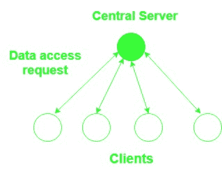
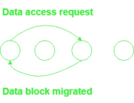
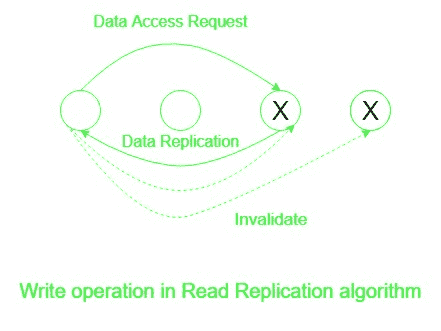
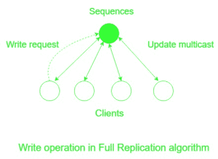

# 实现分布式共享内存的算法

> 原文:[https://www . geeksforgeeks . org/算法实现分布式共享内存/](https://www.geeksforgeeks.org/algorithm-for-implementing-distributed-shared-memory/)

**分布式共享内存(DSM)** 系统是分布式操作系统的资源管理组件，在没有物理共享内存的分布式系统中实现共享内存模型。共享内存模型提供了分布式系统中所有节点共享的虚拟地址空间。

实施需求侧管理的核心问题是:

*   如何跟踪远程数据的位置？
*   如何克服在访问远程数据的系统中执行通信协议所涉及的通信开销和延迟。
*   如何在几个节点上同时访问共享数据以提高性能？

### 实现需求侧管理的算法

**1。中央服务器算法:**

*   在这种情况下，中央服务器维护所有共享数据。它通过向其他节点返回数据项来服务来自这些节点的读请求，并通过更新数据和返回确认消息来服务写请求。
*   超时可以在确认失败的情况下使用，而序列号可以用来避免重复的写请求。
*   实现起来更简单，但是中央服务器会成为瓶颈，为了克服这一点，共享数据可以分布在几个服务器上。这种分布可以通过地址或使用映射函数来定位适当的服务器。

**2。迁移算法:**

*   相比之下，中央服务器 algo 将每个数据访问请求转发到数据位置，同时将数据发送到数据访问请求位置，这样可以在本地执行后续访问。
*   它一次只允许一个节点访问一个共享数据，并且包含数据项的整个块会迁移，而不是请求单个项。
*   当页面频繁地在节点之间迁移，而只服务于少数请求时，它容易受到颠簸的影响。
*   This algo provides an opportunity to integrate DSM with virtual memory provided by operating system at individual nodes.

    

    **3。读取复制算法:**

    *   这通过复制数据块并允许多个节点具有读访问权限或一个节点同时具有读和写访问权限，扩展了迁移算法。
    *   它通过允许多个节点同时访问数据来提高系统性能。
    *   这种情况下的写操作成本很高，因为不同节点上共享数据块的所有副本要么无效，要么用当前值更新，以保持共享数据块的一致性。
    *   需求侧管理必须跟踪其中所有数据块副本的位置。

    

    **4。完整复制算法:**

    *   它是读复制算法的扩展，允许多个节点同时对共享数据块进行读和写访问。
    *   由于许多节点可以并发写入共享数据，因此必须控制对共享数据的访问以保持其一致性。
    *   为了保持一致性，它可以使用无间隙序列，其中所有希望修改共享数据的节点将修改发送到定序器，定序器随后将分配序列号并将具有序列号的修改多播到具有共享数据项副本的所有节点。

    