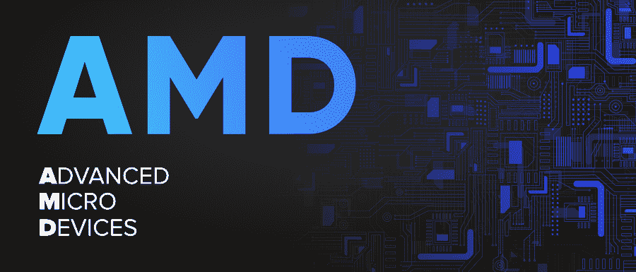

# AMD 全形态

> 原文:[https://www.geeksforgeeks.org/amd-full-form/](https://www.geeksforgeeks.org/amd-full-form/)

**AMD** 代表**高级微器件。** AMD 是一家开发计算机处理器及相关技术的美国跨国半导体公司。它是位于加州圣克拉拉县的 。 **AMD 的**主要产品包括微处理器、主板芯片组、用于服务器、工作站、个人电脑和嵌入式系统应用等的嵌入式处理器和图形处理器。由**杰里·桑德斯**于 1969 年 5 月 1 日创作。AMD 最新的高端处理器包括**锐龙系列**，该系列以其比其前身更好的性能和竞争对手的竞争力而闻名。

这里有一些现在比较有名的最好的 AMD 处理器:

*   AMD 锐龙 9 3900X
*   AMD 锐龙 5 3600X
*   AMD 锐龙 5 5600X
*   AMD 锐龙 3 2200G
*   AMD 锐龙 9 3950X
*   AMD 锐龙 9 5900X

#### **特征**

*   处理器可以是 2(双核)、4(四核)、6(六核)或 8(八核)类型。
*   **高级时钟校准(精度提升)**在今天的 AMD 处理器中有吗
*   AMD 过驱和锐龙大师允许系统中的**实时调整**。
*   **低电压低功率** **利用** **。**
*   AMD 的 64 位处理器也向后支持 32 位系统。
*   **增强的病毒防护**也是当今 AMD 处理器的一个有趣特性，类似于英特尔的执行禁用位。

#### **优势**

*   与同类英特尔处理器相比，性价比更高。
*   AMD 处理器的主板更便宜。
*   最新 AMD 锐龙处理器能耗和功耗较低。
*   AMD 处理器免受许多可能影响英特尔处理器的攻击，如熔毁、剧透，并且对《幽灵》的缓解影响较小。
*   AMD 处理器可以很好地处理 64 位应用。

#### **劣势** s

*   较新的(Zen 2 和 Zen 3) AMD 台式机处理器由于激进的时钟而发热非常厉害。
*   AMD CPU 往往缺少办公、企业使用情况下经常用到的 iGPUs。
*   AMD 处理器对 RAM 和 CPU 内存时序更加敏感。
*   AMD 处理器在多媒体支持方面相当落后，也缺少 AVX-512。