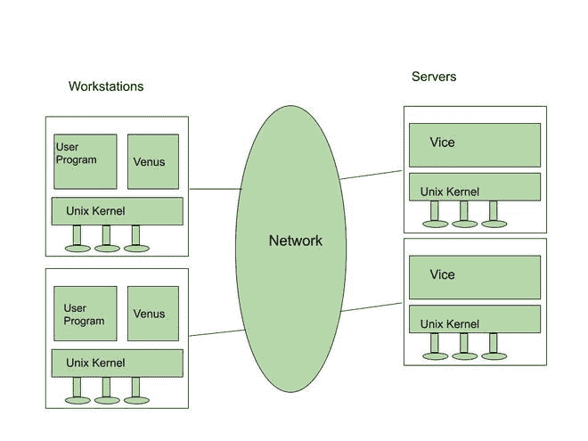

# 安德鲁文件系统

> 原文:[https://www.geeksforgeeks.org/andrew-file-system/](https://www.geeksforgeeks.org/andrew-file-system/)

Morris 等人于 1986 年创建了一个分布式计算环境，用作卡耐基梅隆大学(CMU)的校园计算机和信息系统。AFS 被企业用来使不同位置的 AFS 客户端工作站更容易访问存储的服务器文件。它通过一组值得信赖的服务器向所有客户端工作站呈现一个同构的、与位置无关的文件命名空间。登录到在分布式计算基础设施内部通信的工作站后，用户交换数据和程序(DCI)。目标是通过减少客户机-服务器通信来促进大规模信息交换。这是通过在服务器和客户端计算机之间移动整个文件并缓存它们直到服务器获得更新的版本来实现的。自动售检票系统使用本地缓存来提高速度，并在分散的网络中最大限度地减少工作量。例如，服务器通过将数据存储在工作站的本地缓存中来回复工作站请求。

### **安德鲁文件系统架构:**

*   **Vice:**Andrew 文件系统通过利用一组被称为 Vice 的可信服务器，为所有客户端工作站提供了一个同构的、位置透明的文件命名空间。Unix 操作系统的伯克利软件分发版在客户机和服务器上都使用。每个工作站的操作系统拦截文件系统调用，并将它们重定向到该工作站上的用户级进程。
*   **Venus:** 这种机制被称为 Venus，它缓存来自 Vice 的文件，并将这些文件的更新版本返回到它们起源的服务器。只有打开或关闭文件时，金星才会与 Vice 通信；文件的单个字节直接在缓存副本上读写，跳过 Venus

这种文件系统架构很大程度上是受可伸缩性需求的启发。为了增加服务器可以服务的客户端数量，Venus 执行尽可能多的工作，而不是 vice。Vice 只保留文件系统的完整性、可用性和安全性所必需的功能。服务器被设置为松散的联盟，它们之间几乎没有连接。

图:安德鲁文件系统

以下是 AFS 网络中使用的服务器和客户端组件:

*   任何为网络上托管的 AFS 服务器文件创建请求的计算机都有资格成为客户端。
*   文件保存在客户机的本地缓存中，一旦服务器响应并传输请求的文件，就会显示给用户。
*   当用户访问 AFS 时，客户端通过回调机制将所有修改发送到服务器。客户端机器的本地缓存存储经常使用的文件，以便快速访问。

### **AFS 实现:**

*   客户端进程通过标准系统调用与 UNIX 内核通信。
*   内核进行了重大调整，以识别相关活动中对 Vice 文件的引用，并将请求路由到工作站的 Venus 客户端进程。
*   如果该缓存中缺少一个卷，Venus 会联系它已经连接的任何服务器，询问位置信息，并将其输入到映射缓存中。金星与服务器建立了新的连接，除非它已经有了。然后使用此连接检索文件或目录。
*   认证和安全需要建立连接。当目标文件被定位和高速缓存时，在本地盘上制作目标文件的副本。
*   Venus 然后返回内核，内核打开缓存的副本，并将句柄交给客户端进程。AFS 服务器和客户端都将 UNIX 文件系统用作低级存储系统。在工作站的光盘上，客户端缓存是一个本地目录。该目录包含带有缓存条目占位符名称的文件。
*   Venus 和服务器进程都使用后者的模式直接访问 UNIX 文件，避免了代价高昂的路径名到信息节点的转换方法。
*   当一个文件从缓存中删除时，Venus 会通知相关服务器该文件的回调已被删除。

### **优势:**

*   不常更新的共享文件和不常更新的本地用户文件将持续很长时间。
*   它为缓存设置了大量存储空间。
*   它为用户的所有文件提供了足够大的工作集，确保当用户再次访问文件时，文件仍然在缓存中。