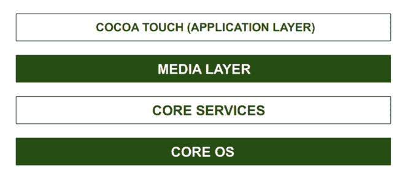

# IOS 操作系统架构

> 原文:[https://www . geesforgeks . org/architecture-of-IOs-operating-system/](https://www.geeksforgeeks.org/architecture-of-ios-operating-system/)

[IOS](https://www.geeksforgeeks.org/difference-between-windows-and-ios/) 是一款[移动操作系统](https://www.geeksforgeeks.org/cbse-class-11-mobile-operating-systems-symbian-andriod-and-ios/)，由苹果公司为 iPhones、iPads 和其他苹果移动设备开发。iOS 是仅次于安卓的第二大最受欢迎和使用最多的移动操作系统。

iOS 操作系统的结构是基于分层的。它的交流不是直接发生的。应用层和硬件层之间的层将有助于通信。较低层提供所有应用程序所依赖的基本服务，较高层提供图形和接口相关服务。大多数系统接口都有一个特殊的包，叫做框架。

框架是保存动态共享库的目录，如。支持该库的文件、头文件、图像和助手应用程序。每一层都有一套对开发人员有帮助的框架。

IOS 的架构

**CORE OS 层:**
所有的 IOS 技术都建立在最底层，即 CORE OS 层下。这些技术包括:

1.  核心蓝牙框架
2.  外部附件框架
3.  加速框架
4.  安全服务框架
5.  本地授权框架等。

它支持 64 位，使应用程序运行得更快。

**核心服务层:**
一些重要的框架存在于核心服务层，帮助 iOS 操作系统自我修复并提供更好的功能。如上所示，它是体系结构中第二低的层。下面是这一层中的一些重要框架:

1.  **通讯录框架-**
    通讯录框架提供对用户联系方式的访问。
2.  **云工具包框架-**
    这个框架为在你的应用和 iCloud 之间移动数据提供了一个媒介。
3.  **核心数据框架-**
    这是用于管理模型视图控制器应用程序的数据模型的技术。
4.  **核心基础框架-**
    该框架为 iOS 应用提供数据管理和服务功能。
5.  **核心位置框架-**
    该框架有助于向应用程序提供位置和航向信息。
6.  **核心运动框架-**
    在核心运动框架的帮助下，可以访问设备上所有基于运动的数据。
7.  **基础框架-**
    目标 C 覆盖了太多在核心基础框架中发现的特性。
8.  **HealthKit 框架-**
    这个框架处理用户的健康相关信息。
9.  **HomeKit 框架-**
    该框架用于与用户家中连接的设备进行通话和控制。
10.  **社交框架-**
    它只是一个可以访问用户社交媒体账号的界面。
11.  **StoreKit 框架-**
    该框架支持从 iOS 应用内部购买内容和服务。

**媒体层:**
在媒体层的帮助下，我们将启用系统的所有图形、视频和音频技术。这是架构中的第二层。媒体层的不同框架是:

1.  **ULKit Graphics-**
    这个框架为设计图像和制作视图内容的动画提供了支持。
2.  **核心图形框架-**
    该框架支持 2D 矢量和基于图像的渲染 ad 它是 iOS 的原生绘图引擎。
3.  **核心动画-**
    这个框架有助于优化 iOS 中应用的动画体验。
4.  **媒体播放器框架-**
    该框架为播放播放列表提供支持，并使用户能够使用他们的 iTunes 资料库。
5.  **AV Kit-**
    这个框架提供了各种易于使用的界面，用于视频演示、录音以及音频和视频的回放。
6.  **Open AL-**
    这个框架是提供音频的行业标准技术。
7.  **核心图像-**
    这个框架为静止图像提供了高级支持。
8.  **GL Kit-**
    这个框架通过硬件加速接口管理高级 2D 和 3D 渲染。

**COCOA TOUCH:**
COCOA TOUCH 也被称为应用层，作为用户使用 iOS 操作系统的界面。它支持触摸和运动事件以及更多功能。可可触摸层提供了以下框架:

1.  **EvenKit 框架-**
    这个框架展示了一个标准的系统界面，使用视图控制器来查看和更改事件。
2.  **GameKit 框架-**
    该框架为用户使用游戏中心在线分享游戏相关数据提供支持。
3.  **MapKit 框架-**
    这个框架给出了一个可滚动的地图，你可以把它包含在应用的用户界面中。
4.  **PushKit 框架-**
    该框架提供注册支持。

**iOS 操作系统的特性:**
我们来讨论一下 iOS 操作系统的一些特性——

1.  比其他操作系统更安全。
2.  iOS 提供了多任务功能，比如在一个应用程序中工作时，我们可以轻松切换到另一个应用程序。
3.  iOS 的用户界面包括多种手势，如滑动、点击、捏和反向捏。
4.  iBooks、iStore、iTunes、游戏中心和电子邮件都是用户友好的。
5.  它提供 Safari 作为默认的网络浏览器。
6.  它有强大的应用编程接口和摄像头。
7.  它具有深度的硬件和软件集成

**IOS 操作系统的应用:**
下面是 IOS 操作系统的一些应用——

1.  iOS 操作系统是苹果公司的商用操作系统，因其安全性而广受欢迎。
2.  iOS 操作系统附带了苹果开发的预装应用程序，如邮件、地图、电视、音乐、钱包、健康等。
3.  Swift 编程语言用于开发运行在 IOS 操作系统上的应用程序。
4.  在 iOS 操作系统中，我们可以执行多任务，比如聊天和上网。

**IOS 操作系统的优势:**
IOS 操作系统相对于市面上的其他操作系统，尤其是[安卓](https://www.geeksforgeeks.org/web-developer-or-android-developer-which-one-is-better-career-choice/)操作系统有一些优势。这里有一些-

1.  比其他操作系统更安全。
2.  出色的用户界面和流畅的响应
3.  最适合企业和专业人士
4.  与安卓系统相比，发热更少。

**IOS 操作系统的缺点:**
我们来看看 IOS 操作系统的一些缺点——

1.  成本更高。
2.  与安卓操作系统相比，用户不太友好。
3.  不灵活，因为它只支持 IOS 设备。
4.  电池性能差。