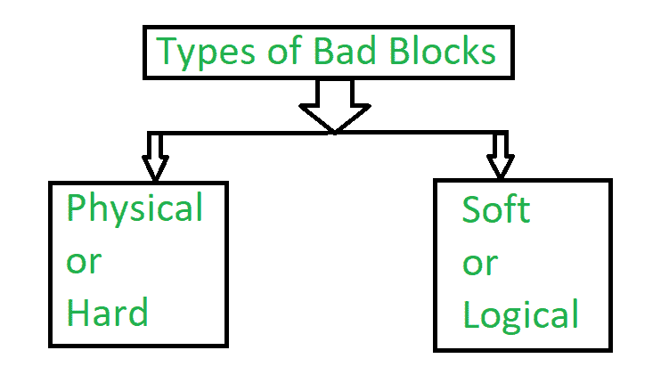

# 操作系统中的坏块

> 原文:[https://www . geesforgeks . org/操作系统中的坏块/](https://www.geeksforgeeks.org/bad-block-in-operating-system/)

**坏块**是存储介质的一个区域，由于其完全损坏或损坏，对于数据存储不再可靠。

我们知道磁盘有活动部件且公差很小，它们很容易发生故障。如果故障完成，则需要更换磁盘，并将其内容从备份介质恢复到新磁盘。更常见的情况是，一个或多个扇区出现故障。更多的磁盘甚至来自名为**坏块**的工厂。

这也被称为坏扇区。

**<u>【坏块原因】</u> :**
存储驱动器可以从工厂发货，其中有源自制造过程的缺陷块。带有**坏块**的设备在出厂前被标记为有缺陷。这些被重新映射为可用的额外存储单元。

设备的物理损坏也会使设备成为坏块，因为有时操作系统无法访问数据。掉落笔记本电脑也会损坏硬盘的盘片。有时灰尘也会损坏硬盘。

当存储晶体管出现故障时，会对固态硬盘造成损坏。随着时间的推移，存储单元也会变得不可靠，因为单元中的 NAND 闪存衬底在一定数量的编程-擦除周期之后变得不可用。

对于固态硬盘的擦除过程，需要通过闪存卡进行大量充电。这降低了将浮栅晶体管与闪存硅衬底分开的氧化层，并且误码率增加。驱动器控制器可以使用错误检测和纠正机制来修复这些错误。然而，在某些时候，错误可能会超过控制器的能力来纠正它们，细胞可能变得不可靠。

软坏扇区是由软件问题引起的。例如，如果一台计算机意外关闭，由于这一点，硬盘也在写入块的过程中关闭。因此，块中包含的数据与循环冗余校验检测错误代码不匹配，将被标记为坏扇区。

**<u>坏块类型</u> :**
坏块有两种类型–

1.  **<u>物理或硬坏块</u> :**
    来源于存储介质损坏。
2.  **<u>【软或逻辑坏块】</u> :**
    当操作系统无法从扇区读取数据时，出现软或逻辑坏块。

**示例–**
软坏块包括特定存储块的循环冗余校验(CRC)或纠错码(ECC)与磁盘读取的数据不匹配。

**<u>坏块的处理方式</u> :**
这些块的处理方式有很多种，但这取决于磁盘和控制器。

在简单的磁盘上，例如一些带有 IDE 控制器的磁盘，坏块是手动处理的。一种策略是在格式化磁盘时扫描磁盘以查找坏块。发现的任何坏块都被标记为不可用，因此文件系统不会分配它们。如果块在正常操作期间变坏，必须手动运行一个特殊的程序(如 Linux badblocks 命令)来搜索坏块并将其锁定。

更复杂的磁盘在坏块恢复方面更聪明。控制器的工作是维护坏块列表。由控制器形成的列表在工厂低级格式化期间被初始化，并在磁盘寿命期间被更新。低级格式化保存操作系统不可见的备用扇区。最后一个任务由控制器完成，用备用扇区在逻辑上替换每个坏扇区。该方案也被称为**扇区备用和转发**。

典型的坏扇区交易如下–

*   假设操作系统想要读取逻辑块 80。
*   现在，控制器将计算 EEC，并假设它发现该块是坏的。它向操作系统报告请求的块是坏的。
*   每当下次系统重新启动时，都会使用一个特殊的命令，它会告诉控制器这个扇区将被替换为备用扇区。
*   将来，每当有对块 80 的请求时，该请求被控制器转换成替换扇区的地址。

**<u>注意</u>–**
控制器的重定向(即请求转换为替换)可能会使操作系统磁盘调度算法的任何优化无效。因此，大多数磁盘都经过格式化，以便在每个柱面和备用柱面中提供一些备用扇区。每当坏块要重新映射时，如果可能，控制器将使用同一柱面的备用扇区；否则也存在备用气缸。

有些控制器用备用扇区替换坏块，还有一种替换坏块的技术是**扇区滑动**。

**<u>扇区滑动示例</u>–**
假设逻辑块 16 出现故障，第一个可用备用扇区位于扇区 200 之后。扇区滑动然后开始重新映射。所有扇区从 16 到 200，将它们全部下移一个点。也就是说，扇区 200 被复制到备用扇区，然后扇区 199 被复制到 200，然后扇区 198 被复制到 199，以此类推，直到扇区 17 被复制到扇区 18。
以这种方式滑动扇区释放了扇区 17 的空间，使得扇区 16 可以映射到它。

坏块的替换不是完全自动的，因为坏块中的数据通常会丢失。一个过程由软错误触发，在该过程中，数据块被复制，数据块被**保留或滑动**。不可恢复的硬错误将丢失所有数据。无论哪个文件正在使用该块，都必须修复，这需要手动干预。