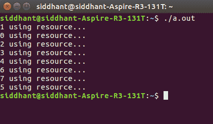

# 过程同步中的烘焙算法

> 原文:[https://www . geesforgeks . org/bakery-算法在处理-同步/](https://www.geeksforgeeks.org/bakery-algorithm-in-process-synchronization/)

先决条件–[关键部分](https://www.geeksforgeeks.org/g-fact-70/)、[进程同步](https://www.geeksforgeeks.org/process-synchronization-set-1/)、[进程间通信](https://www.geeksforgeeks.org/inter-process-communication/)

**烘焙算法**是已知的对于 N 过程一般情况的互斥问题的最简单的解决方案之一。烘焙算法是 **N** 流程的关键部分解决方案。该算法保留了先到先服务的特性。

*   在进入关键部分之前，流程会收到一个数字。最小数字的持有者进入临界区。
*   如果进程 Pi 和 Pj 收到相同的号码，

    ```
    if i < j 
    Pi is served first; 
    else 
    Pj is served first.
    ```

*   编号方案总是按照枚举的递增顺序生成数字；即 1，2，3，3，3，3，4，5，…

**符号–**字典顺序(票证#，进程 id #)–首先比较票证编号。如果相同，则接下来比较进程标识，即-

```
– (a, b) < (c, d) if a < c or if a = c and b < d
– max(a [0], . . ., a [n-1]) is a number, k, such that k >= a[i]  for i = 0, . . ., n - 1
```

共享数据–选择一个数组[0..n–1]的布尔值；& number 是一个数组[0..n–1]个整数值。两者分别初始化为**假&零**。

**算法伪代码–**

```
repeat
    choosing[i] := true;
    number[i] := max(number[0], number[1], ..., number[n - 1])+1;
    choosing[i] := false;
    for j := 0 to n - 1
        do begin
            while choosing[j] do no-op;
            while number[j] != 0
                and (number[j], j) < (number[i], i) do no-op;
        end;

        critical section

    number[i] := 0;

        remainder section

until false;

```

**解释–**
首先，流程将其“选择”变量设置为真，表示其进入关键部分的意图。然后，它会被分配对应于其他进程的最高票证号。然后“选择”变量被设置为假，表示它现在有了一个新的票号。这实际上是算法中最重要也是最令人困惑的部分。

它本身其实就是一个很小的批判部分！前三行的真正目的是，如果一个进程正在修改它的票证值，那么在那个时候，不应该允许某个其他进程检查它现在已经过时的旧票证值。这就是为什么在 for 循环中，在检查票证值之前，我们首先确保所有其他进程都将“choice”变量设为 FALSE。

之后，我们继续检查进程的标签值，其中标签号/进程 id 最少的进程进入临界区。退出部分只是将票证值重置为零。

**代码–**下面是面包店算法的 C 代码实现。在 **UNIX 环境**中运行以下命令–

```
// Importing the thread library
#include "pthread.h"

#include "stdio.h"

// Importing POSIX Operating System API library
#include "unistd.h"

#include "string.h"

// This is a memory barrier instruction.
// Causes compiler to enforce an ordering
// constraint on memory operations.
// This means that operations issued prior
// to the barrier will be performed
// before operations issued after the barrier.
#define MEMBAR __sync_synchronize()
#define THREAD_COUNT 8

volatile int tickets[THREAD_COUNT];
volatile int choosing[THREAD_COUNT];

// VOLATILE used to prevent the compiler
// from applying any optimizations.
volatile int resource;

void lock(int thread)
{

    // Before getting the ticket number
    //"choosing" variable is set to be true
    choosing[thread] = 1;

    MEMBAR;
    // Memory barrier applied

    int max_ticket = 0;

    // Finding Maximum ticket value among current threads
    for (int i = 0; i < THREAD_COUNT; ++i) {

        int ticket = tickets[i];
        max_ticket = ticket > max_ticket ? ticket : max_ticket;
    }

    // Allotting a new ticket value as MAXIMUM + 1
    tickets[thread] = max_ticket + 1;

    MEMBAR;
    choosing[thread] = 0;
    MEMBAR;

    // The ENTRY Section starts from here
    for (int other = 0; other < THREAD_COUNT; ++other) {

        // Applying the bakery algorithm conditions
        while (choosing[other]) {
        }

        MEMBAR;

        while (tickets[other] != 0 && (tickets[other]
                                           < tickets[thread]
                                       || (tickets[other]
                                               == tickets[thread]
                                           && other < thread))) {
        }
    }
}

// EXIT Section
void unlock(int thread)
{

    MEMBAR;
    tickets[thread] = 0;
}

// The CRITICAL Section
void use_resource(int thread)
{

    if (resource != 0) {
        printf("Resource was acquired by %d, but is still in-use by %d!\n",
               thread, resource);
    }

    resource = thread;
    printf("%d using resource...\n", thread);

    MEMBAR;
    sleep(2);
    resource = 0;
}

// A simplified function to show the implementation
void* thread_body(void* arg)
{

    long thread = (long)arg;
    lock(thread);
    use_resource(thread);
    unlock(thread);
    return NULL;
}

int main(int argc, char** argv)
{

    memset((void*)tickets, 0, sizeof(tickets));
    memset((void*)choosing, 0, sizeof(choosing));
    resource = 0;

    // Declaring the thread variables
    pthread_t threads[THREAD_COUNT];

    for (int i = 0; i < THREAD_COUNT; ++i) {

        // Creating a new thread with the function
        //"thread_body" as its thread routine
        pthread_create(&threads[i], NULL, &thread_body, (void*)((long)i));
    }

    for (int i = 0; i < THREAD_COUNT; ++i) {

        // Reaping the resources used by
        // all threads once their task is completed !
        pthread_join(threads[i], NULL);
    }

    return 0;
}
```

输出:
