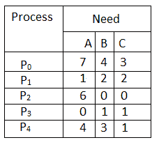
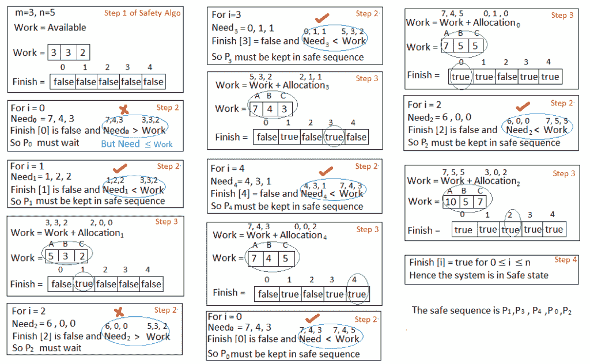
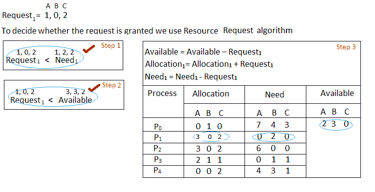
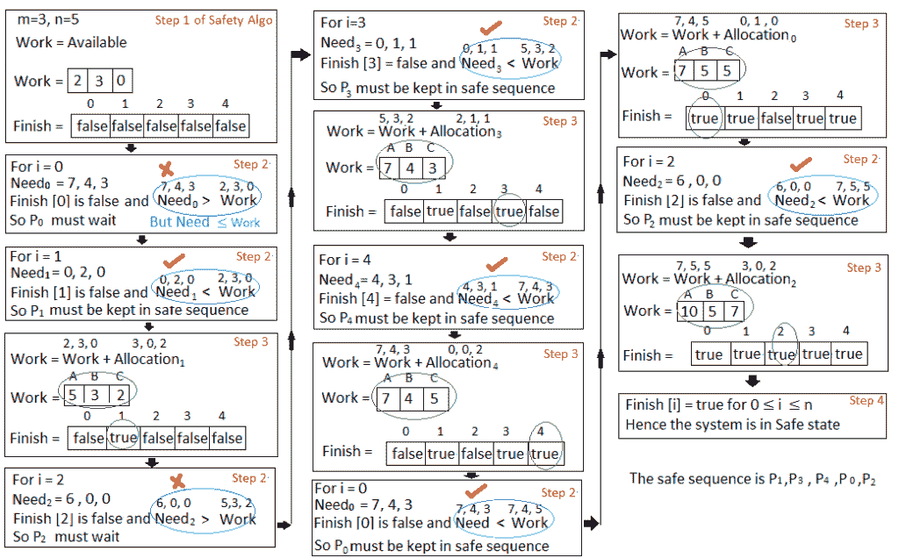

# 操作系统中的银行家算法

> 原文:[https://www . geesforgeks . org/bankers-操作系统中的算法-2/](https://www.geeksforgeeks.org/bankers-algorithm-in-operating-system-2/)

银行家算法是一种资源分配和死锁避免算法，它通过模拟所有资源的预定最大可能数量的分配来测试安全性，然后进行“s 状态”检查来测试可能的活动，然后决定是否允许继续分配。
**为什么庄家算法这么命名？**
银行家算法之所以这样命名，是因为它在银行系统中用于检查贷款是否可以制裁一个人。假设一家银行有 n 个账户持有人，他们的资金总额是 S。如果一个人申请贷款，那么银行首先从银行的资金总额中减去贷款金额，如果剩余金额大于 S，那么只有贷款被批准。这样做是因为如果所有的账户持有人都来取钱，那么银行可以很容易地做到这一点。
换句话说，银行在分配资金时，绝不会再满足所有客户的需求。银行会一直努力保持安全状态。
跟随**的数据结构**用于实现银行家算法:
让 **'n'** 为系统中的进程数， **'m'** 为资源类型数。
**可用:**

*   它是一个一维数组，大小为**‘m’**，表示每种类型的可用资源数量。
*   可用[ j ] = k 表示存在资源类型的**【k】**实例 **R <sub>j</sub>**

**Max :**

*   它是一个尺寸为' **n*m'** 的二维数组，定义了系统中每个进程的最大需求。
*   Max[ i，j ] = k 表示进程 **P <sub>i</sub>** 最多可以请求**【k】**个资源类型实例**R<sub>j</sub>**

**分配:**

*   它是一个大小为 **'n*m'** 的二维数组，定义了当前分配给每个进程的每种类型的资源数量。
*   分配[ i，j ] = k 表示进程 **P <sub>i</sub>** 当前被分配了资源类型 **R <sub>j</sub>** 的**【k】**实例

**需要:**T2】

*   它是一个二维数组，大小为**‘n * m’**，表示每个进程的剩余资源需求。
*   需要[ i，j ] = k 表示流程 **P <sub>i</sub>** 当前需要**【k】**实例的资源类型 **R <sub>j</sub>**
*   需要[ i，j ] =最大[ i，j ]–分配[ i，j]

分配 <sub>i</sub> 指定当前分配给进程 P <sub>i</sub> 和需要 <sub>i</sub> 的资源指定进程 P <sub>i</sub> 仍可能请求完成其任务的额外资源。
银行家算法由安全算法和资源请求算法组成
**安全算法**
判断系统是否处于安全状态的算法可以描述如下:

> 1)让“工作”和“完成”分别是长度为“m”和“n”的向量。
> 初始化:工作=可用
> 完成[i] =假；因为 i=1，2，3，4…n
> 2)找到一个 I，使得两个
> a)完成【I】=假
> b)需要 <sub>i</sub> < =工作
> 如果不存在这样的 I，转到步骤(4)
> 3)工作=工作+分配【I】
> 完成【I】=真
> 转到步骤(2)
> 4)如果完成【I】=真，则系统处于安全状态

**资源请求算法**
让请求 <sub>i</sub> 成为进程 P <sub>i</sub> 的请求数组。请求<sub>I</sub>【j】= k 表示进程 P <sub>i</sub> 想要资源类型 R <sub>j</sub> 的 k 个实例。当进程 P <sub>i</sub> 请求资源时，采取以下操作:

> 1)如果请求 <sub>i</sub> < =需要<sub>I</sub>T4】转到步骤(2)；否则，引发错误条件，因为进程已超过其最大声明。
> 2)如果请求 <sub>i</sub> < =可用
> 转到步骤(3)；否则，P <sub>i</sub> 必须等待，因为资源不可用。
> 3)让系统通过修改状态如下
> 假装已经分配了请求的资源来处理 Pi:
> 可用=可用–请求 i
> 分配 <sub>i</sub> =分配 <sub>i</sub> +请求 <sub>i</sub>
> 需要 <sub>i</sub> =需要<sub>I</sub>–请求 <sub>i</sub>

**例:**
**考虑一个系统有五个流程 P <sub>0</sub> 到 P <sub>4</sub> 和三个 A、B、C 类型的资源，资源类型 A 有 10 个实例，B 有 5 个实例，C 类型有 7 个实例。假设在时间 t <sub>0</sub> 已经拍摄了系统的以下快照:**


**问题 1。需求矩阵的内容是什么？**
需求[i，j] = Max [i，j]–分配[i，j]
所以，需求矩阵的内容是:



**问题 2。系统是否处于安全状态？如果是，那么安全顺序是什么？**
在给定系统上应用安全算法，



**问题 3。如果流程 P <sub>1</sub> 请求一个额外的资源类型 A 实例和两个资源类型 C 实例，会发生什么？**



我们必须确定这个新的系统状态是否安全。为此，我们再次对上述数据结构执行安全算法。



因此，新的系统状态是安全的，因此我们可以立即批准对流程 **P <sub>1 的请求。</sub>**
银行家算法代码

## C

```
// Banker's Algorithm
#include <stdio.h>
int main()
{
    // P0, P1, P2, P3, P4 are the Process names here

    int n, m, i, j, k;
    n = 5; // Number of processes
    m = 3; // Number of resources
    int alloc[5][3] = { { 0, 1, 0 }, // P0    // Allocation Matrix
                        { 2, 0, 0 }, // P1
                        { 3, 0, 2 }, // P2
                        { 2, 1, 1 }, // P3
                        { 0, 0, 2 } }; // P4

    int max[5][3] = { { 7, 5, 3 }, // P0    // MAX Matrix
                      { 3, 2, 2 }, // P1
                      { 9, 0, 2 }, // P2
                      { 2, 2, 2 }, // P3
                      { 4, 3, 3 } }; // P4

    int avail[3] = { 3, 3, 2 }; // Available Resources

    int f[n], ans[n], ind = 0;
    for (k = 0; k < n; k++) {
        f[k] = 0;
    }
    int need[n][m];
    for (i = 0; i < n; i++) {
        for (j = 0; j < m; j++)
            need[i][j] = max[i][j] - alloc[i][j];
    }
    int y = 0;
    for (k = 0; k < 5; k++) {
        for (i = 0; i < n; i++) {
            if (f[i] == 0) {

                int flag = 0;
                for (j = 0; j < m; j++) {
                    if (need[i][j] > avail[j]){
                        flag = 1;
                         break;
                    }
                }

                if (flag == 0) {
                    ans[ind++] = i;
                    for (y = 0; y < m; y++)
                        avail[y] += alloc[i][y];
                    f[i] = 1;
                }
            }
        }
    }

      int flag = 1;

      for(int i=0;i<n;i++)
    {
      if(f[i]==0)
      {
        flag=0;
         printf("The following system is not safe");
        break;
      }
    }

      if(flag==1)
    {
      printf("Following is the SAFE Sequence\n");
      for (i = 0; i < n - 1; i++)
        printf(" P%d ->", ans[i]);
      printf(" P%d", ans[n - 1]);
    }

    return (0);

    // This code is contributed by Deep Baldha (CandyZack)
}
```

## C++

```
// Banker's Algorithm
#include <iostream>
using namespace std;

int main()
{
    // P0, P1, P2, P3, P4 are the Process names here

  int n, m, i, j, k;
  n = 5; // Number of processes
  m = 3; // Number of resources
  int alloc[5][3] = { { 0, 1, 0 }, // P0 // Allocation Matrix
                     { 2, 0, 0 }, // P1
                     { 3, 0, 2 }, // P2
                     { 2, 1, 1 }, // P3
                     { 0, 0, 2 } }; // P4

  int max[5][3] = { { 7, 5, 3 }, // P0 // MAX Matrix
                   { 3, 2, 2 }, // P1
                   { 9, 0, 2 }, // P2
                   { 2, 2, 2 }, // P3
                   { 4, 3, 3 } }; // P4

  int avail[3] = { 3, 3, 2 }; // Available Resources

  int f[n], ans[n], ind = 0;
  for (k = 0; k < n; k++) {
    f[k] = 0;
  }
  int need[n][m];
  for (i = 0; i < n; i++) {
    for (j = 0; j < m; j++)
      need[i][j] = max[i][j] - alloc[i][j];
  }
  int y = 0;
  for (k = 0; k < 5; k++) {
    for (i = 0; i < n; i++) {
      if (f[i] == 0) {

        int flag = 0;
        for (j = 0; j < m; j++) {
          if (need[i][j] > avail[j]){
            flag = 1;
            break;
          }
        }

        if (flag == 0) {
          ans[ind++] = i;
          for (y = 0; y < m; y++)
            avail[y] += alloc[i][y];
          f[i] = 1;
        }
      }
    }
  }

  int flag = 1;

  // To check if sequence is safe or not
  for(int i = 0;i<n;i++)
  {
        if(f[i]==0)
      {
        flag = 0;
        cout << "The given sequence is not safe";
        break;
      }
  }

  if(flag==1)
  {
    cout << "Following is the SAFE Sequence" << endl;
      for (i = 0; i < n - 1; i++)
        cout << " P" << ans[i] << " ->";
      cout << " P" << ans[n - 1] <<endl;
  }

    return (0);
}
```

## Java 语言(一种计算机语言，尤用于创建网站)

```
//Java Program for Bankers Algorithm
public class GfGBankers
{
    int n = 5; // Number of processes
    int m = 3; // Number of resources
    int need[][] = new int[n][m];
    int [][]max;
    int [][]alloc;
    int []avail;
    int safeSequence[] = new int[n];

    void initializeValues()
    {
    // P0, P1, P2, P3, P4 are the Process names here
    // Allocation Matrix
    alloc = new int[][] { { 0, 1, 0 }, //P0  
                  { 2, 0, 0 }, //P1
                  { 3, 0, 2 }, //P2
                  { 2, 1, 1 }, //P3
                  { 0, 0, 2 } }; //P4

    // MAX Matrix
    max = new int[][] { { 7, 5, 3 }, //P0
             { 3, 2, 2 }, //P1
             { 9, 0, 2 }, //P2
             { 2, 2, 2 }, //P3
             { 4, 3, 3 } }; //P4

    // Available Resources 
     avail = new int[] { 3, 3, 2 };
    }

    void isSafe()
    {
    int count=0;

    //visited array to find the already allocated process
    boolean visited[] = new boolean[n];
    for (int i = 0;i < n; i++)
    {
        visited[i] = false;
    }

    //work array to store the copy of available resources
    int work[] = new int[m];   
    for (int i = 0;i < m; i++)
    {
        work[i] = avail[i];
    }

    while (count<n)
    {
        boolean flag = false;
        for (int i = 0;i < n; i++)
        {
            if (visited[i] == false)
             {
            int j;
            for (j = 0;j < m; j++)
            {       
                if (need[i][j] > work[j])
                break;
            }
            if (j == m)
            {
               safeSequence[count++]=i;
               visited[i]=true;
               flag=true;

                for (j = 0;j < m; j++)
                {
                work[j] = work[j]+alloc[i][j];
                }
            }
             }
        }
        if (flag == false)
        {
            break;
        }
    }
    if (count < n)
    {
        System.out.println("The System is UnSafe!");
    }
    else
    {
        //System.out.println("The given System is Safe");
        System.out.println("Following is the SAFE Sequence");
                for (int i = 0;i < n; i++)
        {
            System.out.print("P" + safeSequence[i]);
            if (i != n-1)
            System.out.print(" -> ");
        }
    }
    }

    void calculateNeed()
    {
    for (int i = 0;i < n; i++)
    {
        for (int j = 0;j < m; j++)
         {
        need[i][j] = max[i][j]-alloc[i][j];
         }
    }       
    }

    public static void main(String[] args)
    { 
      int i, j, k;
      GfGBankers gfg = new GfGBankers();

      gfg.initializeValues();   
      //Calculate the Need Matrix   
      gfg.calculateNeed();           

       // Check whether system is in safe state or not
      gfg.isSafe();       
    }
}
```

## 蟒蛇 3

```
# Banker's Algorithm

# Driver code:
if __name__=="__main__":

    # P0, P1, P2, P3, P4 are the Process names here
    n = 5 # Number of processes
    m = 3 # Number of resources

    # Allocation Matrix
    alloc = [[0, 1, 0 ],[ 2, 0, 0 ],
            [3, 0, 2 ],[2, 1, 1] ,[ 0, 0, 2]]

    # MAX Matrix
    max = [[7, 5, 3 ],[3, 2, 2 ],
            [ 9, 0, 2 ],[2, 2, 2],[4, 3, 3]]

    avail = [3, 3, 2] # Available Resources

    f = [0]*n
    ans = [0]*n
    ind = 0
    for k in range(n):
        f[k] = 0

    need = [[ 0 for i in range(m)]for i in range(n)]
    for i in range(n):
        for j in range(m):
            need[i][j] = max[i][j] - alloc[i][j]
    y = 0
    for k in range(5):
        for i in range(n):
            if (f[i] == 0):
                flag = 0
                for j in range(m):
                    if (need[i][j] > avail[j]):
                        flag = 1
                        break

                if (flag == 0):
                    ans[ind] = i
                    ind += 1
                    for y in range(m):
                        avail[y] += alloc[i][y]
                    f[i] = 1

    print("Following is the SAFE Sequence")

    for i in range(n - 1):
        print(" P", ans[i], " ->", sep="", end="")
    print(" P", ans[n - 1], sep="")

# This code is contributed by SHUBHAMSINGH10
```

## C#

```
// C# Program for Bankers Algorithm
using System;
using System.Collections.Generic;

class GFG
{
static int n = 5; // Number of processes
static int m = 3; // Number of resources
int [,]need = new int[n, m];
int [,]max;
int [,]alloc;
int []avail;
int []safeSequence = new int[n];

void initializeValues()
{
    // P0, P1, P2, P3, P4 are the Process
    // names here Allocation Matrix
    alloc = new int[,] {{ 0, 1, 0 }, //P0
                        { 2, 0, 0 }, //P1
                        { 3, 0, 2 }, //P2
                        { 2, 1, 1 }, //P3
                        { 0, 0, 2 }};//P4

    // MAX Matrix
    max = new int[,] {{ 7, 5, 3 }, //P0
                        { 3, 2, 2 }, //P1
                      { 9, 0, 2 }, //P2
                      { 2, 2, 2 }, //P3
                      { 4, 3, 3 }};//P4

    // Available Resources
    avail = new int[] { 3, 3, 2 };
}

void isSafe()
{
    int count = 0;

    // visited array to find the
    // already allocated process
    Boolean []visited = new Boolean[n];
    for (int i = 0; i < n; i++)
    {
        visited[i] = false;
    }

    // work array to store the copy of
    // available resources
    int []work = new int[m];
    for (int i = 0; i < m; i++)
    {
        work[i] = avail[i];
    }

    while (count<n)
    {
        Boolean flag = false;
        for (int i = 0; i < n; i++)
        {
            if (visited[i] == false)
            {
                int j;
                for (j = 0; j < m; j++)
                {    
                    if (need[i, j] > work[j])
                    break;
                }
                if (j == m)
                {
                    safeSequence[count++] = i;
                    visited[i] = true;
                    flag = true;
                    for (j = 0; j < m; j++)
                    {
                        work[j] = work[j] + alloc[i, j];
                    }
                }
            }
        }
        if (flag == false)
        {
            break;
        }
    }
    if (count < n)
    {
        Console.WriteLine("The System is UnSafe!");
    }
    else
    {
        //System.out.println("The given System is Safe");
        Console.WriteLine("Following is the SAFE Sequence");
        for (int i = 0; i < n; i++)
        {
            Console.Write("P" + safeSequence[i]);
            if (i != n - 1)
            Console.Write(" -> ");
        }
    }
}

void calculateNeed()
{
    for (int i = 0;i < n; i++)
    {
        for (int j = 0;j < m; j++)
        {
            need[i, j] = max[i, j] - alloc[i, j];
        }
    }    
}

// Driver Code
public static void Main(String[] args)
{
    GFG gfg = new GFG();

    gfg.initializeValues();

    // Calculate the Need Matrix
    gfg.calculateNeed();        

    // Check whether system is in
    // safe state or not
    gfg.isSafe();    
}
}

// This code is contributed by Rajput-Ji
```

## java 描述语言

```
<script>

  let n, m, i, j, k;
  n = 5; // Number of processes
  m = 3; // Number of resources
  let alloc = [ [ 0, 1, 0 ], // P0 // Allocation Matrix
                [ 2, 0, 0 ], // P1
                [ 3, 0, 2 ], // P2
                [ 2, 1, 1 ], // P3
                [ 0, 0, 2 ] ]; // P4

  let max = [ [ 7, 5, 3 ], // P0 // MAX Matrix
              [ 3, 2, 2 ], // P1
              [ 9, 0, 2 ], // P2
              [ 2, 2, 2 ], // P3
              [ 4, 3, 3 ] ]; // P4

  let avail = [ 3, 3, 2 ]; // Available Resources

  let f = [], ans = [], ind = 0;
  for (k = 0; k < n; k++) {
    f[k] = 0;
  }
  let need = [];
  for (i = 0; i < n; i++) {
      let need1 = [];
    for (j = 0; j < m; j++)
      need1.push(max[i][j] - alloc[i][j]);
    need.push(need1);
  }

  let y = 0;
  for (k = 0; k < 5; k++) {
    for (i = 0; i < n; i++) {
      if (f[i] == 0) {

        let flag = 0;
        for (j = 0; j < m; j++) {
          if (need[i][j] > avail[j]){
            flag = 1;
            break;
          }
        }

        if (flag == 0) {
          ans[ind++] = i;
          for (y = 0; y < m; y++)
            avail[y] += alloc[i][y];
          f[i] = 1;
        }
      }
    }
  }

  document.write("Following is the SAFE Sequence" + "<br>");
  for (i = 0; i < n - 1; i++)
    document.write(" P" + ans[i] + " ->");
  document.write( " P" + ans[n - 1] + "<br>");
</script>
```

**Output**

```
Following is the SAFE Sequence
 P1 -> P3 -> P4 -> P0 -> P2
```

*   当进程进入系统时，它们必须预测所需资源的最大数量，这并不是不切实际的。
*   在这个算法中，进程的数量保持固定，这在交互系统中是不可能的。
*   这种算法要求应该有固定数量的资源来分配。如果一个设备坏了，突然变得不可用，算法将无法工作。
*   当有许多进程和资源时，算法产生的开销成本可能很高，因为它必须为每个进程调用。