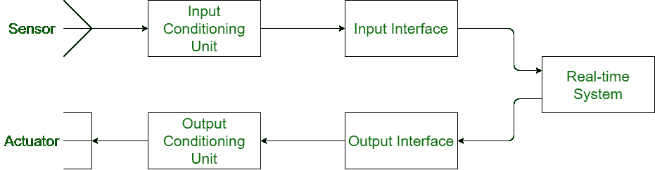

# 实时系统的基本模型

> 原文:[https://www . geeksforgeeks . org/基本实时系统模型/](https://www.geeksforgeeks.org/basic-model-of-a-real-time-system/)

[实时系统](https://www.geeksforgeeks.org/real-time-systems/)是用于执行一些特定任务的系统。这些任务与时间限制有关，需要在该时间间隔内完成。

**实时系统的基本模型:**
实时系统的基本模型给出了实时系统中涉及的所有组件的概述。实时系统包括各种嵌入的硬件和软件，使得特定的任务可以在允许的时间限制内执行。实时系统所涉及的准确性和正确性使得模型变得复杂。实时系统的模型多种多样，比较复杂，难以理解。这里我们将讨论一个实时系统的基本模型，它有一些常用的术语和硬件。

下图显示了实时系统的基本模型:

**传感器:**
传感器用于将一些物理事件或特征转换为电信号。这些硬件设备从环境中获取输入，并通过转换将其提供给系统。例如，温度计将温度作为物理特征，然后将其转换为系统的电信号。

**执行器:**
执行器是传感器的反向装置。当传感器将物理事件转换为电信号时，执行器则相反。它将电信号转换成物理事件或特征。它从系统的输出接口获取输入。致动器的输出可以是任何形式的物理动作。一些常用的致动器是马达和加热器。

**信号调理单元:**
当传感器将物理动作转换为电信号时，则计算机不能直接使用。因此，在将物理行为转换为电信号后，就需要对其进行调理。类似地，当电信号被发送到致动器时给出输出，那么也需要调节。
因此，信号调理有两种类型:

*   **输入调理单元:**用于调理来自传感器的电信号。
*   **输出调节单元:**用于调节来自系统的电信号。

**接口单元:**
接口单元基本用于数模转换，反之亦然。来自输入调节单元的信号是模拟的，系统只对数字信号进行操作，然后使用接口单元将模拟信号转换为数字信号。类似地，在将信号传输到输出调节单元时，信号的接口被改变，即从数字转换为模拟。
在此基础上，接口单元也有两种类型:

*   **输入接口:**用于模拟信号到数字的转换。
*   **输出接口:**用于将数字信号转换为模拟信号。