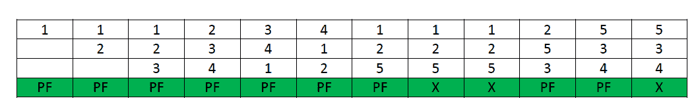
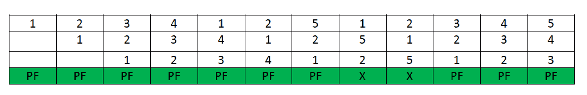
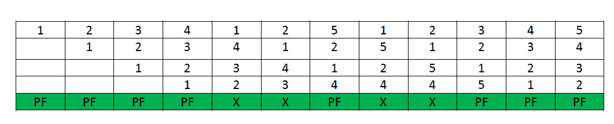

# 贝拉蒂在页面替换算法中的异常

> 原文:[https://www . geeksforgeeks . org/Bela dys-页内异常替换-算法/](https://www.geeksforgeeks.org/beladys-anomaly-in-page-replacement-algorithms/)

先决条件–[页面替换算法](https://www.geeksforgeeks.org/operating-system-page-replacement-algorithm/)
在操作系统中，进程数据以固定大小的块加载，每个块被称为一个页面。处理器将这些页面加载到称为框架的固定大小的内存块中。通常，每页的大小总是等于框架的大小。

当内存中找不到页面，需要从磁盘加载页面时，就会发生页面错误。如果发生页面错误，并且已经分配了所有内存帧，则需要根据新页面的请求替换内存中的页面。这被称为按需分页。选择替换哪个页面由页面替换算法指定。常用的页面替换算法有 FIFO、LRU、最优页面替换算法等。

一般来说，当增加进程虚拟内存的帧数时，页面错误越少，进程的执行速度就越快。有时会发生相反的情况，即当更多的帧被分配给一个进程时，会出现更多的页面错误。这个最意想不到的结果被称为**贝拉蒂异常**。

**Bélády 异常**是指对于给定的内存访问模式，增加页面帧数会导致页面错误数增加的现象。

这种现象常见于以下页面替换算法:

1.  先进先出
2.  二次机会算法
3.  随机页面替换算法

**Belady 异常的原因–**
另外两个常用的页面替换算法是 Optimal 和 LRU，但是对于任何引用字符串，Belady 的 Anamoly 永远不会出现在这些算法中，因为它们属于一类基于堆栈的页面替换算法。

基于堆栈的算法可以显示出 *N* 帧的内存中的页面集合始终是具有 *N + 1* 帧的内存中的页面集合的子集。对于 LRU 替换，内存中的页面集将是最近引用的页面。如果帧数增加，那么这些 *n* 页仍将是最近引用的，因此仍将在内存中。而在先进先出中，如果名为 *b* 的页面在页面–*a*之前进入物理内存，则 *b* 的替换优先级大于 *a* 的替换优先级，但这与页面帧数无关，因此先进先出不遵循堆栈页面替换策略，因此会出现贝拉蒂异常。

**示例:**考虑下图，了解基于堆栈的页面替换算法的行为


该图说明，给定的一组页面，即 3 帧内存中的{0，1，2}不是 4 帧内存中页面的子集–{ 0，1，4，5}，这违反了基于堆栈的算法的特性。这种情况在 FIFO 算法中经常可以看到。

**贝拉蒂在 FIFO 中的异常–**
假设一个系统没有页面加载到内存中，并且使用了 FIFO 页面替换算法。考虑以下引用字符串:

```
1, 2, 3, 4, 1, 2, 5, 1, 2, 3, 4, 5 
```

**案例-1:** 如果系统有 3 帧，使用先进先出页面替换算法的给定参考字符串总共会产生 9 个页面错误。下图说明了示例中页面错误的模式。



**情况-2:** 如果系统有 4 帧，使用 FIFO 页面替换算法的给定参考字符串总共产生 10 个页面错误。下图说明了示例中页面错误的模式。


从上面的例子可以看出，在使用先进先出页面替换算法的同时增加帧数时，**页面错误的数量从 9 增加到 10。**

**注意–**并非每个字符串引用模式都会导致 FIFO 中的 Belady 异常，但在增加帧数时，某些类型的字符串引用会恶化 FIFO 性能。

**为什么基于堆栈的算法不会出现异常–**
所有基于堆栈的算法都不会出现 Belady 异常，因为这些类型的算法会为页面分配一个独立于页面帧数的优先级(用于替换)。这种政策的例子有最优、LRU 和 LFU。此外，这些算法还具有很好的模拟特性，即可以通过参考串一次计算任意数量的页面帧的未命中(或命中)比率。

在 LRU 算法中，每次引用一个页面时，它都会移动到堆栈的顶部，因此，堆栈的顶部 *n* 页面是最近使用的页面 *n* 。即使帧数增加到 *n+1* ，堆栈顶部也会有 *n+1* 个最近使用的页面。

类似的例子可以用来计算 LRU 算法中的页面错误数。假设系统内存中没有加载页面，并且使用 LRU 页面替换算法。考虑以下引用字符串:

```
1, 2, 3, 4, 1, 2, 5, 1, 2, 3, 4, 5  
```

**情况-1:** 如果系统有 3 帧，使用 LRU 页面替换算法的给定参考字符串总共产生 10 个页面错误。下图说明了示例中页面错误的模式。



**情况-2:** 如果系统有 4 帧，给定的参考字符串在使用 LRU 页面替换算法，那么总共发生 8 个页面错误。该图显示了示例中页面错误的模式。



**结论–**
各种因素实质上影响页面错误的数量，例如引用字符串长度和可用的空闲页面框架数量。由于高速缓存大小较小以及高速缓存内容变化速度过快，也会出现异常。此外，即使在增加帧数之后，固定数量的页面错误的情况也可以被视为异常。像**随机页面替换算法**这样的算法通常也容易受到贝拉迪异常的影响，因为它**可能表现得像先进先出(先进先出)**页面替换算法。但是基于堆栈的算法通常不受所有这些情况的影响，因为当帧增加时，它们保证给出更好的页面命中。

**GATE CS 角题–**
练习以下问题有助于测试你的知识。所有的问题在前几年的 GATE 考试或 GATE 模拟考试中都被问过。强烈建议你练习一下。

1.  [GATE-CS-2001 |第 21 题](https://www.geeksforgeeks.org/gate-gate-cs-2001-question-21/)
2.  [GATE-CS-2009 |问题 8](https://www.geeksforgeeks.org/gate-gate-cs-2009-question-8/)
3.  [ISRO CS 2011 |第 73 题](https://www.geeksforgeeks.org/isro-isro-cs-2011-question-73/)
4.  [GATE-CS-2016(第 2 集)|第 30 题](https://www.geeksforgeeks.org/gate-gate-cs-2016-set-2-question-30/)
5.  [ISRO CS 2016 |第 48 题](https://www.geeksforgeeks.org/isro-isro-cs-2016-question-48/)
6.  [GATE CS 模拟 2018 |第 63 题](https://www.geeksforgeeks.org/gate-gate-cs-mock-2018-question-63/)