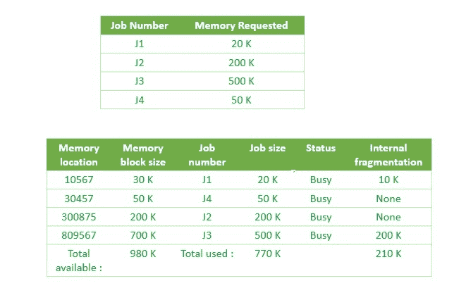

# 操作系统中的最佳分配

> 原文:[https://www . geeksforgeeks . org/最佳操作系统分配/](https://www.geeksforgeeks.org/best-fit-allocation-in-operating-system/)

对于[固定和动态内存分配方案](https://www.geeksforgeeks.org/partition-allocation-methods-in-memory-management/)，操作系统必须保留每个内存位置的列表，注明哪些是空闲的，哪些是繁忙的。然后，随着新作业进入系统，必须分配空闲分区。

这些分区可以通过 4 种方式分配:

```
1. First-Fit Memory Allocation
2. Best-Fit Memory Allocation
3. Worst-Fit Memory Allocation
4. Next-Fit Memory Allocation 
```

这些是**连续**内存分配技术。

[**【最佳内存分配】**](https://www.geeksforgeeks.org/program-best-fit-algorithm-memory-management/) **:**
此方法按大小将忙/闲列表按顺序排列——从最小到最大。在这种方法中，操作系统首先根据给定作业的大小搜索整个内存，并将其分配给内存中最合适的空闲分区，使其能够有效地使用内存。这里的工作是按照从最小到最大的顺序排列的。



如上图所示，操作系统首先搜索整个内存，并将作业分配到最小可能的内存分区，从而提高内存分配效率。

**最佳分配的优势:**
内存高效。操作系统在内存中分配作业最小可能的空间，使得内存管理非常有效。为了避免浪费内存，这是最好的方法。

**最佳匹配分配的缺点:**
这是一个缓慢的过程。为每个作业检查整个内存会使操作系统的工作非常缓慢。完成这项工作需要很多时间。