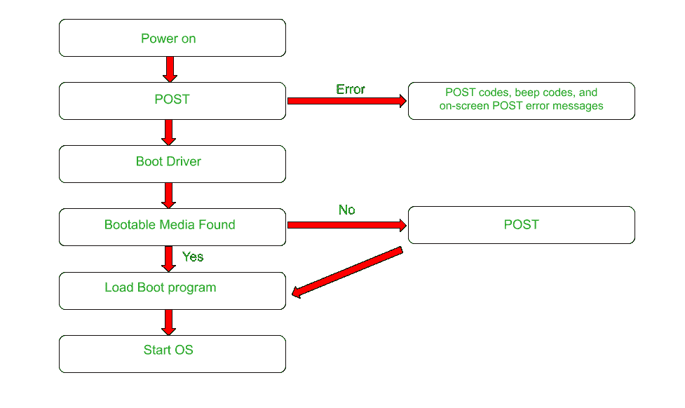

# 基本输入输出系统完整形式

> 原文:[https://www.geeksforgeeks.org/bios-full-form/](https://www.geeksforgeeks.org/bios-full-form/)

**BIOS** 代表**基本输入输出系统。** BIOS 是电脑启动时运行的第一个程序。它是主板上的只读存储器芯片(EEPROM 芯片)，用于引导过程中的硬件初始化。它预先安装在计算机系统中。当基本输入输出系统启动计算机系统时，它会检查所有组件是否到位并正常工作，然后将操作系统从系统硬盘加载到计算机的内存中。
现在的 BIOS 都写在闪存上，方便随时需要重写 BIOS 芯片的过程。

#### BIOS 的历史

BIOS 最早于 1975 年在 CP/M 操作系统中推出。微型计算机控制程序，是由数字研究公司的加里·基尔代尔为基于英特尔 8080/85 的微型计算机开发的。该系统的只读存储器中有一个简单的引导加载程序。
在引入 PS/2 机器时，IBM 将系统 bios 分为两类:

*   **CBIOS:** CBIOS 代表**兼容性 BIOS** 。实模式部分提供了与当前操作系统的向后兼容性，因此被命名为 CBIOS。
*   **ABIOS:** ABIOS 代表**高级 BIOS** 。它提供了新的界面，尤其是适合多任务操作系统的界面。

#### 基本输入输出系统功能

*   **开机自检:**开机自检是计算机系统开始检查任何硬件相关问题后，BIOS 立即执行的过程。如果在此过程中发现任何错误，系统会通过闪烁的指示灯、可听到的蜂鸣声或显示器上的错误信息发出警报，所有这些在技术上分别称为开机自检代码、蜂鸣声和屏幕开机自检错误信息。
*   **引导程序加载器:**存储在 ROM 中的引导程序一启动就加载到硬盘中。引导加载程序定位操作系统并将控制传递给它。
*   接下来，**引导驱动**配置基本硬件，让系统可以运行。它们是低级驱动程序，提供计算机硬件的基本信息。
*   **CMOS 设置:**互补金属氧化物半导体(CMOS)芯片，保存一些系统信息，如时间、日期和其他必要的系统设置。CMOS 芯片由主板上的电池供电。它还存储了一些关于硬件的信息。芯片的内容被复制到系统的随机存取存储器(主存储器)以提高速度，因为互补金属氧化物半导体芯片相当慢。
    这是因为 BIOS 和 CMOS 设置配置了系统的关键信息，如密码、日期和时间。
*   **引导设备选择:**CMOS 最重要的作用之一是，它可以改变设备的引导过程。这对于系统恢复很重要，因为 CMOS 可能需要将引导优先级从硬盘更改为光驱或闪存驱动器，以启动操作系统安装程序或调整从哪个硬盘加载操作系统。

#### BIOS 流程图

#### 基本输入输出系统的特点

*   每个基本输入输出系统的实现都是专门为特定类型的主板型号或特定的计算机设计的。
*   最初，基本输入输出系统固件存储在只读存储器中，但现在它存储在闪存中，以便在不从主板上卸下芯片的情况下重写。
*   这样做的另一个原因是它允许 BIOS 固件的轻松更新，因此可以添加新功能并修复 bug。
*   BIOS 的最新进展是 UEFI(统一可扩展固件接口)。

#### 优势

*   计算机系统将获得更好的兼容性。
*   系统的引导时间减少。
*   系统的整体性能得到改善

#### 不足之处

*   缺点是这是一个耗时的过程。BIOS 经常在 16 位真实模式下启动(不是 32 位也不是 64 位保护模式)，而且由于使用的芯片类型，并不总是最快的。
*   如果在此过程中出现问题，主板可能会受到影响。解决这个问题不是一个容易的过程。