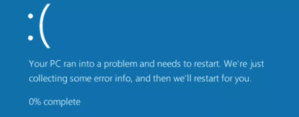

# 死亡蓝屏(BSOD)和停止错误

> 原文:[https://www . geesforgeks . org/死亡蓝屏-bsod-stop-error/](https://www.geeksforgeeks.org/blue-screen-of-death-bsod-and-stop-error/)

在本文中，我们将介绍什么是蓝屏错误(BSOD)，以及如何在 Windows 10 上排除和修复这个烦人的问题。

**蓝屏错误:**
蓝屏错误(死亡蓝屏)基本上是出现致命系统错误后，Windows 计算机上显示的停止错误或异常错误屏幕。它表示一个关键事件，在该事件中，操作系统已经达到无法再安全运行的状态。

**BSOD 成因:**

1.  BSODs 主要是由 Windows 内核中运行的低级软件的问题引起的，当 Microsoft Windows 遇到无法恢复的严重错误时就会发生。其主要原因是 windows 10 的错误升级或任何 windows 文件在更新过程中损坏。
2.  除了软件问题，蓝屏也是由硬件故障引起的，也可能是由电池、内存、硬盘等问题引起的。
    硬件故障导致蓝屏错误的几率非常小，大部分是软件问题导致的。

**注意–**
系统上的常规应用不会导致蓝屏错误。如果您系统上的常规应用程序崩溃，它不会影响操作系统功能。当窗口遇到“停止错误”时会出现蓝屏错误，此时窗口唯一应该做的就是重启系统。

蓝屏错误期间显示的一些最常见的消息如下。

*   数据总线错误
*   意外 _ 内核 _ 模式 _ 陷阱
*   IRQL 不低于或等于
*   页面故障输入非页面区域
*   KMODE_EXCEPTION_NOT_HANDLED

**修复蓝屏错误:**

1.  第一件事，你可以而且应该尝试从你的身边是阅读错误信息，显示在你的系统，然后谷歌它任何可能的修复。
2.  尝试卸载电脑上所有不必要的应用程序。
3.  您还可以使用系统还原将软件回滚到以前的健康状态。
4.  尝试检查任何硬盘错误。
5.  始终检查是否有任何未决的 windows 更新。如果悬而未决，那么尝试尽快安装它。
6.  也可能是你在更新你的窗口后遇到蓝屏错误，那么在这种情况下，你只需要卸载你做的最新更新，然后再次尝试重新安装。
7.  去你系统的官方网站下载所有必要的最新驱动。例如，如果使用戴尔系统，请访问戴尔官方网站下载您电脑的所有最新驱动程序。
8.  请始终在您的系统上使用防病毒软件，因为蓝屏的一个可能原因也可能是因为恶意软件可能会在较低的级别影响 Windows 内核，导致系统不稳定。
9.  尝试使用出厂重置选项将系统完全格式化为出厂状态。
10.  如果以上所有方法都不起作用，那么我建议您重新安装 windows，然后下载所有最新的驱动程序，重新启动您的系统。

**注意–**
最后，我想提一下，蓝屏错误对你的系统并不危险，事实上，它们的发生保护了你的硬件免受任何有害事件的影响。当窗口感觉到你电脑上的某些东西或事件可能会对你的系统固件造成真正的伤害时，它就会停止一切，导致臭名昭著的死亡蓝屏。