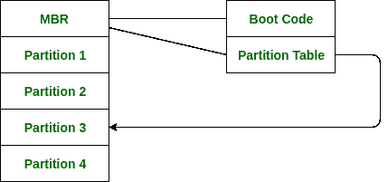

# 操作系统中的引导块

> 原文:[https://www . geesforgeks . org/boot-block-in-operating-system/](https://www.geeksforgeeks.org/boot-block-in-operating-system/)

基本上，当一台计算机启动或重新启动时，它需要一个初始程序来运行。这个被称为**引导**的初始程序需要简单。它必须初始化系统的所有方面，从中央处理器寄存器到设备控制器和主存储器的内容，然后启动操作系统。

为了完成这项工作，引导程序基本上在磁盘上找到操作系统内核，然后将内核加载到内存中，然后跳转到初始地址开始操作系统的执行。

**为什么是 ROM:**
对于今天的大部分计算机来说，引导存储在只读存储器(ROM)中。

1.  这个位置很适合存储，因为这个位置不需要初始化，而且这个位置是固定的，这样处理器就可以在通电或复位时开始执行。
2.  只读存储器基本上是只读存储器，因此它不会受到计算机病毒的影响。

问题是改变引导代码基本上需要改变 ROM 硬件芯片。由于这个原因，现在大多数系统在引导中有微小的引导加载程序，其唯一的工作是从磁盘中取出完整的引导程序。通过这一点，我们现在能够轻松地更改完整的引导程序，并且新版本可以轻松地写入磁盘。

完整的引导程序存储在磁盘上固定位置的**引导块**中。具有引导分区的磁盘称为引导磁盘。引导只读存储器中的代码基本上指示读取控制器将引导块读取到存储器中，然后开始执行代码。完整的引导程序比引导 ROM 中的引导加载程序更复杂，它基本上能够从磁盘上的非固定位置加载完整的操作系统来启动操作系统运行。即使完整的引导程序非常小。

**示例:**
让我们用一个 Windows 2000 中的引导过程示例来尝试理解这一点。

Windows 2000 基本上将其引导代码存储在硬盘的第一个扇区。此外，Windows 2000 允许将硬盘分成一个或多个分区。这一个分区基本上被标识为引导分区，它基本上包含操作系统和设备驱动程序。

在 Windows 2000 中启动是从运行系统只读存储器中的代码开始的。该代码指示系统直接从 MBR 读取代码。除此之外，引导代码还包含列出硬盘分区的表，以及指示从系统引导哪个分区的标志。一旦系统识别了引导分区，它就从存储器中读取第一个扇区，该扇区被称为引导扇区，并继续引导过程的剩余部分，包括加载各种系统服务。

下图显示了在 Windows 2000 中从磁盘启动的过程。

