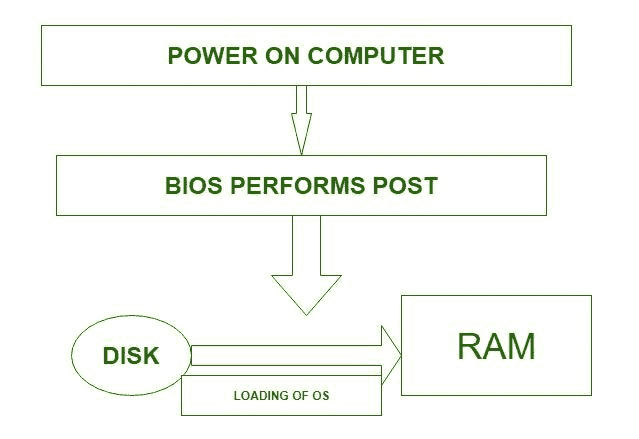

# 操作系统的引导和双引导

> 原文:[https://www . geesforgeks . org/操作系统引导和双引导/](https://www.geeksforgeeks.org/booting-and-dual-booting-of-operating-system/)

操作系统生成后，必须可供硬件使用。但是硬件如何知道内核在哪里，或者如何加载内核？通过加载内核启动计算机的过程称为**引导**系统。因此，它需要一个存储在只读存储器中的特殊程序来完成这个被称为引导加载程序的任务。示例:BIOS(引导输入输出系统)。现代电脑基本输入输出系统支持从各种设备启动。通常，基本输入输出系统允许用户配置引导顺序。如果引导顺序设置为:

*   光盘驱动器
*   硬式磁盘机
*   网络

然后，BIOS 会先尝试从光驱启动，如果失败，它会尝试从硬盘启动，如果失败，它会尝试从网络启动，如果失败，它根本不会启动。

引导是一个启动序列，它在计算机打开时启动操作系统。引导序列是计算机开机时执行的一组初始操作。每台计算机都有一个引导序列。引导加载程序定位内核，将其加载到主内存并开始执行。在某些系统中，一个简单的引导加载程序从磁盘获取一个更复杂的引导程序，然后再加载内核。

**双引导:**
当计算机系统上安装了两个操作系统时，称为双引导。事实上，在这样的系统上可以安装多个操作系统。但是系统如何知道该引导哪个操作系统呢？了解多个文件系统和多个操作系统的引导加载程序会占用引导空间。加载后，它可以引导磁盘上可用的操作系统之一。磁盘可以有多个分区，每个分区包含不同类型的操作系统。当计算机系统打开时，引导管理程序会显示一个菜单，允许用户选择要使用的操作系统。