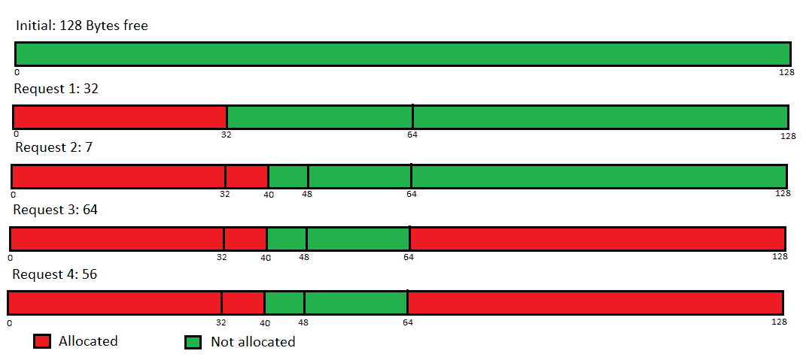

# 好友内存分配程序|设置 1(分配)

> 原文:[https://www . geesforgeks . org/buddy-memory-allocation-program-set-1-allocation/](https://www.geeksforgeeks.org/buddy-memory-allocation-program-set-1-allocation/)

先决条件–[好友系统](https://www.geeksforgeeks.org/operating-system-buddy-system-memory-allocation-technique/)
**问题:**写一个程序，实现操作系统内存分配的好友系统。
**解释–**
伙伴系统的实现如下——一个自由节点列表，所有不同的可能 2 次方，一直保持(因此如果总内存大小为 1 MB，我们将有 20 个自由列表要跟踪——一个用于大小为 1 字节的块，一个用于 2 字节，下一个用于 4 字节，以此类推)。
当分配请求到来时，我们寻找比它大的最小块。如果在空闲列表中找到这样的块，分配就完成了(比如，请求是 27 KB，跟踪 32 KB 块的空闲列表中至少有一个元素)，否则我们向上遍历空闲列表*，直到找到一个足够大的块。然后我们继续将其分成两个块-一个用于添加到下一个空闲列表(较小的大小)，一个用于遍历*到*树，直到我们到达目标并将请求的内存块返回给用户。如果这样的分配是不可能的，我们只需返回 null。*

***示例:**
让我们看看算法是如何通过跟踪大小为 128 KB 的内存块来进行的。最初，自由列表为:{}、{}、{}、{}、{}、{}、{}、{ }、{ }、{ }、{ (0，127) }*

*   ***请求:** 32 字节
    没有找到这样的块，所以我们向上遍历，将 0-127 块拆分为 0-63、64-127；我们将 64-127 添加到跟踪 64 字节块的列表中，并向下传递 0-63；再次将其分成 0-31 和 32-63；由于我们已经找到了所需的块大小，我们将 32-63 添加到跟踪 32 字节块的列表中，并将 0-31 返回给用户。
    列表为:{}、{}、{}、{}、{}、{}、{ (32，63) }、{ (64，127) }、{ }*
*   ***请求:** 7 字节
    没有找到这样的块-将块 32-63 分成两个块，即 32-47 和 48-63；然后将 32-47 分成 32-39 和 40-47；最后，返回 32-39 给用户(出现 1 字节的内部碎片)
    列表为:{}、{}、{}、{ (40，47) }、{ (48，63) }、{}、{ (64，127) }、{}*
*   ***请求:** 64 字节
    直接内存段 64-127 将被分配，因为它已经存在。
    列表为:{}、{}、{}、{ (40，47) }、{ (48，63) }、{}、{}、{}、{ }*
*   *请求:56 字节
    结果:未分配*

*结果如下:*

**

***图–**伙伴分配-128 显示了下一个可能的块的起始地址(如果主存储器大小增加)*

***实施–***

## *C++*

```
*#include<bits/stdc++.h>
using namespace std;

// Size of vector of pairs
int size;

// Global vector of pairs to store
// address ranges available in free list
vector<pair<int, int>> free_list[100000];

// Map used as hash map to store the starting
// address as key and size of allocated segment
// key as value
map<int, int> mp;

void initialize(int sz)
{

    // Maximum number of powers of 2 possible
    int n = ceil(log(sz) / log(2));
    size = n + 1;

    for(int i = 0; i <= n; i++)
        free_list[i].clear();

    // Initially whole block of specified
    // size is available
    free_list[n].push_back(make_pair(0, sz - 1));
}

void allocate(int sz)
{

    // Calculate index in free list
    // to search for block if available
    int n = ceil(log(sz) / log(2));

    // Block available
    if (free_list[n].size() > 0)
    {
        pair<int, int> temp = free_list[n][0];

        // Remove block from free list
        free_list[n].erase(free_list[n].begin());
        cout << "Memory from " << temp.first
             << " to " << temp.second << " allocated"
             << "\n";

        // map starting address with
        // size to make deallocating easy
        mp[temp.first] = temp.second -
                         temp.first + 1;
    }
    else
    {
        int i;
        for(i = n + 1; i < size; i++)
        {

            // Find block size greater than request
            if(free_list[i].size() != 0)
                break;
        }

        // If no such block is found
        // i.e., no memory block available
        if (i == size)
        {
            cout << "Sorry, failed to allocate memory \n";
        }

        // If found
        else
        {
            pair<int, int> temp;
            temp = free_list[i][0];

            // Remove first block to split it into halves
            free_list[i].erase(free_list[i].begin());
            i--;

            for(; i >= n; i--)
            {

                // Divide block into twwo halves
                pair<int, int> pair1, pair2;
                pair1 = make_pair(temp.first,
                                  temp.first +
                                  (temp.second -
                                  temp.first) / 2);
                pair2 = make_pair(temp.first +
                                  (temp.second -
                                  temp.first + 1) / 2,
                                  temp.second);

                free_list[i].push_back(pair1);

                // Push them in free list
                free_list[i].push_back(pair2);
                temp = free_list[i][0];

                // Remove first free block to
                // further split
                free_list[i].erase(free_list[i].begin());
            }
            cout << "Memory from " << temp.first
                 << " to " << temp.second
                 << " allocated" << "\n";

            mp[temp.first] = temp.second -
                             temp.first + 1;
        }
    }
}

// Driver code
int main()
{

    // Uncomment following code for interactive IO
    /*
    int total,c,req;
    cin>>total;
    initialize(total);
    while(true)
    {
        cin>>req;
        if(req < 0)
            break;
        allocate(req);
    }*/

    initialize(128);
    allocate(32);
    allocate(7);
    allocate(64);
    allocate(56);

    return 0;
}

// This code is contributed by sarthak_eddy*
```

## *Java 语言(一种计算机语言，尤用于创建网站)*

```
*import java.io.*;
import java.util.*;

class Buddy {

    // Inner class to store lower
    // and upper bounds of the allocated memory
    class Pair
    {
        int lb, ub;
        Pair(int a, int b)
        {
            lb = a;
            ub = b;
        }
    }

    // Size of main memory
    int size;

    // Array to track all
    // the free nodes of various sizes
    ArrayList<Pair> arr[];

    // Else compiler will give warning
    // about generic array creation
    @SuppressWarnings("unchecked")

    Buddy(int s)
    {
        size = s;

        // Gives us all possible powers of 2
        int x = (int)Math.ceil(Math.log(s) / Math.log(2));

        // One extra element is added
        // to simplify arithmetic calculations
        arr = new ArrayList[x + 1];

        for (int i = 0; i <= x; i++)
            arr[i] = new ArrayList<>();

        // Initially, only the largest block is free
        // and hence is on the free list   
        arr[x].add(new Pair(0, size - 1));
    }

    void allocate(int s)
    {

        // Calculate which free list to search to get the
        // smallest block large enough to fit the request
        int x = (int)Math.ceil(Math.log(s) / Math.log(2));

        int i;
        Pair temp = null;

        // We already have such a block
        if (arr[x].size() > 0)
        {

            // Remove from free list
            // as it will be allocated now
            temp = (Pair)arr[x].remove(0);
            System.out.println("Memory from " + temp.lb
                               + " to " + temp.ub + " allocated");
            return;
        }

        // If not, search for a larger block
        for (i = x + 1; i < arr.length; i++) {

            if (arr[i].size() == 0)
                continue;

            // Found a larger block, so break   
            break;
        }

        // This would be true if no such block was found
        // and array was exhausted
        if (i == arr.length)
        {
            System.out.println("Sorry, failed to allocate memory");
            return;
        }

        // Remove the first block
        temp = (Pair)arr[i].remove(0);

        i--;

        // Traverse down the list
        for (; i >= x; i--) {

            // Divide the block in two halves
            // lower index to half-1
            Pair newPair = new Pair(temp.lb, temp.lb
                                     + (temp.ub - temp.lb) / 2);

            // half to upper index
            Pair newPair2 = new Pair(temp.lb
                                  + (temp.ub - temp.lb + 1) / 2, temp.ub);

            // Add them to next list
            // which is tracking blocks of smaller size
            arr[i].add(newPair);
            arr[i].add(newPair2);

            // Remove a block to continue the downward pass
            temp = (Pair)arr[i].remove(0);
        }

        // Finally inform the user
        // of the allocated location in memory
        System.out.println("Memory from " + temp.lb
                            + " to " + temp.ub + " allocated");
    }

    public static void main(String args[]) throws IOException
    {
        int initialMemory = 0, val = 0;

        // Uncomment the below section for interactive I/O
        /*Scanner sc=new Scanner(System.in);
        initialMemory = sc.nextInt();
        Buddy obj = new Buddy(initialMemory);
        while(true)
        {
            val = sc.nextInt();// Accept the request
            if(val <= 0)
                break;
            obj.allocate(val);// Proceed to allocate
        }*/

        initialMemory = 128;

        // Initialize the object with main memory size
        Buddy obj = new Buddy(initialMemory);
        obj.allocate(32);
        obj.allocate(7);
        obj.allocate(64);
        obj.allocate(56);
    }
}*
```

## *C#*

```
*using System;
using System.Collections.Generic;

public class Buddy
{

    // Inner class to store lower
    // and upper bounds of the
    // allocated memory
    class Pair
    {
        public int lb, ub;
        public Pair(int a, int b)
        {
            lb = a;
            ub = b;
        }
    }

    // Size of main memory
    int size;

    // Array to track all
    // the free nodes of various sizes
    List<Pair> []arr;

    // Else compiler will give warning
    // about generic array creation
    Buddy(int s)
    {
        size = s;

        // Gives us all possible powers of 2
        int x = (int)Math.Ceiling(Math.Log(s) /
                                  Math.Log(2));

        // One extra element is added
        // to simplify arithmetic calculations
        arr = new List<Pair>[x + 1];

        for (int i = 0; i <= x; i++)
            arr[i] = new List<Pair>();

        // Initially, only the largest block is free
        // and hence is on the free list
        arr[x].Add(new Pair(0, size - 1));
    }

    void allocate(int s)
    {

        // Calculate which free list to search
        // to get the smallest block
        // large enough to fit the request
        int x = (int)Math.Ceiling(Math.Log(s) /
                                  Math.Log(2));

        int i;
        Pair temp = null;

        // We already have such a block
        if (arr[x].Count > 0)
        {

            // Remove from free list
            // as it will be allocated now
            temp = (Pair)arr[x][0];
                arr[x].RemoveAt(0);
            Console.WriteLine("Memory from " + temp.lb +
                       " to " + temp.ub + " allocated");
            return;
        }

        // If not, search for a larger block
        for (i = x + 1; i < arr.Length; i++)
        {
            if (arr[i].Count == 0)
                continue;

            // Found a larger block, so break
            break;
        }

        // This would be true if no such block
        // was found and array was exhausted
        if (i == arr.Length)
        {
            Console.WriteLine("Sorry, failed to" +
                              " allocate memory");
            return;
        }

        // Remove the first block
        temp = (Pair)arr[i][0];
        arr[i].RemoveAt(0);

        i--;

        // Traverse down the list
        for (; i >= x; i--)
        {

            // Divide the block in two halves
            // lower index to half-1
            Pair newPair = new Pair(temp.lb, temp.lb +
                                   (temp.ub - temp.lb) / 2);

            // half to upper index
            Pair newPair2 = new Pair(temp.lb + (temp.ub -
                              temp.lb + 1) / 2, temp.ub);

            // Add them to next list which is
            // tracking blocks of smaller size
            arr[i].Add(newPair);
            arr[i].Add(newPair2);

            // Remove a block to continue
            // the downward pass
            temp = (Pair)arr[i][0];
            arr[i].RemoveAt(0);
        }

        // Finally inform the user
        // of the allocated location in memory
        Console.WriteLine("Memory from " + temp.lb +
                   " to " + temp.ub + " allocated");
    }

    // Driver Code
    public static void Main(String []args)
    {
        int initialMemory = 0;
        initialMemory = 128;

        // Initialize the object with main memory size
        Buddy obj = new Buddy(initialMemory);
        obj.allocate(32);
        obj.allocate(7);
        obj.allocate(64);
        obj.allocate(56);
    }
}

// This code is contributed by 29AjayKumar*
```

## *java 描述语言*

```
*<script>

// Inner class to store lower
// and upper bounds of the allocated memory
class Pair
{
    constructor(a, b)
    {
        this.lb = a;
        this.ub = b;
    }
}

let size;
let arr;

function Buddy(s)
{
    size = s;

    // Gives us all possible powers of 2
    let x = Math.ceil(Math.log(s) / Math.log(2));

    // One extra element is added
    // to simplify arithmetic calculations
    arr = new Array(x + 1);

    for(let i = 0; i <= x; i++)
        arr[i] =[];

    // Initially, only the largest block is free
    // and hence is on the free list   
    arr[x].push(new Pair(0, size - 1));
}

function allocate(s)
{

    // Calculate which free list to search to get the
    // smallest block large enough to fit the request
    let x = Math.floor(Math.ceil(
            Math.log(s) / Math.log(2)));

    let i;
    let temp = null;

    // We already have such a block
    if (arr[x].length > 0)
    {

        // Remove from free list
        // as it will be allocated now
        temp = arr[x].shift();
        document.write("Memory from " + temp.lb +
                       " to " + temp.ub + " allocated<br>");
        return;
    }

    // If not, search for a larger block
    for(i = x + 1; i < arr.length; i++)
    {
        if (arr[i].length == 0)
            continue;

        // Found a larger block, so break   
        break;
    }

    // This would be true if no such block was
    // found and array was exhausted
    if (i == arr.length)
    {
        document.write("Sorry, failed to " +
                       "allocate memory<br>");
        return;
    }

    // Remove the first block
    temp = arr[i].shift(0);

    i--;

    // Traverse down the list
    for(; i >= x; i--)
    {

        // Divide the block in two halves
        // lower index to half-1
        let newPair = new Pair(temp.lb,
                               temp.lb +
                               Math.floor(
                                   (temp.ub -
                                    temp.lb) / 2));

        // half to upper index
        let newPair2 = new Pair(temp.lb +
                                Math.floor(
                                    (temp.ub -
                                     temp.lb + 1) / 2),
                                     temp.ub);

        // Add them to next list which is
        // tracking blocks of smaller size
        arr[i].push(newPair);
        arr[i].push(newPair2);

        // Remove a block to continue
        // the downward pass
        temp = arr[i].shift(0);
    }

    // Finally inform the user
    // of the allocated location in memory
    document.write("Memory from " + temp.lb +
                   " to " + temp.ub + " allocated<br>");
}

// Driver code
let initialMemory = 0, val = 0;

// Uncomment the below section for interactive I/O
/*Scanner sc=new Scanner(System.in);
        initialMemory = sc.nextInt();
        Buddy obj = new Buddy(initialMemory);
        while(true)
        {
            val = sc.nextInt();// Accept the request
            if(val <= 0)
                break;
            obj.allocate(val);// Proceed to allocate
        }*/

initialMemory = 128;

// Initialize the object with main memory size
Buddy(initialMemory);
allocate(32);
allocate(7);
allocate(64);
allocate(56);

// This code is contributed by rag2127

</script>*
```

***Output:** 

```
Memory from 0 to 31 allocated
Memory from 32 to 39 allocated
Memory from 64 to 127 allocated
Sorry, failed to allocate memory 
```* 

***时间复杂度–**
如果主内存大小是 **n** ，我们有 log(n)个不同的 2 的幂，因此在跟踪自由列表的数组(代码中命名为 **arr** )中有 log(n)个元素。要分配一个块，我们只需要向上遍历数组一次，向下遍历一次，因此时间复杂度为 **O(2log(n))** 或简单的 **O(logn)***