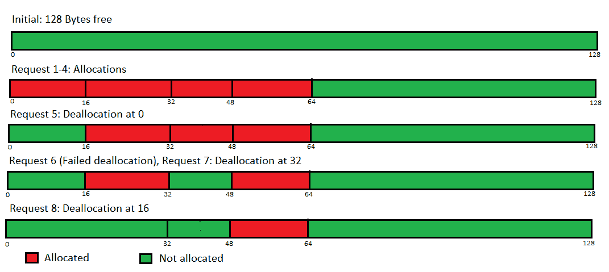

# 伙伴内存分配程序|集合 2(解除分配)

> 原文:[https://www . geeksforgeeks . org/buddy-memory-allocation-program-set-2-deaclaration/](https://www.geeksforgeeks.org/buddy-memory-allocation-program-set-2-deallocation/)

先决条件–[好友分配|集合 1](https://www.geeksforgeeks.org/program-for-buddy-memory-allocation-scheme-in-operating-systems-set-1-allocation/)
**问题:**编写一个程序，实现操作系统中内存分配和解除分配的好友系统。
**解释–**
正如我们从集合 1 中已经知道的，分配是通过自由列表的使用来完成的。现在，对于解除分配，我们将维护一个额外的数据结构——一个以段的起始地址为键，段的大小为值的 Map(c++中的无序集，Java 中的 HashMap)，并在分配请求到来时更新它。现在，当一个解除分配请求到来时，我们将首先检查映射，看看它是否是一个有效的请求。如果是这样的话，我们将把这个块添加到自由列表中，跟踪它们的大小。然后，我们将搜索自由列表，看看它的*伙伴*是否是自由的——如果是，我们将合并这些块，并将它们放在它们上面的自由列表中(它跟踪两倍大小的块)，否则我们不会合并，然后简单地返回。
如何知道哪个区块是给定区块的好友？
我们来定义两个术语-**buddynnumber**和**buddyadress**。块的**buddynnumber**由下式计算:

```
(base_address-starting_address_of_main_memory)/block_size
```

我们注意到这总是一个整数，因为分子和分母都是 2 的幂。现在，一个区块将是另一个区块的伙伴，如果它们都是由同一个更大的区块分裂形成的。例如，如果 4 个 16 字节的连续分配请求到来，我们将结束于块 0-15、16-31、32-47、48-63，其中块 0-15 和 16-31 是伙伴(因为它们是通过分割块 0-32 形成的)，但是 0-15 和 32-47 不是。一个区块的**buddyadress**是其伙伴区块的起始索引，由公式
给出

```
block_starting_address+block_size (if buddyNumber is even)
block_starting_address-block_size (if buddyNumber is odd)
```

因此，我们所要做的就是在空闲列表中找到这个**buddyadress**(通过与该特定列表中的所有起始地址进行比较)，如果存在，就可以进行合并。
**示例:**
让我们看看算法是如何通过跟踪大小为 128 KB 的内存块来进行的。最初，自由列表为:{}、{}、{}、{}、{}、{}、{}、{ }、{ }、{ }、{ (0，127) }

*   **分配请求:** 16 字节
    没有找到这样的块，所以我们向上遍历，将 0-127 块拆分为 0-63、64-127；我们将 64-127 添加到跟踪 64 字节块的列表中，并向下传递 0-63；再次将其分成 0-31 和 32-63；我们添加 32-63 来列出跟踪 32 字节的块，向下传递 0-31；再拆分一次，将 0-15 返回给用户，同时将 16-31 添加到跟踪 16 字节块的自由列表中。
    列表为:{}、{}、{}、{}、{}、{ (16，31) }、{ (32，63) }、{ (64，127) }、{ }
*   **分配请求:** 16 字节
    直接内存段 16-31 将被分配，因为它已经存在。
    列表为:{}、{}、{}、{}、{}、{}、{ (32，63) }、{ (64，127) }、{ }
*   **分配请求:** 16 字节
    没有找到这样的块，所以我们将向上遍历到块 32-63，并将其分成块 32-47 和 48-63；我们将在跟踪 16 字节块的列表中添加 48-63，并向用户返回 32-47。
    列表为:{}、{}、{}、{}、{}、{ (48，63) }、{}、{ (64，127) }、{ }
*   **分配请求:** 16 字节
    直接内存段 48-63 将被分配，因为它已经存在。
    列表为:{}、{}、{}、{}、{}、{}、{}、{ }、{ (64，127) }、{ }
*   **解除分配请求:**开始索引= 0
    将进行解除分配，但不可能合并，因为其**buddynnumber**为 0，**buddyadress**为 16(通过公式)，这些都不在空闲列表中。
    列表为:{}、{}、{}、{}、{}、{ (0，15) }、{}、{ (64，127) }、{ }
*   **解除分配请求:**开始索引= 9
    结果:请求无效，因为从未分配过该段。
    列表为:{}、{}、{}、{}、{}、{ (0，15) }、{}、{ (64，127) }、{ }
*   **解除分配请求:**开始索引= 32
    将进行解除分配，但不可能合并，因为块的**buddynnumber**分别为 0 和 2**buddyadress**分别为 16 和 48，它们都不在空闲列表中。
    列表为:{}，{}，{}，{}，{ (0，15)，(32-47) }，{}，{ (64，127) }，{}
*   **解除分配请求:**开始索引= 16
    解除分配将完成，块 0-15 和 16-31 的合并也将完成，因为块 16-31 的**地址**为 0，它存在于跟踪 16 字节块的空闲列表中。
    列表为:{}、{}、{}、{}、{}、{ (32-47) }、{ (0，31) }、{ (64，127) }、{ }



**Figure –** Buddy algorithm-allocation and deallocation

**实现–**
下面是完整的程序。

## C++

```
#include<bits/stdc++.h>
using namespace std;

// Size of vector of pairs
int size;

// Global vector of pairs to track all
// the free nodes of various sizes
vector<pair<int, int>> arr[100000];

// Map used as hash map to store the
// starting address as key and size
// of allocated segment key as value
map<int, int> mp;

void Buddy(int s)
{

    // Maximum number of powers of 2 possible
    int n = ceil(log(s) / log(2));

    size = n + 1;
    for(int i = 0; i <= n; i++)
        arr[i].clear();

    // Initially whole block of specified
    // size is available
    arr[n].push_back(make_pair(0, s - 1));
}

void allocate(int s)
{

    // Calculate index in free list
    // to search for block if available
    int x = ceil(log(s) / log(2));

    // Block available
    if (arr[x].size() > 0)
    {
        pair<int, int> temp = arr[x][0];

        // Remove block from free list
        arr[x].erase(arr[x].begin());

        cout << "Memory from " << temp.first
             << " to " << temp.second
             << " allocated" << "\n";

        // Map starting address with
        // size to make deallocating easy
        mp[temp.first] = temp.second -
                         temp.first + 1;
    }
    else
    {
        int i;

        // If not, search for a larger block
        for(i = x + 1; i < size; i++)
        {

            // Find block size greater
            // than request
            if (arr[i].size() != 0)
                break;
        }

        // If no such block is found
        // i.e., no memory block available
        if (i == size)
        {
            cout << "Sorry, failed to allocate memory\n";
        }

        // If found
        else
        {
            pair<int, int> temp;
            temp = arr[i][0];

            // Remove first block to split
            // it into halves
            arr[i].erase(arr[i].begin());
            i--;

            for(;i >= x; i--)
            {

                // Divide block into two halves
                pair<int, int> pair1, pair2;
                pair1 = make_pair(temp.first,
                                  temp.first +
                                 (temp.second -
                                  temp.first) / 2);
                pair2 = make_pair(temp.first +
                                 (temp.second -
                                  temp.first + 1) / 2,
                                  temp.second);

                arr[i].push_back(pair1);

                // Push them in free list
                arr[i].push_back(pair2);
                temp = arr[i][0];

                // Remove first free block to
                // further split
                arr[i].erase(arr[i].begin());
            }

            cout << "Memory from " << temp.first
                 << " to " << temp.second
                 << " allocate" << "\n";

            mp[temp.first] = temp.second -
                             temp.first + 1;
        }
    }
}

void deallocate(int id)
{

    // If no such starting address available
    if(mp.find(id) == mp.end())
    {
        cout << "Sorry, invalid free request\n";
        return;
    }

    // Size of block to be searched
    int n = ceil(log(mp[id]) / log(2));

    int i, buddyNumber, buddyAddress;

    // Add the block in free list
    arr[n].push_back(make_pair(id,
                               id + pow(2, n) - 1));
    cout << "Memory block from " << id
         << " to "<< id + pow(2, n) - 1
         << " freed\n";

    // Calculate buddy number
    buddyNumber = id / mp[id];

    if (buddyNumber % 2 != 0)
        buddyAddress = id - pow(2, n);
    else
        buddyAddress = id + pow(2, n);

    // Search in free list to find it's buddy
    for(i = 0; i < arr[n].size(); i++)
    {

        // If buddy found and is also free
        if (arr[n][i].first == buddyAddress)
        {

            // Now merge the buddies to make
            // them one large free memory block
            if (buddyNumber % 2 == 0)
            {
                arr[n + 1].push_back(make_pair(id,
                   id + 2 * (pow(2, n) - 1)));

                cout << "Coalescing of blocks starting at "
                     << id << " and " << buddyAddress
                     << " was done" << "\n";
            }
            else
            {
                arr[n + 1].push_back(make_pair(
                    buddyAddress, buddyAddress +
                    2 * (pow(2, n))));

                cout << "Coalescing of blocks starting at "
                     << buddyAddress << " and "
                     << id << " was done" << "\n";
            }
            arr[n].erase(arr[n].begin() + i);
            arr[n].erase(arr[n].begin() +
            arr[n].size() - 1);
            break;
        }
    }

    // Remove the key existence from map
    mp.erase(id);
}

// Driver code
int main()
{

    // Uncomment following code for interactive IO
    /*
    int total,c,req;
    cout<<"Enter Total Memory Size (in Bytes) => ";
    cin>>total;
    initialize(total);
    label:
    while(1)
    {
        cout<<"\n1\. Add Process into Memory\n
        2\. Remove Process \n3\. Allocation Map\n4\. Exit\n=> ";
        cin>>c;
        switch(c)
        {
            case 1:
            cout<<"Enter Process Size (in Bytes) => ";
            cin>>req;
            cout<<"\n===>";
            allocate(req);
            break;

            case 2:
            cout<<"Enter Starting Address => ";
            cin>>req;
            cout<<"\n===>";
            deallocate(req);
            break;

            case 3:
            print();
            break;

            case 4:
            exit(0);
            break;

            default:
            goto label;
        }
    }*/

    Buddy(128);
    allocate(16);
    allocate(16);
    allocate(16);
    allocate(16);
    deallocate(0);
    deallocate(9);
    deallocate(32);
    deallocate(16);

    return 0;
}

// This code is contributed by sarthak_eddy
```

## Java 语言(一种计算机语言，尤用于创建网站)

```
import java.io.*;
import java.util.*;

class Buddy {

    // Inner class to store lower
    // and upper bounds of the allocated memory
    class Pair {

        int lb, ub;
        Pair(int a, int b)
        {
            lb = a;
            ub = b;
        }
    }

    // Size of main memory
    int size;

    // Array to track all
    // the free nodes of various sizes
    ArrayList<Pair> arr[];

    // Hashmap to store the starting
    // address and size of allocated segment
    // Key is starting address, size is value
    HashMap<Integer, Integer> hm;

    // Else compiler will give warning
    // about generic array creation
    @SuppressWarnings("unchecked")
    Buddy(int s)
    {

        size = s;
        hm = new HashMap<>();

        // Gives us all possible powers of 2
        int x = (int)Math.ceil(Math.log(s) / Math.log(2));

        // One extra element is added
        // to simplify arithmetic calculations
        arr = new ArrayList[x + 1];

        for (int i = 0; i <= x; i++)
            arr[i] = new ArrayList<>();

        // Initially, only the largest block is free
        // and hence is on the free list
        arr[x].add(new Pair(0, size - 1));
    }

    void allocate(int s)
    {

        // Calculate which free list to search to get the
        // smallest block large enough to fit the request
        int x = (int)Math.ceil(Math.log(s) / Math.log(2));

        int i;
        Pair temp = null;

        // We already have such a block
        if (arr[x].size() > 0) {

            // Remove from free list
            // as it will be allocated now
            temp = (Pair)arr[x].remove(0);
            System.out.println("Memory from " + temp.lb
                            + " to " + temp.ub + " allocated");

            // Store in HashMap
            hm.put(temp.lb, temp.ub - temp.lb + 1);
            return;
        }

        // If not, search for a larger block
        for (i = x + 1; i < arr.length; i++) {

            if (arr[i].size() == 0)
                continue;

            // Found a larger block, so break
            break;
        }

        // This would be true if no such block was found
        // and array was exhausted
        if (i == arr.length) {

            System.out.println("Sorry, failed to allocate memory");
            return;
        }

        // Remove the first block
        temp = (Pair)arr[i].remove(0);

        i--;

        // Traverse down the list
        for (; i >= x; i--) {

            // Divide the block in two halves
            // lower index to half-1
            Pair newPair = new Pair(temp.lb, temp.lb
                                    + (temp.ub - temp.lb) / 2);

            // half to upper index
            Pair newPair2 = new Pair(temp.lb
                                    + (temp.ub - temp.lb + 1) / 2,
                                    temp.ub);

            // Add them to next list
            // which is tracking blocks of smaller size
            arr[i].add(newPair);
            arr[i].add(newPair2);

            // Remove a block to continue the downward pass
            temp = (Pair)arr[i].remove(0);
        }

        // Finally inform the user
        // of the allocated location in memory
        System.out.println("Memory from " + temp.lb
                        + " to " + temp.ub + " allocated");

        // Store in HashMap
        hm.put(temp.lb, temp.ub - temp.lb + 1);
    }
    void deallocate(int s)
    {
        // Invalid reference, as this was never allocated
        if (!hm.containsKey(s)) {
            System.out.println("Sorry, invalid free request");
            return;
        }

        // Get the list which will track free blocks
        // of this size
        int x = (int)Math.ceil(Math.log(hm.get(s))
                                        / Math.log(2));
        int i, buddyNumber, buddyAddress;

        // Add it to the free list
        arr[x].add(new Pair(s, s + (int)Math.pow(2, x) - 1));
        System.out.println("Memory block from " + s + " to "
                           + (s + (int)Math.pow(2, x) - 1) + " freed");

        // Calculate it's buddy number and buddyAddress. The
        // base address is implicitly 0 in this program, so no
        // subtraction is necessary for calculating buddyNumber
        buddyNumber = s / hm.get(s);

        if (buddyNumber % 2 != 0) {
            buddyAddress = s - (int)Math.pow(2, x);
        }

        else {
            buddyAddress = s + (int)Math.pow(2, x);
        }

        // Search in the free list for buddy
        for (i = 0; i < arr[x].size(); i++) {

            // This indicates the buddy is also free
            if (arr[x].get(i).lb == buddyAddress) {

                // Buddy is the block after block
                // with this base address
                if (buddyNumber % 2 == 0) {

                    // Add to appropriate free list
                    arr[x + 1].add(new Pair(s, s
                                  + 2 * ((int)Math.pow(2, x)) - 1));
                    System.out.println("Coalescing of blocks starting at "
                                            + s + " and "
                                            + buddyAddress + " was done");
                }

                // Buddy is the block before block
                // with this base address
                else {

                    // Add to appropriate free list
                    arr[x + 1].add(new Pair(buddyAddress,
                                    buddyAddress + 2 * ((int)Math.pow(2, x))
                                                                         - 1));
                    System.out.println("Coalescing of blocks starting at "
                                                + buddyAddress + " and "
                                                + s + " was done");
                }

                // Remove the individual segments
                // as they have coalesced
                arr[x].remove(i);
                arr[x].remove(arr[x].size() - 1);
                break;
            }
        }

        // Remove entry from HashMap
        hm.remove(s);
    }

    public static void main(String args[]) throws IOException
    {
        int initialMemory = 0, type = -1, val = 0;

        // Uncomment below section for interactive I/O
        /*Scanner sc=new Scanner(System.in);
        initialMemory = sc.nextInt();
        Buddy obj=new Buddy(initialMemory);
        while(true)
        {
            type = sc.nextInt();
            if(type==-1)
            break;
            else if(type==1)
            {
                val=sc.nextInt();
                obj.allocate(val);
            }
            else
            {
                val=sc.nextInt();
                obj.deallocate(val);
            }
        }*/

        initialMemory = 128;
        Buddy obj = new Buddy(initialMemory);
        obj.allocate(16);
        obj.allocate(16);
        obj.allocate(16);
        obj.allocate(16);
        obj.deallocate(0);
        obj.deallocate(9);
        obj.deallocate(32);
        obj.deallocate(16);
    }
}
```

## C#

```
using System;
using System.Collections.Generic;

public class Buddy
{

    // Inner class to store lower
    // and upper bounds of the
    // allocated memory
    class Pair
    {
        public int lb, ub;
        public Pair(int a, int b)
        {
            lb = a;
            ub = b;
        }
    }

    // Size of main memory
    int size;

    // Array to track all
    // the free nodes of various sizes
    List<Pair> []arr;

    // Hashmap to store the starting
    // address and size of allocated segment
    // Key is starting address, size is value
    Dictionary<int, int> hm;

    // Else compiler will give warning
    // about generic array creation
    Buddy(int s)
    {

        size = s;
        hm = new Dictionary<int, int>();

        // Gives us all possible powers of 2
        int x = (int)Math.Ceiling(Math.Log(s) /
                                  Math.Log(2));

        // One extra element is added
        // to simplify arithmetic calculations
        arr = new List<Pair>[x + 1];

        for (int i = 0; i <= x; i++)
            arr[i] = new List<Pair>();

        // Initially, only the largest block is
        // free and hence is on the free list
        arr[x].Add(new Pair(0, size - 1));
    }

    void allocate(int s)
    {

        // Calculate which free list to
        // search to get the smallest block
        // large enough to fit the request
        int x = (int)Math.Ceiling(Math.Log(s) /
                                  Math.Log(2));

        int i;
        Pair temp = null;

        // We already have such a block
        if (arr[x].Count > 0)
        {

            // Remove from free list
            // as it will be allocated now
            temp = (Pair)arr[x][0];
            arr[x].RemoveAt(0);
            Console.WriteLine("Memory from " + temp.lb +
                       " to " + temp.ub + " allocated");

            // Store in Dictionary
            hm.Add(temp.lb, temp.ub - temp.lb + 1);
            return;
        }

        // If not, search for a larger block
        for (i = x + 1; i < arr.Length; i++)
        {
            if (arr[i].Count == 0)
                continue;

            // Found a larger block, so break
            break;
        }

        // This would be true if no such block
        // was found and array was exhausted
        if (i == arr.Length)
        {
            Console.WriteLine("Sorry, failed to" +
                              " allocate memory");
            return;
        }

        // Remove the first block
        temp = (Pair)arr[i][0];
        arr[i].RemoveAt(0);

        i--;

        // Traverse down the list
        for (; i >= x; i--)
        {

            // Divide the block in two halves
            // lower index to half-1
            Pair newPair = new Pair(temp.lb, temp.lb +
                                   (temp.ub - temp.lb) / 2);

            // half to upper index
            Pair newPair2 = new Pair(temp.lb + (temp.ub -
                                     temp.lb + 1) / 2, temp.ub);

            // Add them to next list
            // which is tracking blocks of
            // smaller size
            arr[i].Add(newPair);
            arr[i].Add(newPair2);

            // Remove a block to continue
            // the downward pass
            temp = (Pair)arr[i][0];
            arr[i].RemoveAt(0);
        }

        // Finally inform the user
        // of the allocated location in memory
        Console.WriteLine("Memory from " + temp.lb +
                   " to " + temp.ub + " allocated");

        // Store in Dictionary
        hm.Add(temp.lb, temp.ub - temp.lb + 1);
    }

    void deallocate(int s)
    {

        // Invalid reference,
        // as this was never allocated
        if (!hm.ContainsKey(s))
        {
            Console.WriteLine("Sorry, invalid free request");
            return;
        }

        // Get the list which will track free blocks
        // of this size
        int x = (int)Math.Ceiling(Math.Log(hm[s]) /
                                  Math.Log(2));
        int i, buddyNumber, buddyAddress;

        // Add it to the free list
        arr[x].Add(new Pair(s, s +
                  (int)Math.Pow(2, x) - 1));
        Console.WriteLine("Memory block from " + s +
                                       " to " + (s +
               (int)Math.Pow(2, x) - 1) + " freed");

        // Calculate it's buddy number and
        // buddyAddress. The base address is
        // implicitly 0 in this program,
        // so no subtraction is necessary for
        // calculating buddyNumber
        buddyNumber = s / hm[s];

        if (buddyNumber % 2 != 0)
        {
            buddyAddress = s - (int)Math.Pow(2, x);
        }
        else
        {
            buddyAddress = s + (int)Math.Pow(2, x);
        }

        // Search in the free list for buddy
        for (i = 0; i < arr[x].Count; i++)
        {

            // This indicates the buddy is also free
            if (arr[x][i].lb == buddyAddress)
            {

                // Buddy is the block after block
                // with this base address
                if (buddyNumber % 2 == 0)
                {

                    // Add to appropriate free list
                    arr[x + 1].Add(new Pair(s, s + 2 *
                                 ((int)Math.Pow(2, x)) - 1));
                    Console.WriteLine("Coalescing of blocks starting at " +
                                 s + " and " + buddyAddress + " was done");
                }

                // Buddy is the block before block
                // with this base address
                else
                {

                    // Add to appropriate free list
                    arr[x + 1].Add(new Pair(buddyAddress,
                                            buddyAddress +
                                  2 * ((int)Math.Pow(2, x)) - 1));
                    Console.WriteLine("Coalescing of blocks starting at " +
                                 buddyAddress + " and " + s + " was done");
                }

                // Remove the individual segments
                // as they have coalesced
                arr[x].RemoveAt(i);
                arr[x].RemoveAt(arr[x].Count - 1);
                break;
            }
        }

        // Remove entry from Dictionary
        hm.Remove(s);
    }

    // Driver Code
    public static void Main(String []args)
    {
        int initialMemory = 0;
        initialMemory = 128;
        Buddy obj = new Buddy(initialMemory);
        obj.allocate(16);
        obj.allocate(16);
        obj.allocate(16);
        obj.allocate(16);
        obj.deallocate(0);
        obj.deallocate(9);
        obj.deallocate(32);
        obj.deallocate(16);
    }
}

// This code is contributed by 29AjayKumar
```

**Output:** 

```
Memory from 0 to 15 allocated
Memory from 16 to 31 allocated
Memory from 32 to 47 allocated
Memory from 48 to 63 allocated
Memory block from 0 to 15 freed
Sorry, invalid free request
Memory block from 32 to 47 freed
Memory block from 16 to 31 freed
Coalescing of blocks starting at 0 and 16 was done
```

**时间复杂度–**
如集合 1 中已经讨论的，分配的时间复杂度是 **O(log(n))** 。对于解除分配，在最坏的情况下，所有分配的块的大小可以是 1 个单位，这将需要 **O(n)** 时间来扫描列表以进行合并。然而，在实践中，这种分配极不可能发生，因此它通常比线性时间快得多。