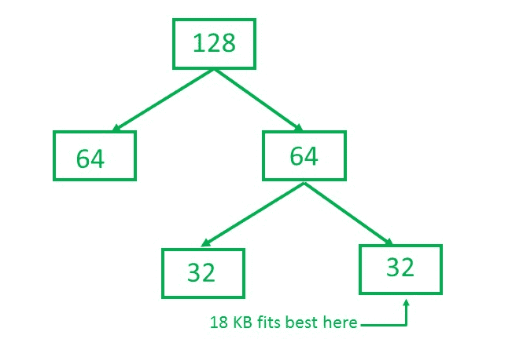

# 伙伴系统–内存分配技术

> 原文:[https://www . geesforgeks . org/buddy-system-memory-allocation-technology/](https://www.geeksforgeeks.org/buddy-system-memory-allocation-technique/)

先决条件–[分区分配方法](https://www.geeksforgeeks.org/operating-system-memory-management-partition-allocation-method/)
**静态分区**方案受到**限制**的影响，即具有固定数量的活动进程，并且空间的使用也可能不是最优的。**伙伴系统**是一种内存分配和管理算法，以两次增量的**次方管理内存。假设内存大小为 2 U ，假设需要 S 的大小。**

*   **如果 2U-1T6<= 2U:**分配整个区块
*   **Else:** 递归等分块，每次测试条件，满足时分配块，退出循环。

系统还保存每个未分配块的记录，并且可以合并这些不同大小的块以形成一个大块。
**优势–**

*   易于实施的伙伴系统
*   正确大小的已分配块
*   很容易合并相邻的孔
*   快速分配内存和取消分配内存

**劣势–**

*   它要求所有分配单位都是 2 的幂
*   它导致内部分裂

**示例–**
考虑一个具有物理地址空间为 128 KB 的伙伴系统的系统。计算 18 KB 进程的分区大小。
**解决方案–**

所以，分区大小为 18 KB 的进程= 32 KB。它除以 2，直到可以得到适合 18 KB 的最小块。