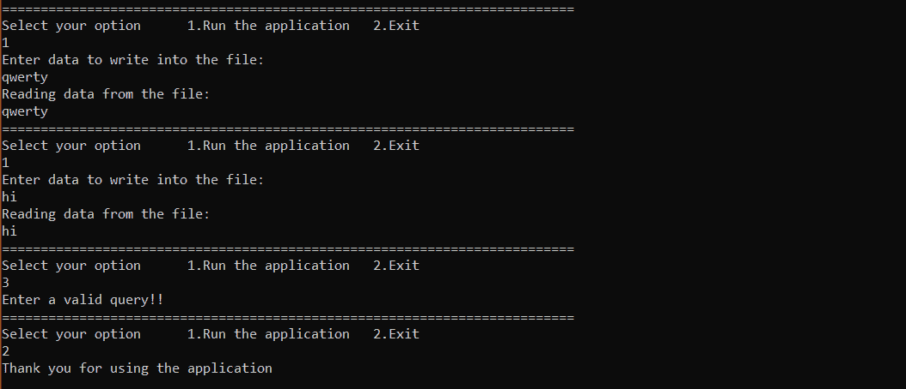

# 使用 Windows 线程的 C++文件写入器-读取器应用程序

> 原文:[https://www . geesforgeks . org/c-file-writer-reader-application-use-windows-threads/](https://www.geeksforgeeks.org/c-file-writer-reader-application-using-windows-threads/)

在本文中，我们将创建一个简单的 [Writer-Reader](https://www.geeksforgeeks.org/readers-writers-problem-set-1-introduction-and-readers-preference-solution/) 应用程序，它使用两个线程，一个用于写入文件，另一个用于读取文件。这里我们将讨论在 C/C++ 中使用 **Win32 线程的方法。可以使用[创建线程()方法](https://docs.microsoft.com/en-us/windows/win32/api/processthreadsapi/nf-processthreadsapi-createthread)创建窗口线程。**

**进场:**

1.  创建从文件

    ```
    // Thread function used to Read data from the file
    DWORD WINAPI ReadFromAFile(PVOID lpParam)
    {
        // Create a buffer
        char buffer[1024] = { 0 };

        // Creating ifstream object
        ifstream fileReader;

        // Opening the file in read mode
        fileReader.open("sample.txt");

        // Reading the data into the buffer
        cout << "Reading data from the file:";

        // Printing the data onto the console
        cout << buffer << endl;

        // Closing the opened file
        fileReader.close();

        return 1;
    }
    ```

    读取数据的线程函数
2.  创建一个线程函数将数据写入文件

    ```
    // Thread function used to Write data into the file
    DWORD WINAPI WriteIntoAFile(PVOID lpParam)
    {
        // Create a buffer
        char buffer[1024] = { 0 };

        // Creating ofstream object
        ofstream fileWriter;

        // Opening the file in write mode
        fileWriter.open("sample.txt");
        cout << "Enter data to write into the file:";

        // Write the given input into the file
        fileWriter << buffer << endl;

        // Closing the opened file
        fileWriter.close();

        return 1;
    }
    ```

3.  使用[创建线程](https://docs.microsoft.com/en-us/windows/win32/api/processthreadsapi/nf-processthreadsapi-createthread)功能创建两个线程，用于从文件中写入和读取数据
4.  使用 [WaitForSingleObject](https://docs.microsoft.com/en-us/windows/win32/api/synchapi/nf-synchapi-waitforsingleobject) 等待，直到指定对象处于信号状态或超时间隔过去。

以下是上述方案的实施情况:

```
// C++ program for File Writer-Reader
// application using Windows Threads

#include <fstream>
#include <iostream>
#include <string.h>
#include <winsock2.h>

using namespace std;

// Thread function used to Read data from the file
DWORD WINAPI ReadFromAFile(PVOID lpParam)
{
    // Create a buffer
    char buffer[1024] = { 0 };

    // Creating ifstream object
    ifstream fileReader;

    // Opening the file in read mode
    fileReader.open("sample.txt");

    // Reading the data into the buffer
    cout << "Reading data from the file:" << endl;

    fileReader >> buffer;
    // Printing the data onto the console
    cout << buffer << endl;

    // Closing the opened file
    fileReader.close();
    return 1;
}

// Thread function used to Write data into the file
DWORD WINAPI WriteIntoAFile(PVOID lpParam)
{
    // Create a buffer
    char buffer[1024] = { 0 };

    // Creating ofstream object
    ofstream fileWriter;

    // Opening the file in write mode
    fileWriter.open("sample.txt");
    cout << "Enter data to write "
         << "into the file:"
         << endl;
    cin >> buffer;

    // Write the given input into the file
    fileWriter << buffer << endl;

    // Closing the opened file
    fileWriter.close();

    return 1;
}

// Driver code
int main()
{
    WSADATA WSAData;
    char buffer[1024];
    DWORD tid;
    ofstream fileWriter;
    ifstream fileReader;
    HANDLE t1, t2;
    int choice, flag = 1;

    while (flag) {
        cout << "================================"
             << "========================"
             << "==================" << endl;
        cout << "Select your option"
             << "\t1.Run the application "
             << "\t2.Exit" << endl;
        cin >> choice;

        switch (choice) {

        case 1:
            // Create the first thread for Writing
            t1 = CreateThread(NULL, 0,
                              WriteIntoAFile,
                              &fileWriter,
                              0, &tid);
            WaitForSingleObject(t1, INFINITE);

            // Create the second thread for Reading
            t2 = CreateThread(NULL, 0,
                              ReadFromAFile,
                              &fileReader,
                              0, &tid);
            WaitForSingleObject(t2, INFINITE);
            break;

        case 2:
            // Exiting the application
            cout << "Thank you for using"
                 << " the application"
                 << endl;
            flag = 0;
            break;

        default:
            // For any query other than 1 and 2
            cout << "Enter a valid query!!"
                 << endl;
        }
    }
    return 0;
}
```

**使用命令**在 cmd 中运行应用程序:

```
g++ MultiThreading.cpp -lws2_32
```

**输出:**
[](https://media.geeksforgeeks.org/wp-content/uploads/20200303143126/output222.png)