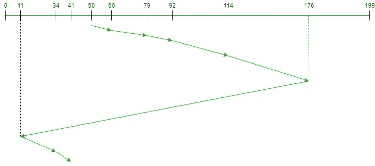

# C-LOOK 磁盘调度算法

> 原文:[https://www . geesforgeks . org/c-look-disk-scheduling-algorithm/](https://www.geeksforgeeks.org/c-look-disk-scheduling-algorithm/)

**先决条件:** [磁盘调度算法](https://www.geeksforgeeks.org/disk-scheduling-algorithms/)

给定一组磁盘磁道号和初始磁头位置，如果使用 **C-LOOK** 磁盘调度算法，我们的任务是找到访问所有请求磁道的寻道操作总数。另外，使用 **C-LOOK** 磁盘调度算法编写一个程序来查找寻道序列。

**C-LOOK(循环 LOOK)磁盘调度算法:**
**C-LOOK** 是 **SCAN** 和 **LOOK** 磁盘调度算法的增强版本。该算法也采用了 C-SCAN 算法将轨迹包裹成圆柱的思想，但寻道时间优于 C-SCAN 算法。我们知道 C-SCAN 是用来避免饥饿和更统一地服务所有请求的，C-LOOK 也是如此。
在该算法中，头部仅在一个方向(左或右)上服务请求，直到该方向上的所有请求都没有被服务，然后跳回到另一个方向上最远的请求，并服务剩余的请求，这提供了更好的统一服务，并且避免了浪费寻道时间直到磁盘结束。

**算法-**

1.  Let Request 数组表示一个数组，该数组存储已按到达时间升序请求的磁道索引，**磁头**是磁盘磁头的位置。
2.  给出了磁头移动的初始方向，并且它在相同的方向上服务。
3.  头部在它移动的方向上一个接一个地服务所有请求。
4.  磁头继续向同一个方向移动，直到这个方向上的所有请求都得到处理。
5.  朝这个方向移动时，计算轨迹与头部的绝对距离。
6.  用此距离增加总寻道计数。
7.  当前维修的履带位置现在成为新的头部位置。
8.  转到步骤 5，直到我们到达这个方向的最后一个请求。
9.  如果我们到达当前方向上的最后一个请求，那么反转方向并在这个方向上移动头部，直到我们到达需要在这个方向上服务的最后一个请求，而不服务中间请求。
10.  反转方向，转到步骤 3，直到所有请求都没有得到处理。

**示例:**

> **输入:**
> 请求顺序= {176，79，34，60，92，11，41，114}
> 磁头初始位置= 50
> 方向=右(从左向右移动)
> **输出:**
> 磁头初始位置:50
> 寻道操作总数= 156
> 寻道顺序为
> 60
> 79
> 92
> 1114

下图显示了使用 C-LOOK 为请求的磁道提供服务的顺序。



因此，总寻道计数=(60–50)+(79–60)+(92–79)+(114–92)+(176–114)+(176–11)+(34–11)+(41–34)= 321

**实现:**
C-LOOK 算法的实现如下。**注意**距离变量用来存储磁头和当前磁道位置之间的绝对距离，disk_size 就是磁盘的大小。向量左和右分别在初始头部位置的左侧和右侧存储所有请求轨迹。

## C++

```
// C++ implementation of the approach
#include <bits/stdc++.h>
using namespace std;
int size = 8;
int disk_size = 200;

// Function to perform C-LOOK on the request
// array starting from the given head
void CLOOK(int arr[], int head)
{
    int seek_count = 0;
    int distance, cur_track;
    vector<int> left, right;
    vector<int> seek_sequence;

    // Tracks on the left of the
    // head will be serviced when
    // once the head comes back
    // to the beginning (left end)
    for (int i = 0; i < size; i++) {
        if (arr[i] < head)
            left.push_back(arr[i]);
        if (arr[i] > head)
            right.push_back(arr[i]);
    }

    // Sorting left and right vectors
    std::sort(left.begin(), left.end());
    std::sort(right.begin(), right.end());

    // First service the requests
    // on the right side of the
    // head
    for (int i = 0; i < right.size(); i++) {
        cur_track = right[i];

        // Appending current track to seek sequence
        seek_sequence.push_back(cur_track);

        // Calculate absolute distance
        distance = abs(cur_track - head);

        // Increase the total count
        seek_count += distance;

        // Accessed track is now new head
        head = cur_track;
    }

    // Once reached the right end
    // jump to the last track that
    // is needed to be serviced in
    // left direction
    seek_count += abs(head - left[0]);
    head = left[0];

    // Now service the requests again
    // which are left
    for (int i = 0; i < left.size(); i++) {
        cur_track = left[i];

        // Appending current track to seek sequence
        seek_sequence.push_back(cur_track);

        // Calculate absolute distance
        distance = abs(cur_track - head);

        // Increase the total count
        seek_count += distance;

        // Accessed track is now the new head
        head = cur_track;
    }

    cout << "Total number of seek operations = "
         << seek_count << endl;

    cout << "Seek Sequence is" << endl;

    for (int i = 0; i < seek_sequence.size(); i++) {
        cout << seek_sequence[i] << endl;
    }
}

// Driver code
int main()
{
    // Request array
    int arr[size] = { 176, 79, 34, 60,
                      92, 11, 41, 114 };
    int head = 50;

    cout << "Initial position of head: " << head << endl;

    CLOOK(arr, head);

    return 0;
}
```

## Java 语言(一种计算机语言，尤用于创建网站)

```
// Java implementation of the approach
import java.util.*;

class GFG{

static int size = 8;
static int disk_size = 200;

// Function to perform C-LOOK on the request
// array starting from the given head
public static void CLOOK(int arr[], int head)
{
    int seek_count = 0;
    int distance, cur_track;

    Vector<Integer> left = new Vector<Integer>();
    Vector<Integer> right = new Vector<Integer>();
    Vector<Integer> seek_sequence = new Vector<Integer>();

    // Tracks on the left of the
    // head will be serviced when
    // once the head comes back
    // to the beginning (left end)
    for(int i = 0; i < size; i++)
    {
        if (arr[i] < head)
            left.add(arr[i]);
        if (arr[i] > head)
            right.add(arr[i]);
    }

    // Sorting left and right vectors
    Collections.sort(left); 
    Collections.sort(right); 

    // First service the requests
    // on the right side of the
    // head
    for(int i = 0; i < right.size(); i++)
    {
        cur_track = right.get(i);

        // Appending current track
        // to seek sequence
        seek_sequence.add(cur_track);

        // Calculate absolute distance
        distance = Math.abs(cur_track - head);

        // Increase the total count
        seek_count += distance;

        // Accessed track is now new head
        head = cur_track;
    }

    // Once reached the right end
    // jump to the last track that
    // is needed to be serviced in
    // left direction
    seek_count += Math.abs(head - left.get(0));
    head = left.get(0);

    // Now service the requests again
    // which are left
    for(int i = 0; i < left.size(); i++)
    {
        cur_track = left.get(i);

        // Appending current track to
        // seek sequence
        seek_sequence.add(cur_track);

        // Calculate absolute distance
        distance = Math.abs(cur_track - head);

        // Increase the total count
        seek_count += distance;

        // Accessed track is now the new head
        head = cur_track;
    }

    System.out.println("Total number of seek " +
                       "operations = " + seek_count);

    System.out.println("Seek Sequence is");

    for(int i = 0; i < seek_sequence.size(); i++)
    {
        System.out.println(seek_sequence.get(i));
    }
}

// Driver code
public static void main(String []args)
{

    // Request array
    int arr[] = { 176, 79, 34, 60,
                  92, 11, 41, 114 };
    int head = 50;

    System.out.println("Initial position of head: " +
                       head);

    CLOOK(arr, head);
}
}

// This code is contributed by divyesh072019
```

## 蟒蛇 3

```
# Python3 implementation of the approach
size = 8
disk_size = 200

# Function to perform C-LOOK on the request
# array starting from the given head
def CLOOK(arr, head):

    seek_count = 0
    distance = 0
    cur_track = 0

    left = []
    right = []

    seek_sequence = []

    # Tracks on the left of the
    # head will be serviced when
    # once the head comes back
    # to the beginning (left end)
    for i in range(size):
        if (arr[i] < head):
            left.append(arr[i])
        if (arr[i] > head):
            right.append(arr[i])

    # Sorting left and right vectors
    left.sort()
    right.sort()

    # First service the requests
    # on the right side of the
    # head
    for i in range(len(right)):
        cur_track = right[i]

        # Appending current track
        # seek sequence
        seek_sequence.append(cur_track)

        # Calculate absolute distance
        distance = abs(cur_track - head)

        # Increase the total count
        seek_count += distance

        # Accessed track is now new head
        head = cur_track

    # Once reached the right end
    # jump to the last track that
    # is needed to be serviced in
    # left direction
    seek_count += abs(head - left[0])
    head = left[0]

    # Now service the requests again
    # which are left
    for i in range(len(left)):
        cur_track = left[i]

        # Appending current track to
        # seek sequence
        seek_sequence.append(cur_track)

        # Calculate absolute distance
        distance = abs(cur_track - head)

        # Increase the total count
        seek_count += distance

        # Accessed track is now the new head
        head = cur_track

    print("Total number of seek operations =",
          seek_count)
    print("Seek Sequence is")

    for i in range(len(seek_sequence)):
        print(seek_sequence[i])

# Driver code

# Request array
arr = [ 176, 79, 34, 60,
        92, 11, 41, 114 ]
head = 50

print("Initial position of head:", head)

CLOOK(arr, head)

# This code is contributed by rag2127
```

## C#

```
// C# implementation of the approach
using System;
using System.Collections.Generic;

class GFG{

static int size = 8;

// Function to perform C-LOOK on the request
// array starting from the given head
static void CLOOK(int[] arr, int head)
{
    int seek_count = 0;
    int distance, cur_track;

    List<int> left = new List<int>();
    List<int> right = new List<int>();
    List<int> seek_sequence = new List<int>();

    // Tracks on the left of the
    // head will be serviced when
    // once the head comes back
    // to the beginning (left end)
    for(int i = 0; i < size; i++)
    {
        if (arr[i] < head)
            left.Add(arr[i]);
        if (arr[i] > head)
            right.Add(arr[i]);
    }

    // Sorting left and right vectors
    left.Sort(); 
    right.Sort(); 

    // First service the requests
    // on the right side of the
    // head
    for(int i = 0; i < right.Count; i++)
    {
        cur_track = right[i];

        // Appending current track
        // to seek sequence
        seek_sequence.Add(cur_track);

        // Calculate absolute distance
        distance = Math.Abs(cur_track - head);

        // Increase the total count
        seek_count += distance;

        // Accessed track is now new head
        head = cur_track;
    }

    // Once reached the right end
    // jump to the last track that
    // is needed to be serviced in
    // left direction
    seek_count += Math.Abs(head - left[0]);
    head = left[0];

    // Now service the requests again
    // which are left
    for(int i = 0; i < left.Count; i++)
    {
        cur_track = left[i];

        // Appending current track to
        // seek sequence
        seek_sequence.Add(cur_track);

        // Calculate absolute distance
        distance = Math.Abs(cur_track - head);

        // Increase the total count
        seek_count += distance;

        // Accessed track is now the new head
        head = cur_track;
    }

    Console.WriteLine("Total number of seek " +
                      "operations = " + seek_count);

    Console.WriteLine("Seek Sequence is");

    for(int i = 0; i < seek_sequence.Count; i++)
    {
        Console.WriteLine(seek_sequence[i]);
    }
}

// Driver code
static void Main()
{

    // Request array
    int[] arr = { 176, 79, 34, 60,
                  92, 11, 41, 114 };
    int head = 50;

    Console.WriteLine("Initial position of head: " +
                      head);

    CLOOK(arr, head);
}
}

// This code is contributed by divyeshrabadiya07
```

## java 描述语言

```
<script>

    // Javascript implementation of the approach

    let size = 8;

    // Function to perform C-LOOK on the request
    // array starting from the given head
    function CLOOK(arr, head)
    {
        let seek_count = 0;
        let distance, cur_track;

        let left = [];
        let right = [];
        let seek_sequence = [];

        // Tracks on the left of the
        // head will be serviced when
        // once the head comes back
        // to the beginning (left end)
        for(let i = 0; i < size; i++)
        {
            if (arr[i] < head)
                left.push(arr[i]);
            if (arr[i] > head)
                right.push(arr[i]);
        }

        // Sorting left and right vectors
        left.sort(function(a, b){return a - b});
        right.sort(function(a, b){return a - b});

        // First service the requests
        // on the right side of the
        // head
        for(let i = 0; i < right.length; i++)
        {
            cur_track = right[i];

            // Appending current track
            // to seek sequence
            seek_sequence.push(cur_track);

            // Calculate absolute distance
            distance = Math.abs(cur_track - head);

            // Increase the total count
            seek_count += distance;

            // Accessed track is now new head
            head = cur_track;
        }

        // Once reached the right end
        // jump to the last track that
        // is needed to be serviced in
        // left direction
        seek_count += Math.abs(head - left[0]);
        head = left[0];

        // Now service the requests again
        // which are left
        for(let i = 0; i < left.length; i++)
        {
            cur_track = left[i];

            // Appending current track to
            // seek sequence
            seek_sequence.push(cur_track);

            // Calculate absolute distance
            distance = Math.abs(cur_track - head);

            // Increase the total count
            seek_count += distance;

            // Accessed track is now the new head
            head = cur_track;
        }

        document.write("Total number of seek " +
                          "operations = " + seek_count + "</br>");

        document.write("Seek Sequence is" + "</br>");

        for(let i = 0; i < seek_sequence.length; i++)
        {
            document.write(seek_sequence[i] + "</br>");
        }
    }

    // Request array
    let arr = [ 176, 79, 34, 60, 92, 11, 41, 114 ];
    let head = 50;

    document.write("Initial position of head: " + head + "</br>");

    CLOOK(arr, head);

</script>
```

**Output:** 

```
Initial position of head: 50
Total number of seek operations = 321
Seek Sequence is
60
79
92
114
176
11
34
41
```