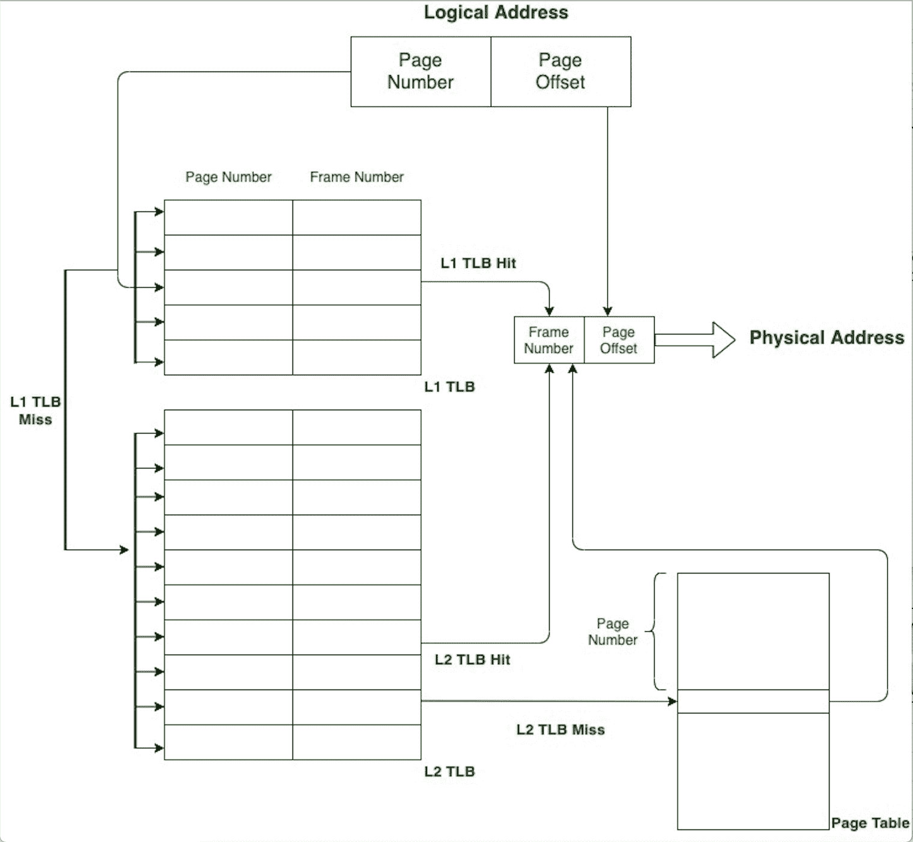

# 缓存页表

> 原文:[https://www.geeksforgeeks.org/caching-page-tables/](https://www.geeksforgeeks.org/caching-page-tables/)

[分页](https://www.geeksforgeeks.org/paging-in-operating-system/)是一种内存管理方案，允许进程的物理地址空间不连续。分页的基本思想是将物理内存分成称为**帧的固定大小的块**，将逻辑内存分成称为**页的相同大小的块**。在执行该过程时，该过程所需的页面被从它们的源(即盘或任何备份存储设备)加载到可用的帧中。

中央处理器为进程生成[逻辑地址](https://www.geeksforgeeks.org/logical-and-physical-address-in-operating-system/)，分为*页码和页面偏移量*。页表包含物理内存中每页的基址。基址和页面偏移量一起定义了物理内存地址。页码用作页表的索引。页表保存在主存储器中，一个**页表基址寄存器(PTBR)** 指向页表。

要访问位置 x，请在页表中查找条目，使用 PTBR 中的值乘以 x 的页码。页表条目给出帧号，帧号与页面偏移量相结合产生实际地址。然后我们可以访问所需的存储位置。因此，为了访问位置 x，需要两次存储器访问，从而降低了操作速度。

一种称为[翻译后备缓冲器(TLB)](https://www.geeksforgeeks.org/translation-lookaside-buffer-tlb-in-paging/) 的特殊的、小的、快速的查找硬件高速缓存用于缓存页表中的少量条目。每个 TLB 条目由两部分组成:键(或标签)和值，这里键是页码，值是帧号。TLB 的所有条目都同时与页码进行比较，因此搜索速度很快。TLB 通常包含 32–1024 个条目。TLB 是一个硬件缓存，现代计算机将其作为指令流水线的一部分来实现，因此不会产生 TLB 搜索的开销。

如果在 TLB 找不到页码，则称之为 *TLB 错过*，从页表中取出相应的帧号，更新 TLB。现在，如果 TLB 已经客满，TLB 的一个条目需要用这个新条目替换。各种策略用于此类替换，如最近最少使用(LRU)、循环或随机替换。

今天的中央处理器提供多级 TLB。如果 L1·TLB 失手，则在 L2·TLB 搜索，如果 L2·TLB 也失手，则在页表中搜索。感兴趣的页码在 TLB 被发现的次数百分比称为 ***命中率(命中率)*** 而在 TLB 未被发现的次数百分比称为*失败率(失败率)*。现代系统的 TLB 失败率为 0.1-1%，因此在很大程度上减少了访问页表的开销。

一些顶级域名还在每个 TLB 条目中存储*地址空间标识符(ASIDS)* 。它唯一地标识每个进程，并且当完成逻辑地址到物理地址的转换时，只检查属于该进程的那些 TLB 条目，如果没有找到这样的条目，则认为是 TLB 未命中。这允许 TLB 同时拥有多个进程的条目。如果 TLB 不允许 ASIDS，那么每次发生上下文切换(将执行进程从一个进程更改为另一个进程)时，需要刷新或擦除 TLB，以确保下一个执行进程不使用来自前一个进程的翻译信息。

每个 TLB 条目都有一个与之相关的有效/无效位，表示 TLB 条目是否有效。当 TLB 被刷新，TLB 条目没有被实际删除，只有 TLB 的所有条目被无效时，这尤其有用。因此，在使用 TLB 条目进行翻译之前，检查该条目是否有效。此外，如果在更新 TLB 条目时 TLB 未命中，则首先更新无效条目。

TLB 条目中还有其他几个位，如全局位(G)，用于跨进程全局共享的页面，几个位用于 ASID(共享页面忽略)，脏位(确定是否必须写入页面)等。所有这些位都用于一般的 TLB 条目。但是，条目的实际大小、TLB 条目中的各种保护位、TLB 的级别数、每个级别中的 TLB 条目数等因体系结构而异。