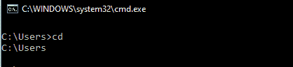
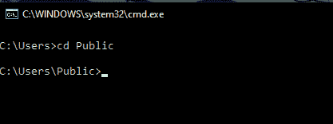
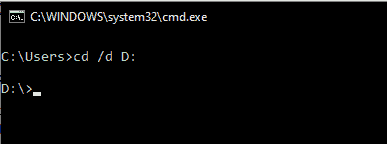
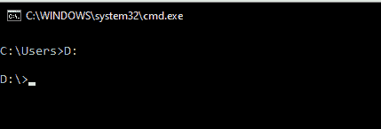

# Cd cmd 命令

> 原文:[https://www.geeksforgeeks.org/cd-cmd-command/](https://www.geeksforgeeks.org/cd-cmd-command/)

Cd 是 chdir 的缩写或同义词。它是在 Windows 命令处理器(cmd)中找到的命令，允许更改外壳实例的当前工作目录。CWD(当前工作目录)是文件系统中的一个路径(目录的路径)，shell 当前正在该路径上工作。当前工作目录对于解析相对路径至关重要。Cd 是大多数操作系统的命令解释器中的通用命令。

**命令描述:**
显示当前目录的名称或更改当前目录。

```
CHDIR [/D] [drive:][path]
CHDIR [..]
CD [/D] [drive:][path]
CD [..]

..   Specifies that you want to change to the parent directory.
```

键入**光驱:**显示指定驱动器中的当前目录。
输入**光盘**无参数显示当前驱动器和目录。
除了更改驱动器的当前目录外，使用 **/D** 开关更改当前驱动器。

*   有些输出由于长度太大而被截断。
*   为了获得上述文本，执行 **cd /？**指令接通 cmd。
*   需要注意的是 **chdir** 是 cd 的别名，因此可以替换它的所有出现。

**使用命令:**

1.  **Displaying the Current Working Directory :**
    Displaying the current working directory is not generally not required on cmd. This is because the default prompt in cmd displays the Current drive and path (CWD) along with the greater than sign ( > ) at all times ($P$G code). But for the sake of completeness, we would be describing it as well. To display the Current Working Directory, execute the cd command without any arguments.

    **语法:**

    ```
    cd
    ```

    

    从上面的输出可以明显看出，我们没有必要打印 cwd，因为它已经被提示显示了。在整篇文章中，我们将使用 C:\Users 作为我们的 CWD。

2.  **Changing the CWD :**
    We can change the Current Working Directory to different paths in the system. The following are the options –

    **1。到当前驱动器的目录:**
    要更改工作目录，执行命令 **cd** ，后跟您想要成为 CWD 的目录的绝对或相对路径。路径应符合以下标准–

    *   路径应该是目录。
    *   目录应该存在。
    *   路径可以是绝对的，也可以是相对的。如果使用相对路径，则该路径应该相对于 CWD。

    **语法:**

    ```
    cd [Path]
    ```

    

    **2。到另一个驱动器的目录:**
    要将工作目录更改为另一个驱动器，请执行命令 **cd /D** ，后跟目录路径。该路径应符合以下标准–

    *   路径应该是绝对的。
    *   路径应包含驱动器号，后跟驱动器限定符(驱动器号&冒号)。

    **语法:**

    ```
    cd /d [Path]
    ```

    

    3。在不使用 cd 命令的情况下，将 CWD 更改为另一个驱动器的另一种方法是执行驱动器号后跟冒号。

    **语法:**

    ```
    (Drive_Letter):
    ```

