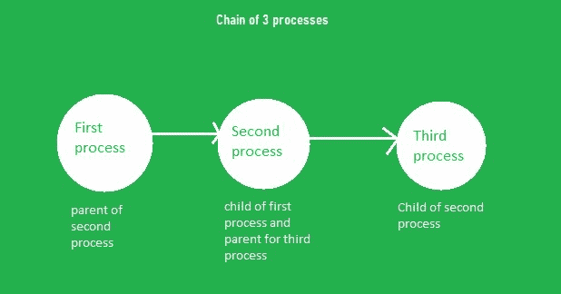
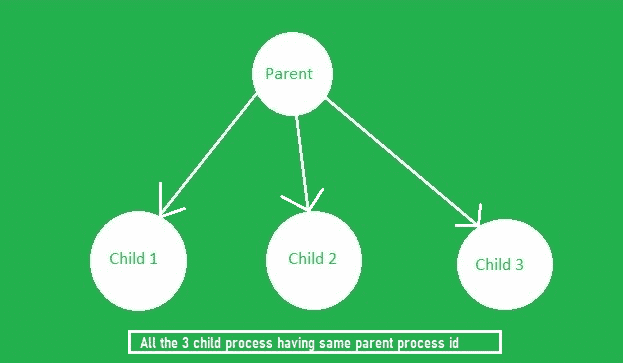

# 链流程与使用 C

中的 fork()函数的流程风扇

> 原文:[https://www . geesforgeks . org/chain-processes-vs-fan-of-processes-use-fork-function-in-c/](https://www.geeksforgeeks.org/chain-processes-vs-fan-of-processes-using-fork-function-in-c/)

[**Fork System Call**](https://www.geeksforgeeks.org/fork-system-call/)**:**Fork System Call 用于创建新的[进程](https://www.geeksforgeeks.org/difference-between-program-and-process/)，称为 [**子进程**](https://www.geeksforgeeks.org/difference-between-process-parent-process-and-child-process/) ，与进行 Fork()调用的进程(父进程)并发运行。创建新的子进程后，两个进程都将执行 fork()系统调用之后的下一条指令。子进程使用与父进程相同的程序计数器、相同的中央处理器寄存器和相同的打开文件。

要创建流程的扇形或链条，首先插入[头文件](https://www.geeksforgeeks.org/header-files-in-c-cpp-and-its-uses/)**【unitd . h】**使用 [fork()](https://www.geeksforgeeks.org/fork-system-call/) 功能创建流程。使用 [exit()](https://www.geeksforgeeks.org/exit-vs-_exit-c-cpp/) 方法包括**【stdlib . h】**，程序中有 3 种方式可以使用 exit 语句:

*   **退出(0):** 正常终止
*   **退出(1):** 异常终止
*   **退出():**可以正常也可以异常。

### **<u>流程链</u> :**

假设有三个进程，第一个进程是父进程，它正在创建子进程，那么这个第二个进程创建另一个进程(第三个进程)，那么第一个进程成为第二个进程的父进程，第二个进程成为第三个进程的父进程。因此，获得了一个过程链，这叫做过程链。



3 个过程的链

下面是使用 fork()创建流程链的实现:

## C

```
// C program to create a chain of process
#include <stdio.h>
#include <stdlib.h>
#include <sys/types.h>
#include <sys/wait.h>
#include <unistd.h>

// Driver Code
int main()
{
    int pid;

    // Iterate in the range [0, 2]
    for (int i = 0; i < 3; i++) {
        pid = fork();

        if (pid > 0) {
            // Print the parent process
            printf("Parent process ID is %d\n",
                   getpid());
            break;
        }
        else {
            // Print the child process
            printf("Child process ID is %d\n",
                   getpid());
        }
    }

    return 0;
}
```

**Output**

```
Parent process ID is 1359
Child process ID is 1360
Parent process ID is 1360
Child process ID is 1360
Child process ID is 1361
Parent process ID is 1361
Child process ID is 1360
Child process ID is 1361
Child process ID is 1362
```

**说明:**在上面的程序中， [**getpid()**](https://www.geeksforgeeks.org/getppid-getpid-linux/) 用来获取进程 id。或者，也可以使用 **getppid()** 来获取父进程标识。每次程序运行时，输出都不一样，**因为不是每次操作系统都给进程分配相同的进程 id ，而是每次程序运行时总是以非递减顺序获得 PID(进程 id)****。******

### ******[**<u>【流程迷】</u>**](https://www.geeksforgeeks.org/create-n-child-process-parent-process-using-fork-c/) **:********

****假设有三个进程，第一个进程是父进程，它正在创建两个子进程。如果两个进程有相同的父进程，那么它就是进程的粉丝。****

****

三个进程的粉丝**** 

****下面是使用 fork()创建进程粉丝的实现:****

## ****C****

```
**// C program to create a fan of processes

#include <stdio.h>
#include <stdlib.h>
#include <sys/wait.h>
#include <unistd.h>

// Driver Code
int main()
{
    // Iterate in the range [0, 2]
    for (int i = 0; i < 3; i++) {
        if (fork() == 0) {
            // getpid gives process id
            // getppid gives parent process id
            printf("child pid %d from the"
                   " parent pid %d\n",
                   getpid(), getppid());

            // Set Normal termination of
            // the program
            exit(0);
        }
    }

    for (int i = 0; i < 3; i++)
        wait(NULL);
}**
```

******Output**

```
child pid 29831 from parent pid 29830
child pid 29832 from parent pid 29830
child pid 29833 from parent pid 29830
```**** 

******说明:**在上面的程序中，每次相同的进程 ID 并不是每次都被操作系统分配给进程。这意味着在这种情况下，每次运行程序时输出也是不同的，但是创建的子进程将具有相同的父进程标识。****