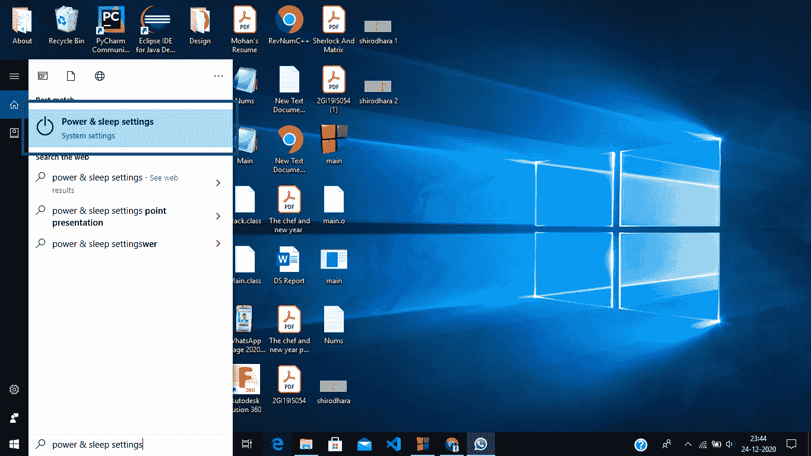
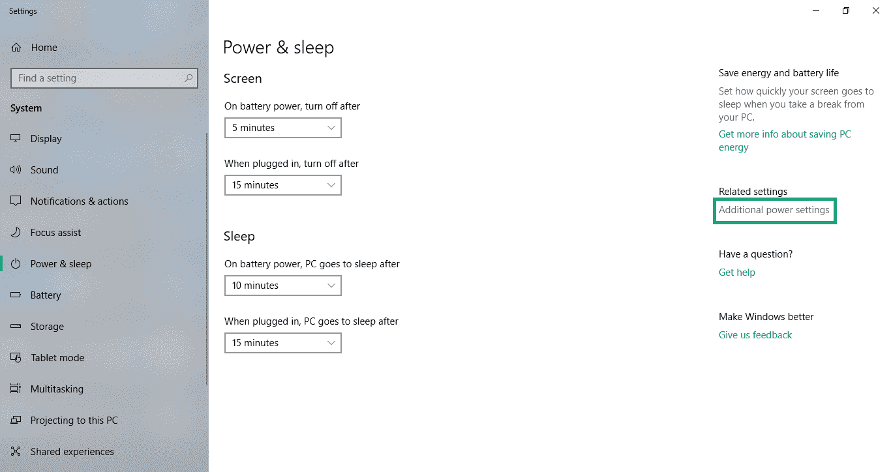
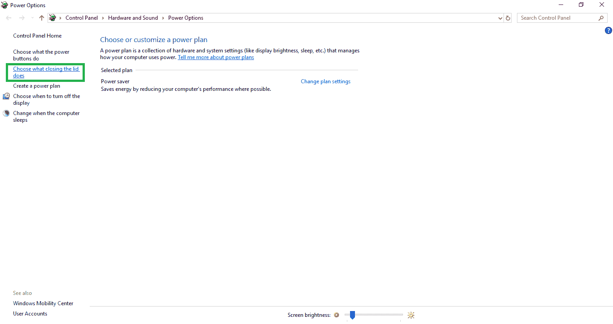
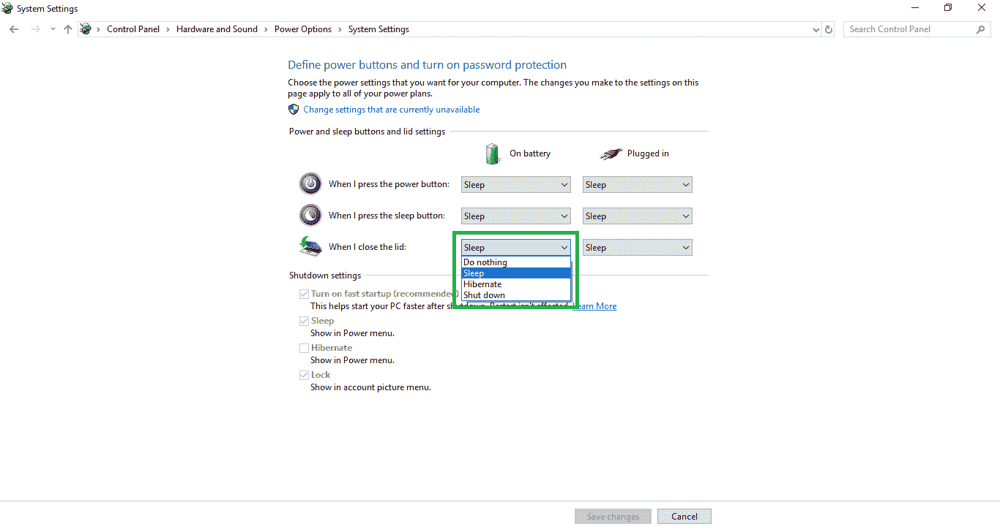
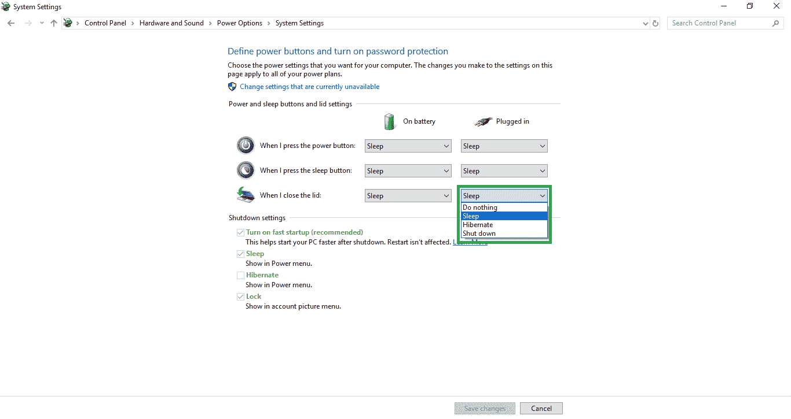
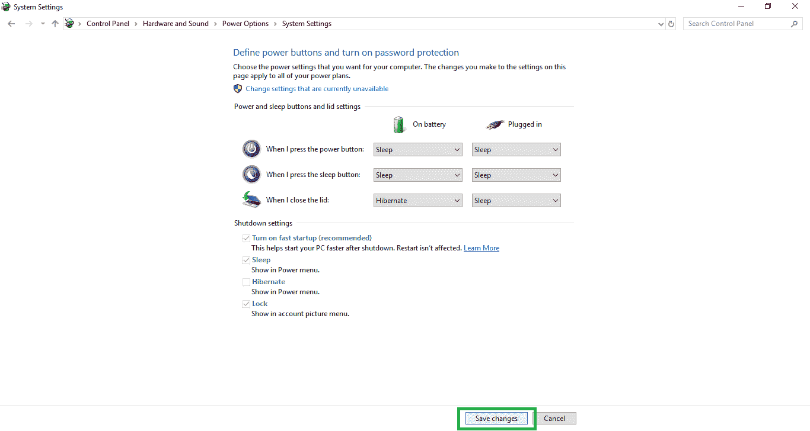
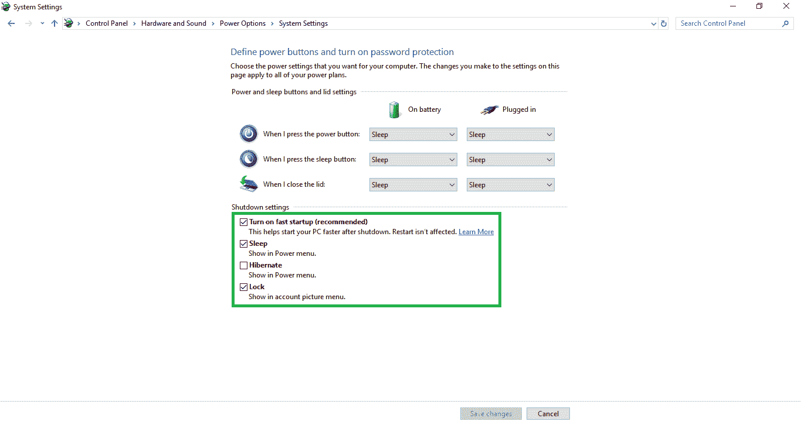

# 改变当你在 Windows 10 上合上笔记本电脑的盖子时会发生什么

> 原文:[https://www . geesforgeks . org/change-当你关闭笔记本电脑时会发生什么-windows 10 上的盖子/](https://www.geeksforgeeks.org/change-what-happens-when-you-shut-the-laptops-lid-on-windows-10/)

当我们关上笔记本电脑的盖子时，我们通常会看到笔记本电脑自动进入睡眠状态。当我们关上笔记本电脑的盖子时，我们可以选择笔记本电脑应该做什么。

有 4 个选项可供选择。

1.  **关闭–**
    你们都知道这一点。笔记本电脑会关闭操作系统。当您想再次使用笔记本电脑时，您需要打开笔记本电脑并完成启动过程。你需要等待硬件初始化和启动程序加载。当您不想保存任何东西并直接关闭笔记本电脑电源时，可以使用此功能。
2.  **睡眠–**
    睡眠是一种省电状态。所有操作都将停止，所有打开的文档和应用程序都将放入内存。当你打开笔记本电脑时，它可以很快恢复正常，一切都会回到我们停止的地方，包括所有打开的文档和正在运行的应用程序。当您不想短时间使用笔记本电脑时，可以使用此选项。

*   **Hibernate–**
    Hibernate 模式会将你打开的文档和运行的应用保存到你的硬盘上，并关闭笔记本电脑，所以它使用零功耗。当您再次打开笔记本电脑时，它会将以前的状态从硬盘加载到内存中。当您需要节省电池并保持所有打开的文档和运行的应用程序安全时，您可以使用它。*   **Do Nothing –**
    As the word only says, it does nothing. But this may harm your laptop if you choose this option.

    你们都可以根据自己的需要改变这些选项，也就是说，当设备正在充电和使用电池时，你可以选择上面的任何一个选项。下面显示了导航到这些选项的步骤。

    **后续步骤:**

    **步骤-1:** 在启动菜单中搜索电源&睡眠设置，点击打开。

    

    **步骤 2:** 点击右侧可用的附加电源设置。

    

    **步骤 3:** 点击选择关闭盖子的功能。

    

    **第 4 步:**从列表中选择接通电池和接通电源的任一选项。

    

    

    **第 5 步:**点击保存更改保存设置。

    

    如果要更改关机设置。遵循以下步骤。

    **后续步骤:**

    **步骤 1:** 单击更改当前不可用的设置。

    

    **第 2 步:**可以根据需要勾选或取消勾选选项，保存更改。

    

    <video class="wp-video-shortcode" id="video-533957-1" width="640" height="360" preload="metadata" controls=""><source type="video/mp4" src="https://media.geeksforgeeks.org/wp-content/uploads/20201224142119/Windows-lid-GFG.mp4?_=1">[https://media.geeksforgeeks.org/wp-content/uploads/20201224142119/Windows-lid-GFG.mp4](https://media.geeksforgeeks.org/wp-content/uploads/20201224142119/Windows-lid-GFG.mp4)</video>