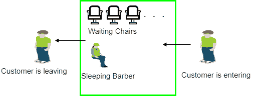

# 用信号量解决同步的经典问题

> 原文:[https://www . geeksforgeeks . org/与信号量同步的经典问题-解决方案/](https://www.geeksforgeeks.org/classical-problems-of-synchronization-with-semaphore-solution/)

在本文中，我们将看到许多经典的[同步](https://www.geeksforgeeks.org/process-synchronization-set-1/)问题，作为一大类并发控制问题的例子。在我们的问题解决方案中，我们使用[信号量](https://www.geeksforgeeks.org/semaphores-operating-system/)进行同步，因为这是呈现此类解决方案的传统方式。然而，这些解决方案的实际实现可以使用[互斥锁](https://www.geeksforgeeks.org/mutex-vs-semaphore/)代替二进制信号量。

这些问题几乎用于测试每一个新提出的同步方案。以下同步问题被认为是经典问题:

```
1. Bounded-buffer (or Producer-Consumer) Problem,
2. Dining-Philosophers Problem,
3. Readers and Writers Problem,
4. Sleeping Barber Problem
```

这些都是总结出来的，对于详细的解释，你可以查看每个的链接文章。

*   [**有界缓冲(或生产者-消费者)问题**](https://www.geeksforgeeks.org/producer-consumer-solution-using-semaphores-java/)【T4:
    有界缓冲问题也叫生产者消费者问题。这个问题被概括为生产者-消费者问题。这个问题的解决方案是，创建两个计数信号量“满”和“空”，分别跟踪当前已满和空缓冲区的数量。生产者生产产品，消费者消费产品，但双方每次都使用其中一个容器。

*   [**Dining-Philosophers Problem**](https://www.geeksforgeeks.org/operating-system-dining-philosopher-problem-using-semaphores/)**:** 
    The Dining Philosopher Problem states that K philosophers seated around a circular table with one chopstick between each pair of philosophers. There is one chopstick between each philosopher. A philosopher may eat if he can pickup the two chopsticks adjacent to him. One chopstick may be picked up by any one of its adjacent followers but not both. This problem involves the allocation of limited resources to a group of processes in a deadlock-free and starvation-free manner. 


*   [**【读者和作者问题】**](https://www.geeksforgeeks.org/readers-writers-problem-set-1-introduction-and-readers-preference-solution/) **:**
    假设一个数据库要在几个并发进程之间共享。其中一些进程可能只想读取数据库，而另一些进程可能想更新(即读写)数据库。我们通过将前者称为读者，将后者称为作者来区分这两种过程。确切地说，在操作系统中，我们称这种情况为读者-作者问题。问题参数:
    *   一组数据由多个进程共享。

    *   一旦编写器准备好了，它就执行它的写操作。一次只能有一个作家写作。

    *   如果一个进程正在写入，没有其他进程可以读取它。

    *   如果至少有一个读取器正在读取，则没有其他进程可以写入。

    *   读者不可以写，只能读。

*   [**Sleeping Barber Problem**](https://www.geeksforgeeks.org/operating-system-sleeping-barber-problem/)**:** 
    Barber shop with one barber, one barber chair and N chairs to wait in. When no customers the barber goes to sleep in barber chair and must be woken when a customer comes in. When barber is cutting hair new customers take empty seats to wait, or leave if no vacancy. 

