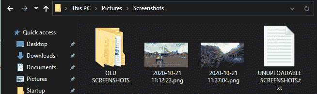

# cmd | Dir 命令

> 原文:[https://www.geeksforgeeks.org/cmd-dir-command/](https://www.geeksforgeeks.org/cmd-dir-command/)

Dir 是在 windows 命令处理器(cmd.exe)中找到的命令，通常用于列出当前目录中的目录和文件。该命令本身确实是基本的，但是它的大量开关的存在使它成为一个动态命令，有几个用例。它是导航命令行时最有用的命令之一，在多个操作系统中以不同的形式出现。在本文中，我们将看一下 Dir 命令，并了解它的几个用例。

**命令描述:**

```
help dir

```

**输出:**

```
Displays a list of files and subdirectories in a directory.

DIR [drive:][path][filename] [/A[[:]attributes]] [/B] [/C] [/D] [/L] [/N]
 [/O[[:]sortorder]] [/P] [/Q] [/R] [/S] [/T[[:]timefield]] [/W] [/X] [/4]

 [drive:][path][filename]
             Specifies drive, directory, and/or files to list.

 /A          Displays files with specified attributes.
 attributes   D  Directories                R  Read-only files
              H  Hidden files               A  Files ready for archiving
              S  System files               I  Not content indexed files
              L  Reparse Points             O  Offline files
              -  Prefix meaning not
 /B          Uses bare format (no heading information or summary).
 /C          Display the thousand separator in file sizes.  This is the
 .
 .

```

**命令用法:**
命令主要用于显示一个目录下的文件和子目录列表。这可以通过在没有任何参数的情况下执行 **Dir** 命令来实现。

```
Dir

```

这将产生类似这样的输出。
**输出:**

```
Volume in drive C has no label.
Volume Serial Number is 2C7D-7820

Directory of C:\Users

09/26/2020  11:34 AM    <DIR>          .
09/26/2020  11:34 AM    <DIR>          ..
09/02/2020  07:07 PM             1, 000 applese
09/24/2020  08:59 PM    <DIR>          Public
10/20/2020  06:39 PM    <DIR>          Soap
              1 File(s)          1, 000 bytes
              4 Dir(s)  13, 879, 459, 840 bytes free

```

这对于大多数用户来说是有用的，但是该命令提供了更多的功能，通过添加各种开关，我们可以修改命令的工作方式，以产生定制的输出。我们将查看一些常用的命令开关。

**显示具有特定属性的文件/子目录:**
你可以通过发送 */A* 开关过滤 dir 的输出，后面跟着一个特定的属性。这将只显示那些具有所提供属性的文件/文件夹。

该命令的语法如下。

```
Dir /A[attribute]

```

其中*属性*将是以下列表中一个字符的一个/组合

```
              D  Directories                R  Read-only files
              H  Hidden files               A  Files ready for archiving
              S  System files               I  Not content indexed files
              L  Reparse Points             O  Offline files
              -  Prefix meaning not

```

根据上面的列表，如果您只想显示目录列表。您可以使用下面给出的命令。

```
Dir /AD
```

这将显示当前目录中的子目录列表(交叉点和目录符号链接)。

**使用目录的绝对/相对路径显示目录的文件/子目录:**
你现在可以得到的文件/子目录列表只有当前目录，还有其他目录。如果您提供目录的完整路径，您可以在该目录上执行 dir 命令。

语法如下:

```
Dir [Path to the Directory]

```

其中*到目录*的路径是相对的或者是我们感兴趣的目录的完整路径。要获取***【C:\ Users \ Public】***目录的内容，命令应为:

```
Dir "C:\Users\Public"

```

应该注意的是，如果*文件*的路径被提供作为参数，那么将只显示关于该文件的信息。

**对 dir 命令输出进行排序:**
可以使用 ***/O*** 开关对 Dir 命令输出中的文件/文件夹列表进行排序。该开关采用这些字符中的一个/组合来产生排序输出。

```
              N  By name (alphabetic)       S  By size (smallest first)
              E  By extension (alphabetic)  D  By date/time (oldest first)
              G  Group directories first    -  Prefix to reverse order

```

根据上面的列表，如果您希望输出按文件大小排序(降序)。命令语法如下。

```
Dir /O-S

```

这将产生一个输出，其中具有较大大小的文件将在列表的顶部，而较小的文件/文件夹在底部。

**注意–**
一般来说，目录会在底部，因为它们通常没有文件那样固定的大小(作为文件表条目存在)。

**以最小格式显示 Dir 命令的输出:**
Dir 命令的输出包含的信息远远超过人们可能感兴趣的内容。为了显示 Dir 命令的输出，在一个裸格式中我们可以追加 ***/B*** 切换到它。这将删除附加信息，如修改时间、尺寸、类型等。从条目列表中。命令语法如下。

```
Dir /B

```

**示例–**
考虑一个目录是否有以下内容。



然后在目录上运行 Dir 命令将产生以下输出。

```
Volume in drive C has no label.
Volume Serial Number is 2C7D-7820

Directory of C:\Users\Sauleyayan\Pictures\Screenshots

10/21/2020  11:37 AM    <DIR>          .
10/21/2020  11:37 AM    <DIR>          ..
10/21/2020  11:12 AM         1, 240, 912 2020-10-21 11꞉12꞉23.png
10/21/2020  11:37 AM         1, 376, 105 2020-10-21 11꞉37꞉04.png
10/04/2020  10:10 AM    <DIR>          OLD SCREENSHOTS
10/19/2020  06:18 PM               287 UNUPLOADABLE_SCREENSHOTS.txt
              3 File(s)      2, 617, 304 bytes
              3 Dir(s)  12, 749, 389, 824 bytes free

```

使用 **/B** 开关运行目录命令时，会产生

```
2020-10-21 11꞉12꞉23.png
2020-10-21 11꞉37꞉04.png
OLD SCREENSHOTS
UNUPLOADABLE_SCREENSHOTS.txt

```

这对于大多数用户来说更容易阅读。

**注–**

*   该命令有更多的开关，可以在命令的*帮助页面*找到。
*   If the path to a directory/file is provided for displaying its contents, switches should be added after the before providing the path.

    **创建语法，如–**

    ```
    Dir [switches] [Path to the Directory/File]

    ```

*   *Dir* 是内部命令