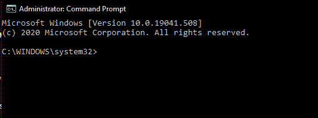
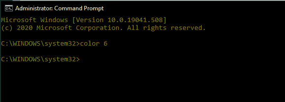
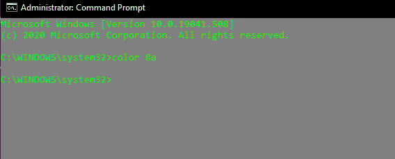

# 颜色 cmd 命令

> 原文:[https://www.geeksforgeeks.org/color-cmd-command/](https://www.geeksforgeeks.org/color-cmd-command/)

Color 是一个内置命令，位于 Windows 命令处理器(cmd.exe)中，用于更改控制台前景和背景的颜色。默认情况下，控制台有白色前景色和黑色背景色(07 色代码)。该命令通常用于个性化控制台窗口的美观，或者使颜色更适合暗淡或黑暗显示(例如。TN 面板)。在本文中，我们将了解 color 命令，还将了解它提供的各种用途。

**命令描述:**
键入命令–**颜色/？**在命令提示符下。

它设置默认的控制台前景色和背景色。

```
COLOR [attr]
attr - Specifies the color attribute of console output.
```

颜色属性由两个十六进制数字指定–

*   首先对应背景。
*   第二个对应前景。

**使用命令:**
该命令输入 2 个十六进制数字(第 2 位数字可选)，其中第 1 位数字对应背景颜色，第 2 位数字对应前景色。

**语法:**

```
Color (Background)(Foreground)
```

如果只提供了第一个数字，那么只有前景色会改变。每个数字可以有十六进制代码点(0–f)中的任何值，其中每个值对应一种唯一的颜色。数字与颜色的对应关系如下–

```
  0 = Black       8 = Gray
  1 = Blue        9 = Light Blue
  2 = Green       A = Light Green
  3 = Aqua        B = Light Aqua
  4 = Red         C = Light Red
  5 = Purple      D = Light Purple
  6 = Yellow      E = Light Yellow
  7 = White       F = Bright White
```

**语法:**

```
Color 1F
```

它将在深蓝色上产生亮白色。除了前景和背景颜色相同的特殊情况(例如。颜色 FF 或颜色 33)。在这种情况下，颜色不会发生变化，并且 **%ERRORLEVEL%** 的值变为 1。如果在没有提供任何参数的情况下执行该命令，则该命令将恢复 cmd.exe 最初开始时的颜色。

1.  **Changing Only The Foreground Color :**

    **语法:**

    ```
    Color (Hex_digit)
    ```

    (Hex_digit)是十六进制范围内的一个数字(或字符)，即它应该属于范围 0-F

    **示例:**
    我们将前景颜色更改为黄色(6)。

    **之前:**

    

    **之后:**

    

    从上面的图像中可以清楚地看到，执行命令 **Color 6** 后，前景的颜色从白色变为黄色。

2.  **Changing the Color of Background And Foreground :**
    For changing the color of the foreground and the background of the console window, the color attributes are specified by 2 of the previously mentioned hex digits.

    **语法:**

    ```
    color (Back_Hex_digit)(Fore_hex_digit)
    ```

    Back_Hex_digit 和 Fore_hex_digit 是十六进制数字，分别用于确定背景和前景的颜色。在下面的示例中，我们将背景颜色更改为灰色(7)，前景颜色更改为浅绿色(a)。

    **之前:**

    

    **之后:**

    