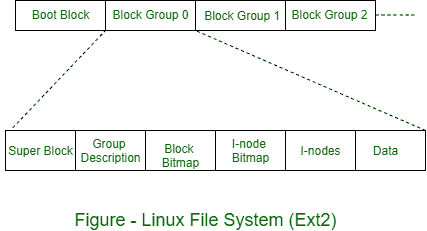

# 对比 Windows 和 Linux 中的文件系统

> 原文:[https://www . geesforgeks . org/compare-file-system-in-windows-and-Linux/](https://www.geeksforgeeks.org/compare-file-system-in-windows-and-linux/)

**Linux 中的文件系统:**
Linux 使用 NFS 技术支持超过 12 个文件系统。当链接 Linux(即操作系统代码)时，需要指定默认的文件系统选项。根据需求，可以动态调用其他文件系统。Ext 文件系统是最受欢迎的选项。它类似于伯克利文件系统。

该文件系统假设磁盘以引导块开始，然后从一系列其他块组创建磁盘。块组按顺序编号，并包含几个子字段。

整体组织如图所示。

块组中子字段的详细信息如下-

1.  **超级块–**指定块数、I 节点数、块大小等。

2.  **组描述–**包含有关位图位置、可用块数、I 节点、组中目录等的信息。

3.  **块位图–**包含空闲块列表。

4.  **I 节点位图–**包含自由 I 节点列表。

5.  **I 节点–**这些是实际的 I 节点。每个输入节点有 128 字节长。

Linux 支持以下文件类型-

1.  **目录–**这只是一个名字列表。

2.  **普通文件–**这是一个包含数据或应用程序或可执行文件的文件。

3.  **符号链接–**这个文件实际上是另一个文件的链接(或路径)。

4.  **特殊文件–**这是指设备驱动程序。

5.  **命名管道–**这是两个或多个进程之间用于数据交换的公共通道。

Windows 中的文件系统:- Windows 2000 (W2K)支持许多文件系统，包括在 Windows 95、MS-DOS 和 OS/2 上运行的文件分配表(FAT)。但是 W@K 的开发者也设计了一个新的文件系统，W2K 文件系统(NTFS)，旨在满足工作站和服务器的高端需求。

高端应用的例子包括

1.  客户机/服务器应用程序，如文件服务器、计算机服务器和数据库服务器。

2.  资源密集型工程和科学应用。

3.  大型企业系统的网络应用。

**NTFS 的关键特性:**
NTFS 是一个灵活而强大的文件系统，建立在简单的文件系统模型之上。非关税壁垒最显著的特点包括

1.  可恢复性

2.  安全

3.  大磁盘和大文件

4.  多个数据流

5.  通用索引工具

**NTFS 卷和文件结构:**
NTFS 使用以下磁盘存储概念-

1.  **扇区:**
    磁盘上最小的物理存储单元。以字节为单位的数据大小是 2 的幂，几乎总是 512 字节。

2.  **集群:**
    一个或多个连续(在同一轨道上彼此相邻)扇区。扇区中的簇大小是 2 的幂。

3.  **卷:**
    磁盘上的逻辑分区，由一个或多个集群组成，由文件系统用来分配空间。在任何时候，卷都由文件系统信息、文件集合以及卷上剩余的任何可分配给文件的未分配空间组成。一个卷可以是单个磁盘的全部或一部分，也可以跨多个磁盘扩展。如果使用硬件或软件 RAID 5，一个卷由跨越多个磁盘的条带组成。