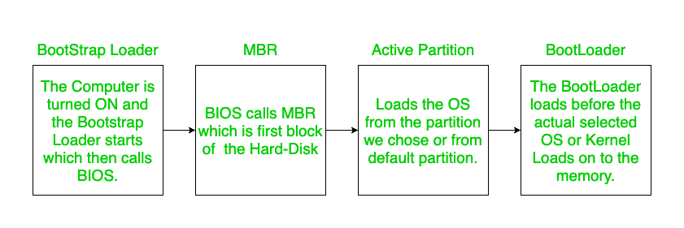

# 多重引导指南背后的概念

> 原文:[https://www . geesforgeks . org/concept-behind-multi-booting-guide/](https://www.geeksforgeeks.org/concept-behind-multiple-booting-guide/)

今天使用的大多数计算机都是这样的:传统的 BIOS-MBR 类型，和 UEFI-GPT 方法(由高级/最新的计算机使用)。

*   **第一步:供电:**
    正常不太重要。
*   **Step-2: Bootstrapping:**
    When the computer is switched on, Computer has no idea where is the OS and what to load on to the CPU. Hence, we use a special program called as Bootstrap Loader.

    简单来说，这将定位内核并将其加载到主内存中。在某些情况下，即使是简单的引导加载程序也会加载更复杂的引导加载程序。

*   **Step-3: The Role of BIOS in booting process:**
    (Now from here something real starts). When the computer boots up initially or is reset then the Instruction Register gets loaded with some default address which is basically a jump address that transfers control the bootstrap Loader and the job of BIOS starts.

    **BIOS 代表基本输入输出系统:**
    BIOS 执行的功能有:

    1.  检查互补金属氧化物半导体的自定义设置
    2.  检查设备驱动程序并执行开机自检。
    3.  显示所有设置。
    4.  查找可用且具有有效操作系统的可引导设备
    5.  引导加载程序继续执行后续步骤。

    互补金属氧化物半导体是主板上的一种小型内存芯片。当电脑关机时，这个互补金属氧化物半导体的内容不会被擦除。CMOS 包含关于我们应该在哪里寻找有效的可引导文件的信息。如今，现代计算机制造商正在保护互补金属氧化物半导体，这样用户就不会轻易修改互补金属氧化物半导体的设置。

    人们通常有一个误解，当他们修改引导顺序时，他们改变了基本输入输出系统设置，但实际上他们修改的互补金属氧化物半导体设置是你修改引导顺序的地方。一旦开机自检成功完成。

    BIOS 将检查 CMOS 设置，找出引导顺序。引导顺序是设备/源的首选顺序，引导加载程序将根据该顺序找到将操作系统加载到主内存的源。引导操作系统的各种来源有硬盘、网络、通用串行总线驱动程序、光盘等。只要操作系统映像在这些设备上正确存在(没有任何损坏)，任何源都可以用来将操作系统加载到主存储器上。

    可以根据需要修改引导顺序。

    如果试图安装双引导，那么我们可以通过将所需的 Linux 操作系统(开源免费)文件刻录到 u 盘上，并将该操作系统加载到我们可能为安装新操作系统而创建的磁盘分区上，来创建一个可引导的笔式驱动器。

    引导加载程序将按照 CMOS 中的顺序进行检查，并在找到可引导源的地方加载第一个源。

*   **Step-4: MBR and GRUB:**
    Pay attention here, it is really important.

    考虑到从硬盘正常启动，基本输入输出系统最初总是查看硬盘的固定地址，通常是硬盘的起始扇区。简而言之，它意味着基本输入输出系统加载硬盘的第 0 块。该扇区包含主引导记录。MBR 包含分区的所有细节。紧随其后的是分区表。该分区表包含硬盘上各个分区的信息，还存储每个分区的起始位置信息。

    **注意:**
    以上步骤对于所有操作系统都是一样的，无论是 Windows / a 系列的 Loaded Linux 系统。通常当我们在系统上加载一个 UNIX 时，默认的 MBR 会被 GRUB 替换。简单来说，GRUB 是一个辅助引导加载器。

    GRUB 代表 GRand 统一引导加载程序。

    现在假设我们的硬盘有 4 个分区，并且在每个分区中我们有一个不同的操作系统。这里每个分区都以一个称为引导块(在 UNIX 中)或称为引导扇区(在 NTFS 中)的块开始。该块将具有关于每个操作系统在存储器中的位置的信息。

    随后是卷控制块，它存储有关该分区大小和分配给该分区的块数的信息。在 UFS(Unix 文件系统)，它被称为超级块，在 NTFS 中，它被称为主文件表。

    

    
**Figure –** MBR Details

    引导加载程序、引导加载程序、BIOs 不是一回事，它们不应该相互混淆。

    引导是一个完整的过程，基本输入输出系统和引导加载程序是其中的一部分，基本输入输出系统执行我之前解释过的任务，引导加载程序是在实际的操作系统或内核加载到主内存之前加载到主内存上的任何东西。

    

    GRUB 通常有 3 个阶段名称 1、1.5 和 2。阶段 1 很简单，调用阶段 1.5 执行下面解释的任务。第二阶段实际上是加载内核。

    通常分区在扇区 63 之前不会开始。所以分区从 63 号扇区开始。因此，在这个自由空间中存储了 GRUB 1.5。MBR 和分区起点之间的空闲空间称为 MBR GAP。

    Grub Stage 1.5 出现在这个 MBR GAP 中，它通常包含读取文件系统的驱动程序。所以 grub 阶段 1 将把 grub 阶段 1.5 加载到 RAM 中，并将控制权交给 GRUB 阶段 1.5。

    现在 grub stage 1.5 将加载文件系统驱动程序，一旦文件系统驱动程序被加载，它现在可以访问/boot/grub/grub.conf 文件，该文件包含关于内核路径和 initrd 路径等的其他细节。

    现在，您将看到一个漂亮的 TUI(终端用户界面)，您可以选择您的操作系统内核并按回车键启动它。因此，在上述步骤之后，我们选择了我们希望在机器中使用的所有已安装操作系统的操作系统。

    **第五步:加载内核:**
    内核是操作系统的核心部分。不应该混淆操作系统和内核，因为内核只是操作系统的核心部分，而操作系统是一套完整的操作和实用程序。正常的操作系统加载将继续，这取决于我们从 GRUB 中选择的操作系统(假设我们已经安装了多个操作系统)。如果我们没有从 GRUB 屏幕中选择任何操作系统，那么将加载默认操作系统。