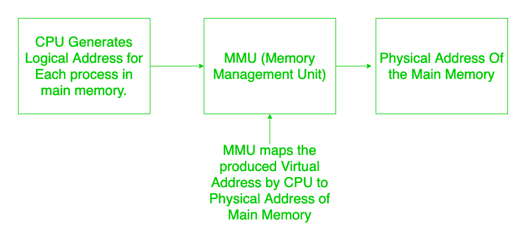
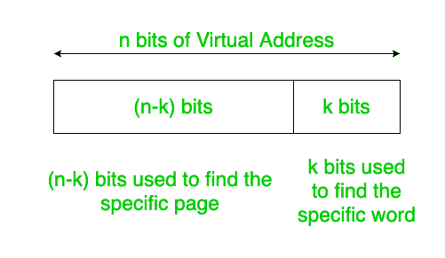
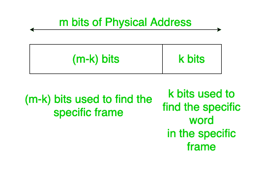
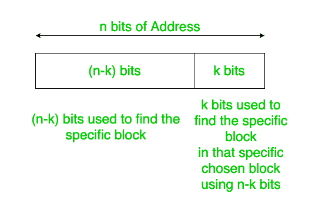

# 操作系统中地址分割的概念

> 原文:[https://www . geesforgeks . org/地址分割概念-in-os/](https://www.geeksforgeeks.org/concept-of-address-split-in-os/)

在操作系统中，我们有两种地址:[虚拟/逻辑地址，和物理地址](https://www.geeksforgeeks.org/logical-and-physical-address-in-operating-system/)。

**虚拟或逻辑地址:**
由 CPU 生成。前一句话的意思是，我们的系统是这样设计的，即 CPU 利用率应该是最大的，因此为了正确使用 CPU，我们选择使用多道程序设计。由于多道程序设计，并不是只有完整的进程被加载到主存储器中，相反，许多不同数量的进程可能存在于主存储器中。当每个进程被加载到中央处理器时，中央处理器认为只有该进程存在于主存储器中。因此，它产生相对于 0 的地址，这意味着中央处理器开始处理该进程，就像它被加载到主存储器中的存储位置 0 一样。因此，对于每个进程(在上下文切换期间)，中央处理器将产生相对于 0 的地址。

现在每个过程被分成等长的页面，作为回报，每个页面由固定数量的单词组成。

为了跟踪哪些页面被加载到主存的什么位置，我们使用了一个页表。页表条目的数量等于页数。就像数组索引一样，索引代表页码，相应的内容将保存页面在主内存中实际加载的位置。有时，甚至我们需要的页面也可能不在页面表中，因此会发生页面丢失，在这种情况下，我们需要从辅助内存中获取页面。

**物理地址:**
如上所述，CPU 产生主存储器中所有进程相对于零的地址，即 CPU 产生从 0 开始的地址。现在由生成的地址绝不是真实的，因为如果这些地址有效，那么所有进程将从零开始，主内存中的剩余空间将是内存。因此，中央处理器产生的地址应该以某种方式[映射到主存储器的真实(物理地址)](https://www.geeksforgeeks.org/mapping-virtual-addresses-to-physical-addresses/)。这是由 [MMU(内存管理单元)](https://www.geeksforgeeks.org/whats-difference-between-mmu-and-mpu/)完成的。



现在我们通常把主存分成大小相等的帧。作为回报，每个框架由相同数量的单词组成。

需要注意的重要一点是**页面尺寸=框架尺寸**。

**注:**
内存中最小的可寻址单元叫做字。它是指使用地址位可以明确识别的最小单位。

虚拟地址的地址空间分为两部分:页码和页面偏移量。

同样，物理地址的地址空间分为两部分:帧号和帧偏移量。

假设虚拟地址有 n 位，物理地址有 m 位。

```
Page Size = Frame Size = k bits 
```

(如上所述，页面尺寸=框架尺寸)。

```
Number of Pages = 2(n-k) pages
```



```
Number of Frames = 2(m-k) Frames
```



并且，每页/帧的字数= 2 <sup>(k)</sup> 页。

因此，在两种寻址方案中，最后 k 位被保留以找到特定的字。左边的 n-k 位用于从所有的页码集合中找出页码，在帧的情况下，其余的 m-k 位用于从所有的帧编号集合中找出特定的帧。

简单地说，我可以在这里解释，虚拟地址中的 n 位中的 n-k 位是在页表中找到特定的页码，物理地址的 m 位中的 m-k 位用于找到特定的帧，在找到特定的帧后，我们需要转到包含所需数据的特定字(因为字是最小的可寻址单元)，因此 k 位用于找到该特定的帧。

**技巧:**
考虑一个 n 位地址空间，如果使用 k 位来定义该地址空间中的块数，则剩余的 n-k 位用于使用 k 位沿着所选的块找到特定的块。从下面的框图可以清楚地看出这一点。



同样的概念也可以扩展到计算机网络。

**注意:**
字可寻址和字节可寻址的概念是不同的，当有疑问时，询问字可寻址，将地址空间转换成字，然后应用上面解释的所有概念。