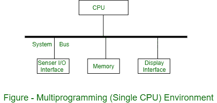
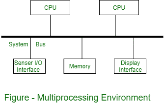
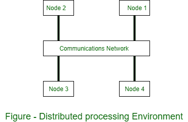

# 操作系统中的并发进程

> 原文:[https://www . geesforgeks . org/操作系统中的并发进程/](https://www.geeksforgeeks.org/concurrent-processes-in-operating-system/)

**并发处理**是多处理器同时执行指令以获得更好性能的计算模型。并发的意思是，当其他事情发生时发生。这些任务被分成子类型，然后分配给不同的处理器来同时、顺序地执行，因为它们必须由一个处理器来执行。并发处理有时与并行处理同义。

并发处理中的真实和虚拟并发术语:

1.  **Multiprogramming Environment :**
    In multiprogramming environment, there are multiple tasks shared by one processor. while a virtual concert can be achieved by the operating system, if the processor is allocated for each individual task, so that the virtual concept is visible if each task has a dedicated processor. The multilayer environment shown in figure.

    

2.  **Multiprocessing Environment :**
    In multiprocessing environment two or more processors are used with shared memory. Only one virtual address space is used, which is common for all processors. All tasks reside in shared memory. In this environment, concurrency is supported in the form of concurrently executing processors. The tasks executed on different processors are performed with each other through shared memory. The multiprocessing environment is shown in figure.

    

3.  **Distributed Processing Environment :**
    In a distributed processing environment, two or more computers are connected to each other by a communication network or high speed bus. There is no shared memory between the processors and each computer has its own local memory. Hence a distributed application consisting of concurrent tasks, which are distributed over network communication via messages. The distributed processing environment is shown in figure.

    