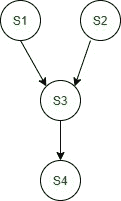
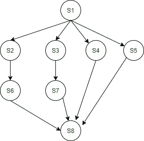

# 具有优先图的并发程序

> 原文:[https://www . geesforgeks . org/concurrent-program-with-preference-graph/](https://www.geeksforgeeks.org/concurrent-program-with-precedence-graph/)

在本文中，我们将介绍操作系统中的[并发程序](https://www.geeksforgeeks.org/different-approaches-to-concurrent-programming-in-java/)，并将为该程序制作一个[优先图](https://www.geeksforgeeks.org/precedence-graph-in-operating-system/)，并将介绍该程序的执行。

在并发编程中，真正的并发程序在多处理器系统上是可能的。任何两个语句 Si 和 Sj 都可以同时或并行执行，只要它们符合以下条件。

```
Read set(Si) ∩ Write set(Sj) = ϕ
Write set(Si) ∩ Read set(Sj) = ϕ
Write set(Si) ∩ Write set(Sj) = ϕ
```

在并发编程中**“并发”**一词有不同的含义。

*   它们可以并发或并行执行。
*   他们没有任何依赖性。
*   任何人都可以先开始。

**示例–**
让我们考虑以下表达式–

```
S1: p = q+r;
S2: s = t×u;
S3: v = w/x;
S4: y = z×a;
```

上述表达式的读集和写集如下–

```
Read Set = {q, r, t, u, w, x, z, a}
Write Set ={p, s, v, y}
```

读写集的优先图如下–

[](https://media.geeksforgeeks.org/wp-content/uploads/20201022121207/graph.jpg)

在并发编程中，将使用下面给出的语句完成或返回–

```
par begin - par end
or 
Co begin - Co end 
```

**优先图并发程序:**

让我们考虑下面给出的优先图–

[](https://media.geeksforgeeks.org/wp-content/uploads/20201022122439/os.jpg) 

**给定优先级的并发程序如下图–**

```
begin 
    S1:
    par begin 
        begin
            S2;
            S6;
        end
        begin
            S3;
            S7;
        end
            S4;
            S5;
    par end
            S8;
end
```