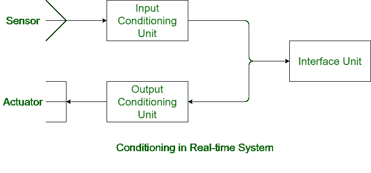

# 实时系统中的调节

> 原文:[https://www . geesforgeks . org/实时调节系统/](https://www.geeksforgeeks.org/conditioning-in-real-time-systems/)

在实时系统中，有各种组件。它有传感器、执行器、调节单元和接口单元。传感器产生的信号不能被接口单元直接使用。同样，在实时系统中，计算机产生的信号也不能被执行器直接使用。因此，需要一个过程来将信号从一个转换到另一个，这个过程被称为实时系统中的调节。

**实时系统中的调节类型:**
以下是实时系统中对不同信号进行的调节:

*   **电压放大–**
    电压放大基本上是为了匹配传感器输出信号的电压刻度和接口输入信号的电压刻度。传感器的输出电压需要用接口输出电压的满量程来满量程。

例如，传感器可能产生毫伏范围内的信号电压，而接口输入可能需要伏范围内的信号电压。在这种情况下，电压放大完成。

*   **Voltage Level Shifting –**
    Voltage level shifting is required to assign the voltage level generated by the sensor that can be acceptable by the interface unit. Same thing is with the voltage level shifting of signals from interface unit to the actuator in real-time systems.

    例如，传感器可以产生-0.05 到+0.5 伏范围内的信号电压，但是接口单元只接受 0 到 1 伏范围内的信号。在这种情况下，传感器电压被电平移动以与接口单元相匹配。

    *   **Frequency Range Shifting –**
    Just like the level shifting of voltage, frequency range shifting is also carried out in real-time systems. This is carried out to match the frequency of the signals generated by sensor and signals that may be accepted by the interface input. In the same way, range of signals generated by the computer is shifted to match the frequency range of actuator.*   **Noise Filtering –**
    Many types of noise may occur in the real-time system and signals may be affected by these noise. Hence in order to reduce the noise in signals, frequency filtering is used. It reduces the noise component in the signal and signals are shifted from noise bands.*   **信号模式转换–**
    调理中的信号模式转换基本上是将交流电转换为直流电，反之亦然。信号模式转换还有一种用途——将模拟信号转换为数字信号，反之亦然。当信号从传感器传输到接口单元时，信号从模拟变为数字，当信号从计算机传输到执行器时，信号从数字变为模拟。