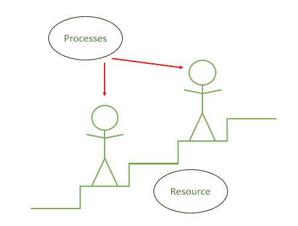

# 操作系统死锁的条件

> 原文:[https://www . geesforgeks . org/操作系统死锁条件/](https://www.geeksforgeeks.org/conditions-for-deadlock-in-operating-system/)

[死锁](https://www.geeksforgeeks.org/introduction-of-deadlock-in-operating-system/)是一种涉及多个资源和进程相互作用的情况。

我们可以把僵局的发生想象成两个人在一个楼梯上的情况。一个在爬楼梯，另一个在下降。楼梯太窄了，一次只能坐一个人。结果，一个人不得不撤退，而其他人继续前进并使用楼梯。一旦那个人完成了，另一个人可以使用那个楼梯。但是在这里，没有一个人愿意撤退，等待对方撤退。他们谁也不能使用楼梯。这里的人是过程，楼梯是资源。

当一个进程请求已经被另一个进程占用的资源，而另一个进程需要另一个资源来继续，但是被第一个进程占用，那么这就叫做**死锁**。

死锁发生有 4 个必要条件。借助上面举例说明的楼梯，可以理解它们:

1.  **互斥:**
    当两个人在着陆时相遇，他们不能就这么走过去了，因为只有一个人的空间。这个只允许一个人(或进程)使用他们之间的步骤(或资源)的条件是死锁发生的第一个必要条件。
2.  **坚守等待:**
    当 2 人拒绝撤退坚守阵地时，称为坚守。这是死锁的下一个必要条件。
3.  **无抢占:**
    为了解决死锁，可以简单地取消一个进程，让其他进程继续。但是操作系统没有这样做。它会根据需要将资源分配给处理器，直到任务完成。因此，没有临时重新分配资源。这是死锁的第三个条件。
4.  **循环等待:**
    当两人拒绝撤退，等待对方撤退，以便完成任务时，称为循环等待。这是死锁发生的最后条件。

**注:**
这 4 个条件都是死锁发生的必要条件。如果任何一个被阻止或解决，死锁就被解决了。