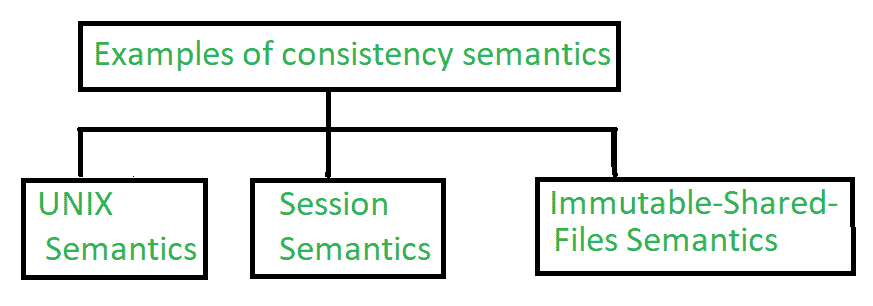

# 文件共享的一致性语义

> 原文:[https://www . geesforgeks . org/consistency-semantics-for-file-sharing/](https://www.geeksforgeeks.org/consistency-semantics-for-file-sharing/)

**一致性语义**是用户用来检查系统中支持文件共享的文件系统的概念。基本上，检查单个系统中多个用户如何同时访问同一个文件是一种规范。它们被用来检查文件中的各种东西，比如什么时候某个用户对某个文件的修改会被其他人注意到。

一致性语义是与过程同步算法概念直接相关的概念。但是[进程同步](https://www.geeksforgeeks.org/introduction-of-process-synchronization/)算法由于延迟大、磁盘和网络传输速度慢等问题，在文件输入输出的情况下没有使用。

**示例:**
当用户对远程磁盘执行原子事务时，它涉及网络通信、磁盘读写或两者兼有。用全套功能完成任务的系统性能不佳。在 Andrew 文件系统中，发现了共享语义的成功实现。

要由用户访问同一个文件，进程总是被包含在 open()和 close()操作之间。当对同一个文件进行一系列访问时，就组成了一个文件会话。

**1。UNIX 语义:**
UNIX 中的文件系统使用以下一致性语义–

*   用户将要写入的文件对当时共享该文件的所有用户都是可见的。
*   在 UNIX 语义中，共享文件的一种方式是通过共享当前位置的指针。但会影响所有其他分享用户。

在这种情况下，共享的文件与作为独占资源访问的单个物理映像相关联。这个单一的图像会导致用户进程的延迟。

**2。会话语义:**
Andrew 中的文件系统使用以下一致性语义。

*   用户将要写入的文件对当时共享该文件的所有用户都不可见。
*   关闭文件后，用户对该文件所做的更改仅在稍后启动的会话中可见。如果更改文件已被其他用户打开，则该用户将看不到更改。

在这种情况下，共享的文件与几个映像相关联，并且没有延迟，因为它允许多个用户同时对其映像执行读和写访问。

**3。不可变共享文件语义:**
不可变共享文件似乎有一种独特的方法。在这种情况下，用户不允许修改文件，该文件被声明为由其创建者共享。
不可变文件有如下两个属性–

*   它的名称不能重复使用。
*   其内容不得更改。

在这个文件系统中，文件的内容是固定的。语义在分布式系统中的实现很简单，因为共享是有规律的。