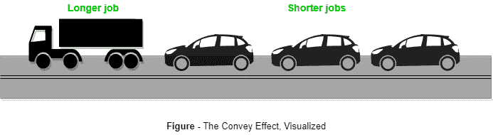

# 操作系统中的护航效应

> 原文:[https://www . geesforgeks . org/guardian-effect-operating-systems/](https://www.geeksforgeeks.org/convoy-effect-operating-systems/)

**先决条件:**FCFS 调度基础([FCFS 调度程序|第 1 集](https://www.geeksforgeeks.org/program-fcfs-scheduling-set-1/)，[FCFS 调度程序|第 2 集](https://www.geeksforgeeks.org/program-fcfs-scheduling-set-2-processes-different-arrival-time/))

护航效应是一种与先到先服务(FCFS)算法相关的现象，在这种算法中，由于很少的慢进程，整个操作系统会变慢。

FCFS 算法本质上是非抢占式的，即一旦 CPU 时间被分配给一个进程，其他进程只有在当前进程完成后才能获得 CPU 时间。FCFS 调度的这种特性导致了一种叫做护航效应的情况。

假设就绪队列中有一个 CPU 密集型(大突发时间)进程，以及其他几个突发时间相对较少但受输入/输出(I/O)限制的进程(经常需要 I/O 操作)。

步骤如下:

*   首先为输入/输出绑定进程分配中央处理器时间。由于它们的 CPU 密集程度较低，所以它们会很快被执行并进入输入/输出队列。
*   现在，CPU 密集型进程被分配了 CPU 时间。由于它的爆发时间很长，需要时间来完成。
*   在执行 CPU 密集型进程时，输入/输出绑定进程完成其输入/输出操作，并被移回就绪队列。
*   然而，由于 CPU 密集型进程仍未完成，输入/输出绑定进程被迫等待。**这导致输入/输出设备空闲。**
*   当 CPU 密集型进程结束时，它被发送到输入/输出队列，以便它可以访问输入/输出设备。
*   与此同时，输入/输出绑定进程获得所需的 CPU 时间，并移回输入/输出队列。
*   但是，由于中央处理器密集型进程仍在访问输入/输出设备，它们被迫等待。结果**CPU 现在闲置**。

因此，在护航效应中，一个缓慢的进程会降低整个进程集的性能，并导致 CPU 时间和其他设备的浪费。

为了避免护航效应，可以使用抢占式调度算法，如循环调度，因为较小的进程不必等待太多的 CPU 时间，从而加快它们的执行速度，减少闲置资源。

参考文献–

*   A.《操作系统概念(第八版)》，威利印度有限公司

本文由 **[三创·阿加瓦尔](http://www.facebook.com/sanchit3008)** 供稿。如果你喜欢 GeeksforGeeks 并想投稿，你也可以使用[contribute.geeksforgeeks.org](http://www.contribute.geeksforgeeks.org)写一篇文章或者把你的文章邮寄到 contribute@geeksforgeeks.org。看到你的文章出现在极客博客主页上，帮助其他极客。

如果你发现任何不正确的地方，或者你想分享更多关于上面讨论的话题的信息，请写评论。