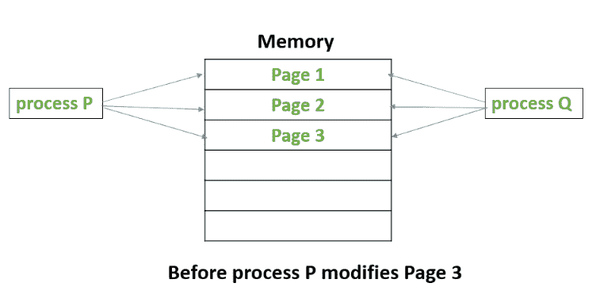
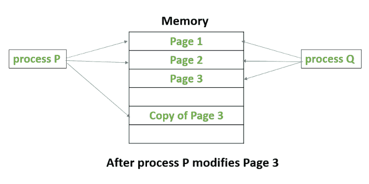

# 写时复制

> 原文:[https://www.geeksforgeeks.org/copy-on-write/](https://www.geeksforgeeks.org/copy-on-write/)

**写时拷贝**或者简称 COW 是一种资源管理技术。它的一个主要用途是实现分叉系统调用，其中它共享操作系统的虚拟内存(页面)。

在类似于操作系统的 UNIX 中，fork()系统调用创建了父进程的一个重复进程，该进程被称为子进程。

写时复制背后的思想是，当父进程创建子进程时，这两个进程最初将共享内存中的相同页面，并且这些共享页面将被标记为写时复制，这意味着如果这些进程中的任何一个试图修改共享页面，那么将只创建这些页面的副本，并且修改将由该进程在页面副本上完成，因此不会影响其他进程。

假设，有一个进程 P 创建了一个新的进程 Q，然后进程 P 修改了第 3 页。
下图显示了流程 P 修改第 3 页前后发生的情况。

