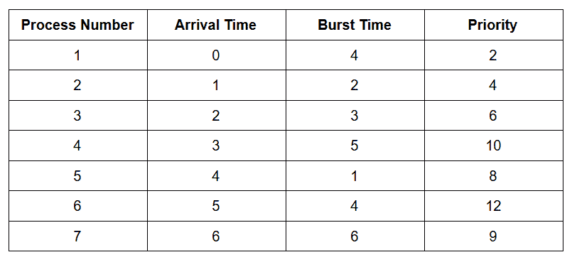

# 使用优先级队列的操作系统中的 CPU 调度，带甘特图

> 原文:[https://www . geesforgeks . org/CPU-操作系统中的调度-使用优先级-带甘特图的队列/](https://www.geeksforgeeks.org/cpu-scheduling-in-operating-systems-using-priority-queue-with-gantt-chart/)

先决条件:[操作系统中的 CPU 调度](https://www.geeksforgeeks.org/cpu-scheduling-in-operating-systems/)
**不同的调度算法:**

1.  **先到先服务 CPU 调度:**
    根据进程到达时间进行调度的最简单的调度算法。先来先服务调度算法规定先请求 CPU 的进程先分配 CPU。它是通过使用先进先出队列实现的。当一个进程进入就绪队列时，它的印刷电路板被链接到队列的尾部。当中央处理器空闲时，它被分配给队列头部的进程。然后，正在运行的进程将从队列中删除。FCFS 是一种非抢占式调度算法。
2.  **最短作业优先(抢占式):**
    在抢占式最短作业优先调度中，作业到达时被放入就绪队列，但当突发时间较短的进程到达时，现有进程被抢占或从执行中移除，较短的作业被首先执行。
3.  **最短作业优先(非抢先):**
    在非抢先最短作业优先中，首先调度突发时间最短的进程。如果两个过程具有相同的破裂时间，则使用 FCFS 来打破平局。
4.  **最长作业优先(抢先):**
    它类似于 SJF 调度算法。但是，在这个调度算法中，我们优先考虑剩余突发时间最大的进程。
5.  **最长作业优先(非抢先):**
    类似于 SJF 调度算法。但是，在该调度算法中，我们优先考虑具有最长突发时间的进程。这在本质上是非抢先的，即当任何进程开始执行时，在完成执行之前不能被中断。
6.  **循环调度:**
    为了实现循环调度，我们将就绪队列保持为进程的 FIFO 队列。新的进程被添加到就绪队列的尾部。中央处理器调度器从就绪队列中选择第一个进程，设置一个定时器在 1 个时间段后中断，并调度该进程。接下来会发生两件事中的一件。该进程可能具有小于 1 倍量程的中央处理器突发。在这种情况下，进程本身会主动释放 CPU。然后，调度程序将进入就绪队列中的下一个进程。否则，如果当前正在运行的进程的中央处理器突发长于 1 时间量，定时器将会关闭，并导致操作系统中断。将执行一个上下文切换，并且该进程将被放在就绪队列的尾部。然后，中央处理器调度程序将选择就绪队列中的下一个进程。
7.  **基于优先级的(抢占式)调度:**
    在抢占式优先级调度中，当一个进程到达就绪队列时，会将其优先级与就绪队列中其他进程的优先级以及该时间点 CPU 正在执行的进程进行比较。在所有可用进程中具有最高优先级的进程将被赋予下一个 CPU。在这个程序中，我们有两种选择，是将最高编号视为最高优先级，还是将最低编号视为最高优先级。
8.  **基于优先级的(非抢占式)调度:**
    在非抢占式优先级调度中，进程根据分配给它们的优先级编号进行调度。一旦进程被调度，它将一直运行到完成。一般优先级数越低，流程的优先级越高。人们可能会混淆优先级数字，因此在 GATE 中，会清楚地提到哪个优先级最高，哪个优先级最低。在这个程序中，我们有两种选择，是将最高编号视为最高优先级，还是将最低编号视为最高优先级。
9.  **最高响应比 Next (HRRN)调度:**
    最高响应比 Next(HRRN)是最优的调度算法之一。这是一种非抢占式算法，在这种算法中，调度是基于一个称为响应比的额外参数来完成的。为每个可用作业计算响应率，响应率最高的作业优先于其他作业。

考虑下表:
[](https://media.geeksforgeeks.org/wp-content/uploads/20200403214436/Screenshot-2820.png)

下面是使用[优先级队列](https://www.geeksforgeeks.org/priority-queue-set-1-introduction/) :
的上述算法的实现

## FirstCome

```
// C++ implementation of the FCFS algorithm
#include <cstdlib>
#include <iostream>
#include <queue>
using namespace std;

class process {
public:
    pid_t p_no = 0;
    time_t start_AT = 0, AT = 0,
           BT_left = 0, BT = 0, temp_BT = 0,
           CT = 0, TAT = 0, WT = 0, RT = 0;
    int priority = 0;

    // Function for completion time
    void set_CT(time_t time)
    {
        CT = time;
        set_TAT();
        set_WT();
    }

    // Function for Turn Around Time
    void set_TAT()
    {
        TAT = CT - start_AT;
    }

    // Function for Waiting Time
    void set_WT()
    {
        WT = TAT - BT;
    }
    // Function to set starting Arrival Time
    // Because arrival time gets updated
    // when you push process in ready queue again
    // in preemptive algorithms
    void P_set()
    {
        start_AT = AT;
        BT_left = BT;
    }
    // Function to set Response Time
    void set_RT(time_t time)
    {
        RT = time - start_AT;
    }

    // Overload operator '<' w.r.t arrival
    // time because arrival time is the
    // first priority even greater than
    // priority of process and priority_queue
    // pops out the greatest value first
    // so we need to replace '<' with '>' inorder
    // to pop out smallest value
    friend bool operator<(const process& a, const process& b)
    {
        return a.AT > b.AT;
    }
};

// Function to implement FCFS algorithm
priority_queue<process> FCFS_run(priority_queue<process> ready_queue,
                                 queue<process>* gantt)
{
    priority_queue<process> completion_queue;
    process p;
    time_t clock = 0;

    // Till ready queue is not empty
    while (!ready_queue.empty()) {

        // While clock is less than
        // Arrival Time
        while (clock < ready_queue.top().AT) {
            p.temp_BT++;
            clock++;
        }
        if (p.temp_BT > 0) {
            p.p_no = -1;
            p.CT = clock;
            (*gantt).push(p);
        }
        p = ready_queue.top();
        ready_queue.pop();
        p.set_RT(clock);
        while (p.BT_left > 0) {
            p.temp_BT++;
            p.BT_left--;
            clock++;
        }
        p.set_CT(clock);

        // Update the Gantt Chart
        (*gantt).push(p);
        p.temp_BT = 0;

        // Update the completion time to
        // the queue
        completion_queue.push(p);
    }
    return completion_queue;
}

// Set data on the basis of given table
priority_queue<process> set_sample_data()
{
    priority_queue<process> ready_queue;
    process temp;
    temp.AT = 0;
    temp.BT = 4;
    temp.priority = 2;
    temp.p_no = 1;
    temp.P_set();
    ready_queue.push(temp);
    temp.AT = 1;
    temp.BT = 2;
    temp.priority = 4;
    temp.p_no = 2;
    temp.P_set();
    ready_queue.push(temp);
    temp.AT = 2;
    temp.BT = 3;
    temp.priority = 6;
    temp.p_no = 3;
    temp.P_set();
    ready_queue.push(temp);
    temp.AT = 3;
    temp.BT = 5;
    temp.priority = 10;
    temp.p_no = 4;
    temp.P_set();
    ready_queue.push(temp);
    temp.AT = 4;
    temp.BT = 1;
    temp.priority = 8;
    temp.p_no = 5;
    temp.P_set();
    ready_queue.push(temp);
    temp.AT = 5;
    temp.BT = 4;
    temp.priority = 12;
    temp.p_no = 6;
    temp.P_set();
    ready_queue.push(temp);
    temp.AT = 6;
    temp.BT = 6;
    temp.priority = 9;
    temp.p_no = 7;
    temp.P_set();
    ready_queue.push(temp);
    return ready_queue;
}

// Function to get total Waiting Time
double get_total_WT(priority_queue<process> processes)
{
    double total = 0;
    while (!processes.empty()) {
        total += processes.top().WT;
        processes.pop();
    }
    return total;
}

// Function to get total Turn Around Time
double get_total_TAT(priority_queue<process> processes)
{
    double total = 0;
    while (!processes.empty()) {
        total += processes.top().TAT;
        processes.pop();
    }
    return total;
}

// Function to get total Completion Time
double get_total_CT(priority_queue<process> processes)
{
    double total = 0;
    while (!processes.empty()) {
        total += processes.top().CT;
        processes.pop();
    }
    return total;
}

// Function to get total Response Time
double get_total_RT(priority_queue<process> processes)
{
    double total = 0;
    while (!processes.empty()) {
        total += processes.top().RT;
        processes.pop();
    }
    return total;
}

// Function to display Completion Queue and
// all the time
void disp(priority_queue<process> main_queue, bool high)
{
    int i = 0, temp, size = main_queue.size();
    priority_queue<process> tempq = main_queue;
    double temp1;
    cout << "+-------------+--------------";
    cout << "+------------+-----------------";
    cout << "+-----------------+--------------+---------------+";
    if (high == true)
        cout << "----------+" << endl;
    else
        cout << endl;
    cout << "| Process No. | Arrival Time ";
    cout << "| Burst Time | Completion Time ";
    cout << "| Turnaround Time | Waiting Time | Response Time |";
    if (high == true)
        cout << " Priority |" << endl;
    else
        cout << endl;
    cout << "+-------------+--------------";
    cout << "+------------+-----------------";
    cout << "+-----------------+--------------+---------------+";
    if (high == true)
        cout << "----------+" << endl;
    else
        cout << endl;
    while (!main_queue.empty()) {
        temp = to_string(main_queue.top().p_no).length();
        cout << '|' << string(6 - temp / 2 - temp % 2, ' ')
             << main_queue.top().p_no << string(7 - temp / 2, ' ');
        temp = to_string(main_queue.top().start_AT).length();
        cout << '|' << string(7 - temp / 2 - temp % 2, ' ')
             << main_queue.top().start_AT << string(7 - temp / 2, ' ');
        temp = to_string(main_queue.top().BT).length();
        cout << '|' << string(6 - temp / 2 - temp % 2, ' ')
             << main_queue.top().BT << string(6 - temp / 2, ' ');
        temp = to_string(main_queue.top().CT).length();
        cout << '|' << string(8 - temp / 2 - temp % 2, ' ')
             << main_queue.top().CT << string(9 - temp / 2, ' ');
        temp = to_string(main_queue.top().TAT).length();
        cout << '|' << string(8 - temp / 2 - temp % 2, ' ')
             << main_queue.top().TAT << string(9 - temp / 2, ' ');
        temp = to_string(main_queue.top().WT).length();
        cout << '|' << string(7 - temp / 2 - temp % 2, ' ')
             << main_queue.top().WT << string(7 - temp / 2, ' ');
        temp = to_string(main_queue.top().RT).length();
        cout << '|' << string(7 - temp / 2 - temp % 2, ' ')
             << main_queue.top().RT << string(8 - temp / 2, ' ');
        if (high == true) {
            temp = to_string(main_queue.top().priority).length();
            cout << '|' << string(5 - temp / 2 - temp % 2, ' ')
                 << main_queue.top().priority << string(5 - temp / 2, ' ');
        }
        cout << "|\n";
        main_queue.pop();
    }
    cout << "+-------------+--------------";
    cout << "+------------+-----------------";
    cout << "+-----------------+--------------+---------------+";
    if (high == true)
        cout << "----------+";
    cout << endl;
    temp1 = get_total_CT(tempq);
    cout << "\nTotal completion time :- " << temp1
         << endl;
    cout << "Average completion time :- " << temp1 / size
         << endl;
    temp1 = get_total_TAT(tempq);
    cout << "\nTotal turnaround time :- " << temp1
         << endl;
    cout << "Average turnaround time :- " << temp1 / size
         << endl;
    temp1 = get_total_WT(tempq);
    cout << "\nTotal waiting time :- " << temp1
         << endl;
    cout << "Average waiting time :- " << temp1 / size
         << endl;
    temp1 = get_total_RT(tempq);
    cout << "\nTotal response time :- " << temp1
         << endl;
    cout << "Average response time :- " << temp1 / size
         << endl;
}

// Function to display Gantt Chart
void disp_gantt_chart(queue<process> gantt)
{
    int temp, prev = 0;
    queue<process> spaces = gantt;
    cout << "\n\nGantt Chart (IS indicates ideal state) :- \n\n+";

    // For 1st row of gantt chart
    while (!spaces.empty()) {
        cout << string(to_string(spaces.front().p_no).length()
                           + (spaces.front().p_no != -1)
                           + 2 * spaces.front().temp_BT,
                       '-')
             << "+";
        spaces.pop();
    }
    cout << "\n|";
    spaces = gantt;

    // For process no. in 2nd row
    while (!spaces.empty()) {
        cout << string(spaces.front().temp_BT, ' ');
        if (spaces.front().p_no == -1)
            cout << "IS" << string(spaces.front().temp_BT, ' ') << '|';
        else
            cout << "P" << spaces.front().p_no
                 << string(spaces.front().temp_BT, ' ') << '|';
        spaces.pop();
    }
    spaces = gantt;
    cout << "\n+";

    while (!spaces.empty()) {
        cout << (string(to_string(spaces.front().p_no).length()
                            + (spaces.front().p_no != -1)
                            + 2 * spaces.front().temp_BT,
                        '-'))
             << "+";
        spaces.pop();
    }
    spaces = gantt;
    cout << "\n0";
//For 3rd row of gantt chart
    while (!spaces.empty()) {
        temp = to_string(spaces.front().CT).length();
        cout << (string(to_string(spaces.front().p_no).length()
                            + (spaces.front().p_no != -1)
                            + 2 * spaces.front().temp_BT - temp / 2 - prev,
                        ' '))
             << spaces.front().CT;
        prev = temp / 2 - temp % 2 == 0;
        spaces.pop();
    }
    cout << "\n\n";
}

// Driver Code
int main()
{
    // Initialise Ready and Completion Queue
    priority_queue<process> ready_queue;
    priority_queue<process> completion_queue;

    // queue for Gantt Chart
    queue<process> gantt;
    ready_queue = set_sample_data();

    // Function call for completion data
    completion_queue = FCFS_run(ready_queue, &gantt);

    // Display Completion Queue
    disp(completion_queue, false);

    // Display Gantt Chart
    disp_gantt_chart(gantt);
    return 0;
}
```

**输出:-**

```
+-------------+--------------+------------+-----------------+-----------------+--------------+---------------+
| Process No. | Arrival Time | Burst Time | Completion Time | Turnaround Time | Waiting Time | Response Time |
+-------------+--------------+------------+-----------------+-----------------+--------------+---------------+
|     1       |      0       |     4      |       4         |       4         |      0       |      0        |
|     2       |      1       |     2      |       6         |       5         |      3       |      3        |
|     3       |      2       |     3      |       9         |       7         |      4       |      4        |
|     4       |      3       |     5      |       14        |       11        |      6       |      6        |
|     5       |      4       |     1      |       15        |       11        |      10      |      10       |
|     6       |      5       |     4      |       19        |       14        |      10      |      10       |
|     7       |      6       |     6      |       25        |       19        |      13      |      13       |
+-------------+--------------+------------+-----------------+-----------------+--------------+---------------+

Total completion time :- 92
Average completion time :- 13.1429

Total turnaround time :- 71
Average turnaround time :- 10.1429

Total waiting time :- 46
Average waiting time :- 6.57143

Total response time :- 46
Average response time :- 6.57143

Gantt Chart (IS indicates ideal state) :- 

+----------+------+--------+------------+----+----------+--------------+
|    P1    |  P2  |   P3   |     P4     | P5 |    P6    |      P7      |
+----------+------+--------+------------+----+----------+--------------+
0          4      6        9           14   15         19             25

```

## 沙弗

```
// C++ implementation of the SJF preemptive algorithm
#include <cstdlib>
#include <iostream>
#include <queue>
using namespace std;

class process {
public:
    pid_t p_no = 0;
    time_t start_AT = 0, AT = 0,
           BT_left = 0, BT = 0, temp_BT = 0,
           CT = 0, TAT = 0, WT = 0, RT = 0;
    int priority = 0;

    // Function for completion time
    void set_CT(time_t time)
    {
        CT = time;
        set_TAT();
        set_WT();
    }

    // Function for Turn Around Time
    void set_TAT()
    {
        TAT = CT - start_AT;
    }

    // Function for Waiting Time
    void set_WT()
    {
        WT = TAT - BT;
    }
    void P_set()
    {
        start_AT = AT;
        BT_left = BT;
    }
    void set_RT(time_t time)
    {
        RT = time - start_AT;
    }

    // Overload operator '<' w.r.t arrival
    // time because arrival time is the
    // first priority even greater than
    // priority of process and priority_queue
    // pops out the greatest value first
    // so we need to replace '<' with '>' inorder
    // to pop out smallest value
    friend bool operator<(const process& a, const process& b)
    {
        return a.AT > b.AT;
    }
};

process pop_index(priority_queue<process>* main_queue, int index)
{
    priority_queue<process> rm_index;
    int i;
    process p;
    switch (index) {
    case 0:
        p = (*main_queue).top();
        (*main_queue).pop();
        break;
    default:
        for (i = 0; i < index; i++) {
            rm_index.push((*main_queue).top());
            (*main_queue).pop();
        }
        p = (*main_queue).top();
        (*main_queue).pop();
        while (!(*main_queue).empty()) {
            rm_index.push((*main_queue).top());
            (*main_queue).pop();
        }
        (*main_queue) = rm_index;
        break;
    }
    return p;
}
time_t min_BT(priority_queue<process> main_queue, time_t clock)
{
    time_t min = 0;
    while (!main_queue.empty() && main_queue.top().AT <= clock) {
        if (min == 0 || min > main_queue.top().BT_left)
            min = main_queue.top().BT_left;
        main_queue.pop();
    }
    return min;
}
int min_BT_index(priority_queue<process> main_queue, time_t limit)
{
    int index, i = 0;
    time_t min = 0;
    while (!main_queue.empty() && main_queue.top().AT <= limit) {
        if (min == 0 || main_queue.top().BT_left < min) {
            min = main_queue.top().BT_left;
            index = i;
        }
        main_queue.pop();
        i++;
    }
    return index;
}

// Function to implement SJF preemptive algorithm
priority_queue<process> SJF_P_run(priority_queue<process> ready_queue,
                                  queue<process>* gantt)
{
    priority_queue<process> completion_queue;
    process p;
    time_t clock = 0;

    while (!ready_queue.empty()) {
        while (clock < ready_queue.top().AT) {
            p.temp_BT++;
            clock++;
        }
        if (p.temp_BT > 0) {
            p.p_no = -1;
            p.CT = clock;
            (*gantt).push(p);
        }
        p = pop_index(&ready_queue, min_BT_index(ready_queue, clock));
        if (p.AT == p.start_AT)
            p.set_RT(clock);
        while (p.BT_left > 0 && (ready_queue.empty()
                                 || clock < ready_queue.top().AT
                                 || p.BT_left <= min_BT(ready_queue, clock))) {
            p.BT_left--;
            p.temp_BT++;
            clock++;
        }
        if (p.BT_left == 0) {
            p.AT = p.start_AT;
            p.set_CT(clock);
            (*gantt).push(p);
            p.temp_BT = 0;
            completion_queue.push(p);
        }
        else {
            p.AT = clock;
            p.CT = clock;
            (*gantt).push(p);
            p.temp_BT = 0;
            ready_queue.push(p);
        }
    }

    return completion_queue;
}

// Set data on the basis of given table
priority_queue<process> set_sample_data()
{
    priority_queue<process> ready_queue;
    process temp;
    temp.AT = 0;
    temp.BT = 4;
    temp.priority = 2;
    temp.p_no = 1;
    temp.P_set();
    ready_queue.push(temp);
    temp.AT = 1;
    temp.BT = 2;
    temp.priority = 4;
    temp.p_no = 2;
    temp.P_set();
    ready_queue.push(temp);
    temp.AT = 2;
    temp.BT = 3;
    temp.priority = 6;
    temp.p_no = 3;
    temp.P_set();
    ready_queue.push(temp);
    temp.AT = 3;
    temp.BT = 5;
    temp.priority = 10;
    temp.p_no = 4;
    temp.P_set();
    ready_queue.push(temp);
    temp.AT = 4;
    temp.BT = 1;
    temp.priority = 8;
    temp.p_no = 5;
    temp.P_set();
    ready_queue.push(temp);
    temp.AT = 5;
    temp.BT = 4;
    temp.priority = 12;
    temp.p_no = 6;
    temp.P_set();
    ready_queue.push(temp);
    temp.AT = 6;
    temp.BT = 6;
    temp.priority = 9;
    temp.p_no = 7;
    temp.P_set();
    ready_queue.push(temp);
    return ready_queue;
}

// Function to get total Waiting Time
double get_total_WT(priority_queue<process> processes)
{
    double total = 0;
    while (!processes.empty()) {
        total += processes.top().WT;
        processes.pop();
    }
    return total;
}

// Function to get total Turn Around Time
double get_total_TAT(priority_queue<process> processes)
{
    double total = 0;
    while (!processes.empty()) {
        total += processes.top().TAT;
        processes.pop();
    }
    return total;
}

// Function to get total Completion Time
double get_total_CT(priority_queue<process> processes)
{
    double total = 0;
    while (!processes.empty()) {
        total += processes.top().CT;
        processes.pop();
    }
    return total;
}

// Function to get total Response Time
double get_total_RT(priority_queue<process> processes)
{
    double total = 0;

    while (!processes.empty()) {
        total += processes.top().RT;
        processes.pop();
    }
    return total;
}

// Function to display Completion Queue
// and all the time
void disp(priority_queue<process> main_queue, bool high)
{
    int i = 0, temp, size = main_queue.size();
    priority_queue<process> tempq = main_queue;
    double temp1;
    cout << "+-------------+--------------";
    cout << "+------------+-----------------";
    cout << "+-----------------+--------------+---------------+";
    if (high == true)
        cout << "----------+" << endl;
    else
        cout << endl;
    cout << "| Process No. | Arrival Time ";
    cout << "| Burst Time | Completion Time ";
    cout << "| Turnaround Time | Waiting Time | Response Time |";
    if (high == true)
        cout << " Priority |" << endl;
    else
        cout << endl;
    cout << "+-------------+--------------";
    cout << "+------------+-----------------";
    cout << "+-----------------+--------------+---------------+";
    if (high == true)
        cout << "----------+" << endl;
    else
        cout << endl;
    while (!main_queue.empty()) {
        temp = to_string(main_queue.top().p_no).length();
        cout << '|' << string(6 - temp / 2 - temp % 2, ' ')
             << main_queue.top().p_no << string(7 - temp / 2, ' ');
        temp = to_string(main_queue.top().start_AT).length();
        cout << '|' << string(7 - temp / 2 - temp % 2, ' ')
             << main_queue.top().start_AT << string(7 - temp / 2, ' ');
        temp = to_string(main_queue.top().BT).length();
        cout << '|' << string(6 - temp / 2 - temp % 2, ' ')
             << main_queue.top().BT << string(6 - temp / 2, ' ');
        temp = to_string(main_queue.top().CT).length();
        cout << '|' << string(8 - temp / 2 - temp % 2, ' ')
             << main_queue.top().CT << string(9 - temp / 2, ' ');
        temp = to_string(main_queue.top().TAT).length();
        cout << '|' << string(8 - temp / 2 - temp % 2, ' ')
             << main_queue.top().TAT << string(9 - temp / 2, ' ');
        temp = to_string(main_queue.top().WT).length();
        cout << '|' << string(7 - temp / 2 - temp % 2, ' ')
             << main_queue.top().WT << string(7 - temp / 2, ' ');
        temp = to_string(main_queue.top().RT).length();
        cout << '|' << string(7 - temp / 2 - temp % 2, ' ')
             << main_queue.top().RT << string(8 - temp / 2, ' ');
        if (high == true) {
            temp = to_string(main_queue.top().priority).length();
            cout << '|' << string(5 - temp / 2 - temp % 2, ' ')
                 << main_queue.top().priority << string(5 - temp / 2, ' ');
        }
        cout << "|\n";
        main_queue.pop();
    }
    cout << "+-------------+--------------";
    cout << "+------------+-----------------";
    cout << "+-----------------+--------------+---------------+";
    if (high == true)
        cout << "----------+";
    cout << endl;
    temp1 = get_total_CT(tempq);
    cout << "\nTotal completion time :- " << temp1 << endl;
    cout << "Average completion time :- " << temp1 / size << endl;
    temp1 = get_total_TAT(tempq);
    cout << "\nTotal turnaround time :- " << temp1 << endl;
    cout << "Average turnaround time :- " << temp1 / size << endl;
    temp1 = get_total_WT(tempq);
    cout << "\nTotal waiting time :- " << temp1 << endl;
    cout << "Average waiting time :- " << temp1 / size << endl;
    temp1 = get_total_RT(tempq);
    cout << "\nTotal response time :- " << temp1 << endl;
    cout << "Average response time :- " << temp1 / size << endl;
}

// Function to display Gantt Chart
void disp_gantt_chart(queue<process> gantt)
{
    int temp, prev = 0;
    queue<process> spaces = gantt;
    cout << "\n\nGantt Chart (IS indicates ideal state) :- \n\n+";

    while (!spaces.empty()) {
        cout << string(to_string(spaces.front().p_no).length() + (spaces.front().p_no != -1) + 2 * spaces.front().temp_BT, '-') << "+";
        spaces.pop();
    }
    cout << "\n|";
    spaces = gantt;

    while (!spaces.empty()) {
        cout << string(spaces.front().temp_BT, ' ');
        if (spaces.front().p_no == -1)
            cout << "IS" << string(spaces.front().temp_BT, ' ') << '|';
        else
            cout << "P" << spaces.front().p_no
                 << string(spaces.front().temp_BT, ' ') << '|';
        spaces.pop();
    }
    spaces = gantt;
    cout << "\n+";

    while (!spaces.empty()) {
        cout << string(to_string(spaces.front().p_no).length() + (spaces.front().p_no != -1) + 2 * spaces.front().temp_BT, '-')
             << "+";
        spaces.pop();
    }
    spaces = gantt;
    cout << "\n0";

    while (!spaces.empty()) {
        temp = to_string(spaces.front().CT).length();
        cout << string(to_string(spaces.front().p_no).length() + (spaces.front().p_no != -1) + 2 * spaces.front().temp_BT
                           - temp / 2 - prev,
                       ' ')
             << spaces.front().CT;
        prev = temp / 2 - temp % 2 == 0;
        spaces.pop();
    }

    cout << "\n\n";
}

// Driver Code
int main()
{
    // Initialize Ready and Completion Queue
    priority_queue<process> ready_queue, completion_queue;

    // queue for Gantt Chart
    queue<process> gantt;
    ready_queue = set_sample_data();

    // Function call for completion data
    completion_queue = SJF_P_run(ready_queue, &gantt);

    // Display Completion Queue
    disp(completion_queue, false);

    // Display Gantt Chart
    disp_gantt_chart(gantt);
    return 0;
}
```

**输出:-**

```
+-------------+--------------+------------+-----------------+-----------------+--------------+---------------+
| Process No. | Arrival Time | Burst Time | Completion Time | Turnaround Time | Waiting Time | Response Time |
+-------------+--------------+------------+-----------------+-----------------+--------------+---------------+
|     1       |      0       |     4      |       7         |       7         |      3       |      0        |
|     2       |      1       |     2      |       3         |       2         |      0       |      0        |
|     3       |      2       |     3      |       10        |       8         |      5       |      5        |
|     4       |      3       |     5      |       19        |       16        |      11      |      11       |
|     5       |      4       |     1      |       5         |       1         |      0       |      0        |
|     6       |      5       |     4      |       14        |       9         |      5       |      5        |
|     7       |      6       |     6      |       25        |       19        |      13      |      13       |
+-------------+--------------+------------+-----------------+-----------------+--------------+---------------+

Total completion time :- 83
Average completion time :- 11.8571

Total turnaround time :- 62
Average turnaround time :- 8.85714

Total waiting time :- 37
Average waiting time :- 5.28571

Total response time :- 34
Average response time :- 4.85714

Gantt Chart (IS indicates ideal state) :- 

+----+------+----+----+------+--------+----------+------------+--------------+
| P1 |  P2  | P1 | P5 |  P1  |   P3   |    P6    |     P4     |      P7      |
+----+------+----+----+------+--------+----------+------------+--------------+
0    1      3    4    5      7       10         14           19             25

```

## 沙弗

```
// C++ implementation of the SJF(Non-preemptive) algorithm
#include <cstdlib>
#include <iostream>
#include <queue>
using namespace std;
class process {
public:
    pid_t p_no = 0;
    time_t start_AT = 0, AT = 0,
           BT_left = 0, BT = 0, temp_BT = 0,
           CT = 0, TAT = 0, WT = 0, RT = 0;
    int priority = 0;

    // Function for completion time
    void set_CT(time_t time)
    {
        CT = time;
        set_TAT();
        set_WT();
    }

    // Function for Turn Around Time
    void set_TAT()
    {
        TAT = CT - start_AT;
    }

    // Function for Waiting Time
    void set_WT()
    {
        WT = TAT - BT;
    }
    void P_set()
    {
        start_AT = AT;
        BT_left = BT;
    }
    void set_RT(time_t time)
    {
        RT = time - start_AT;
    }

    // Overload operator '<' w.r.t arrival
    // time because arrival time is the
    // first priority even greater than
    // priority of process and priority_queue
    // pops out the greatest value first
    // so we need to replace '<' with '>' inorder
    // to pop out smallest value
    friend bool operator<(const process& a, const process& b)
    {
        return a.AT > b.AT;
    }
};

// Function to implementation pop_index()
process pop_index(priority_queue<process>* main_queue, int index)
{
    priority_queue<process> rm_index;
    int i;
    process p;
    switch (index) {
    case 0:
        p = (*main_queue).top();
        (*main_queue).pop();
        break;
    default:
        for (i = 0; i < index; i++) {
            rm_index.push((*main_queue).top());
            (*main_queue).pop();
        }
        p = (*main_queue).top();
        (*main_queue).pop();
        while (!(*main_queue).empty()) {
            rm_index.push((*main_queue).top());
            (*main_queue).pop();
        }
        (*main_queue) = rm_index;
        break;
    }
    return p;
}

// Function to find index of process
//with minimum BT
int min_BT_index(priority_queue<process> main_queue, time_t limit)
{
    int index, i = 0;
    time_t min = 0;
    while (!main_queue.empty() && main_queue.top().AT <= limit) {
        if (min == 0 || main_queue.top().BT_left < min) {
            min = main_queue.top().BT_left;
            index = i;
        }
        main_queue.pop();
        i++;
    }
    return index;
}

// Function to implement SJF(Non-preemptive)
priority_queue<process> SJF_NP_run(priority_queue<process> ready_queue,
                                   queue<process>* gantt)
{
    priority_queue<process> completion_queue;
    process p;
    time_t clock = 0;
    while (!ready_queue.empty()) {
        while (clock < ready_queue.top().AT) {
            p.temp_BT++;
            clock++;
        }
        if (p.temp_BT > 0) {
            p.p_no = -1;
            p.CT = clock;
            (*gantt).push(p);
        }
        p = pop_index(&ready_queue,
                      min_BT_index(ready_queue, clock));
        p.set_RT(clock);
        while (p.BT_left > 0) {
            p.temp_BT++;
            p.BT_left--;
            clock++;
        }
        p.set_CT(clock);
        (*gantt).push(p);
        p.temp_BT = 0;
        completion_queue.push(p);
    }
    return completion_queue;
}

// Set data on the basis of given table
priority_queue<process> set_sample_data()
{
    priority_queue<process> ready_queue;
    process temp;
    temp.AT = 0;
    temp.BT = 4;
    temp.priority = 2;
    temp.p_no = 1;
    temp.P_set();
    ready_queue.push(temp);
    temp.AT = 1;
    temp.BT = 2;
    temp.priority = 4;
    temp.p_no = 2;
    temp.P_set();
    ready_queue.push(temp);
    temp.AT = 2;
    temp.BT = 3;
    temp.priority = 6;
    temp.p_no = 3;
    temp.P_set();
    ready_queue.push(temp);
    temp.AT = 3;
    temp.BT = 5;
    temp.priority = 10;
    temp.p_no = 4;
    temp.P_set();
    ready_queue.push(temp);
    temp.AT = 4;
    temp.BT = 1;
    temp.priority = 8;
    temp.p_no = 5;
    temp.P_set();
    ready_queue.push(temp);
    temp.AT = 5;
    temp.BT = 4;
    temp.priority = 12;
    temp.p_no = 6;
    temp.P_set();
    ready_queue.push(temp);
    temp.AT = 6;
    temp.BT = 6;
    temp.priority = 9;
    temp.p_no = 7;
    temp.P_set();
    ready_queue.push(temp);
    return ready_queue;
}
//Function to get total Waiting Time
double get_total_WT(priority_queue<process> processes)
{
    double total = 0;
    while (!processes.empty()) {
        total += processes.top().WT;
        processes.pop();
    }
    return total;
}

// Function to get total Turn Around Time
double get_total_TAT(priority_queue<process> processes)
{
    double total = 0;
    while (!processes.empty()) {
        total += processes.top().TAT;
        processes.pop();
    }
    return total;
}

// Function to get total Completion Time
double get_total_CT(priority_queue<process> processes)
{
    double total = 0;
    while (!processes.empty()) {
        total += processes.top().CT;
        processes.pop();
    }
    return total;
}

// Function to get total Response Time
double get_total_RT(priority_queue<process> processes)
{
    double total = 0;
    while (!processes.empty()) {
        total += processes.top().RT;
        processes.pop();
    }
    return total;
}

// Function to display the queue
void disp(priority_queue<process> main_queue, bool high)
{
    int i = 0, temp, size = main_queue.size();
    priority_queue<process> tempq = main_queue;
    double temp1;
    cout << "+-------------+--------------";
    cout << "+------------+-----------------";
    cout << "+-----------------+--------------+---------------+";
    if (high == true)
        cout << "----------+" << endl;
    else
        cout << endl;
    cout << "| Process No. | Arrival Time ";
    cout << "| Burst Time | Completion Time ";
    cout << "| Turnaround Time | Waiting Time | Response Time |";
    if (high == true)
        cout << " Priority |" << endl;
    else
        cout << endl;
    cout << "+-------------+--------------";
    cout << "+------------+-----------------";
    cout << "+-----------------+--------------+---------------+";
    if (high == true)
        cout << "----------+" << endl;
    else
        cout << endl;
    while (!main_queue.empty()) {
        temp = to_string(main_queue.top().p_no).length();
        cout << '|' << string(6 - temp / 2 - temp % 2, ' ')
             << main_queue.top().p_no << string(7 - temp / 2, ' ');
        temp = to_string(main_queue.top().start_AT).length();
        cout << '|' << string(7 - temp / 2 - temp % 2, ' ')
             << main_queue.top().start_AT << string(7 - temp / 2, ' ');
        temp = to_string(main_queue.top().BT).length();
        cout << '|' << string(6 - temp / 2 - temp % 2, ' ')
             << main_queue.top().BT << string(6 - temp / 2, ' ');
        temp = to_string(main_queue.top().CT).length();
        cout << '|' << string(8 - temp / 2 - temp % 2, ' ')
             << main_queue.top().CT << string(9 - temp / 2, ' ');
        temp = to_string(main_queue.top().TAT).length();
        cout << '|' << string(8 - temp / 2 - temp % 2, ' ')
             << main_queue.top().TAT << string(9 - temp / 2, ' ');
        temp = to_string(main_queue.top().WT).length();
        cout << '|' << string(7 - temp / 2 - temp % 2, ' ')
             << main_queue.top().WT << string(7 - temp / 2, ' ');
        temp = to_string(main_queue.top().RT).length();
        cout << '|' << string(7 - temp / 2 - temp % 2, ' ')
             << main_queue.top().RT << string(8 - temp / 2, ' ');
        if (high == true) {
            temp = to_string(main_queue.top().priority).length();
            cout << '|' << string(5 - temp / 2 - temp % 2, ' ')
                 << main_queue.top().priority << string(5 - temp / 2, ' ');
        }
        cout << "|\n";
        main_queue.pop();
    }
    cout << "+-------------+--------------";
    cout << "+------------+-----------------";
    cout << "+-----------------+--------------+---------------+";
    if (high == true)
        cout << "----------+";
    cout << endl;
    temp1 = get_total_CT(tempq);
    cout << "\nTotal completion time :- " << temp1 << endl;
    cout << "Average completion time :- " << temp1 / size << endl;
    temp1 = get_total_TAT(tempq);
    cout << "\nTotal turnaround time :- " << temp1 << endl;
    cout << "Average turnaround time :- " << temp1 / size << endl;
    temp1 = get_total_WT(tempq);
    cout << "\nTotal waiting time :- " << temp1 << endl;
    cout << "Average waiting time :- " << temp1 / size << endl;
    temp1 = get_total_RT(tempq);
    cout << "\nTotal response time :- " << temp1 << endl;
    cout << "Average response time :- " << temp1 / size << endl;
}

// Function to display Gantt Chart
void disp_gantt_chart(queue<process> gantt)
{
    int temp, prev = 0;
    queue<process> spaces = gantt;
    cout << "\n\nGantt Chart (IS indicates ideal state) :- \n\n+";
    while (!spaces.empty()) {
        cout << string(to_string(spaces.front().p_no).length() + (spaces.front().p_no != -1) + 2 * spaces.front().temp_BT, '-') << "+";
        spaces.pop();
    }
    cout << "\n|";
    spaces = gantt;
    while (!spaces.empty()) {
        cout << string(spaces.front().temp_BT, ' ');
        if (spaces.front().p_no == -1)
            cout << "IS" << string(spaces.front().temp_BT, ' ') << '|';
        else
            cout << "P" << spaces.front().p_no
                 << string(spaces.front().temp_BT, ' ') << '|';
        spaces.pop();
    }
    spaces = gantt;
    cout << "\n+";
    while (!spaces.empty()) {
        cout << string(to_string(spaces.front().p_no).length() + (spaces.front().p_no != -1) + 2 * spaces.front().temp_BT, '-')
             << "+";
        spaces.pop();
    }
    spaces = gantt;
    cout << "\n0";
    while (!spaces.empty()) {
        temp = to_string(spaces.front().CT).length();
        cout << string(to_string(spaces.front().p_no).length() + (spaces.front().p_no != -1) + 2 * spaces.front().temp_BT
                           - temp / 2 - prev,
                       ' ')
             << spaces.front().CT;
        prev = temp / 2 - temp % 2 == 0;
        spaces.pop();
    }
    cout << "\n\n";
}

// Driver Code
int main()
{
    // Initialise Ready and Completion Queue
    priority_queue<process> ready_queue, completion_queue;

    // queue for Gantt Chart
    queue<process> gantt;
    ready_queue = set_sample_data();

    // Function call to find completion data
    completion_queue = SJF_NP_run(ready_queue, &gantt);

    // Display Completion Queue
    disp(completion_queue, false);

    // Display Gantt Chart
    disp_gantt_chart(gantt);
    return 0;
}
```

**输出:-**

```
+-------------+--------------+------------+-----------------+-----------------+--------------+---------------+
| Process No. | Arrival Time | Burst Time | Completion Time | Turnaround Time | Waiting Time | Response Time |
+-------------+--------------+------------+-----------------+-----------------+--------------+---------------+
|     1       |      0       |     4      |       4         |       4         |      0       |      0        |
|     2       |      1       |     2      |       7         |       6         |      4       |      4        |
|     3       |      2       |     3      |       10        |       8         |      5       |      5        |
|     4       |      3       |     5      |       19        |       16        |      11      |      11       |
|     5       |      4       |     1      |       5         |       1         |      0       |      0        |
|     6       |      5       |     4      |       14        |       9         |      5       |      5        |
|     7       |      6       |     6      |       25        |       19        |      13      |      13       |
+-------------+--------------+------------+-----------------+-----------------+--------------+---------------+

Total completion time :- 84
Average completion time :- 12

Total turnaround time :- 63
Average turnaround time :- 9

Total waiting time :- 38
Average waiting time :- 5.42857

Total response time :- 38
Average response time :- 5.42857

Gantt Chart (IS indicates ideal state) :- 

+----------+----+------+--------+----------+------------+--------------+
|    P1    | P5 |  P2  |   P3   |    P6    |     P4     |      P7      |
+----------+----+------+--------+----------+------------+--------------+
0          4    5      7       10         14           19             25

```

## ljf(消歧义)

```
// C++ implementation of the LJF(Preemptive) algorithm
#include <cstdlib>
#include <iostream>
#include <queue>
using namespace std;
class process {
public:
    pid_t p_no = 0;
    time_t start_AT = 0, AT = 0,
           BT_left = 0, BT = 0, temp_BT = 0,
           CT = 0, TAT = 0, WT = 0, RT = 0;
    int priority = 0;

    // Function for completion time
    void set_CT(time_t time)
    {
        CT = time;
        set_TAT();
        set_WT();
    }

    // Function for Turn Around Time
    void set_TAT()
    {
        TAT = CT - start_AT;
    }

    // Function for Waiting Time
    void set_WT()
    {
        WT = TAT - BT;
    }
    void P_set()
    {
        start_AT = AT;
        BT_left = BT;
    }
    void set_RT(time_t time)
    {
        RT = time - start_AT;
    }

    // Overload operator '<' w.r.t arrival
    // time because arrival time is the
    // first priority even greater than
    // priority of process and priority_queue
    // pops out the greatest value first
    // so we need to replace '<' with '>' inorder
    // to pop out smallest value
    friend bool operator<(const process& a, const process& b)
    {
        return a.AT > b.AT;
    }
};

// Function to implementation pop_index()
process pop_index(priority_queue<process>* main_queue, int index)
{
    priority_queue<process> rm_index;
    int i;
    process p;
    switch (index) {
    case 0:
        p = (*main_queue).top();
        (*main_queue).pop();
        break;
    default:
        for (i = 0; i < index; i++) {
            rm_index.push((*main_queue).top());
            (*main_queue).pop();
        }
        p = (*main_queue).top();
        (*main_queue).pop();
        while (!(*main_queue).empty()) {
            rm_index.push((*main_queue).top());
            (*main_queue).pop();
        }
        (*main_queue) = rm_index;
        break;
    }
    return p;
}

// Function to implement maximum Burst Time
time_t max_BT(priority_queue<process> main_queue, time_t limit)
{
    time_t max = 0;
    while (!main_queue.empty() && main_queue.top().AT <= limit) {
        if (main_queue.top().BT_left > max)
            max = main_queue.top().BT_left;
        main_queue.pop();
    }
    return max;
}

// Function to implement maximum BT index w.r.t given clock limit
int max_BT_index(priority_queue<process> main_queue, time_t limit)
{
    int index, i = 0;
    time_t max = 0;
    while (!main_queue.empty() && main_queue.top().AT <= limit) {
        if (main_queue.top().BT_left > max) {
            max = main_queue.top().BT_left;
            index = i;
        }
        main_queue.pop();
        i++;
    }
    return index;
}

// Function to implement LJF(Preemptive) algorithm
priority_queue<process> LJF_P_run(priority_queue<process> ready_queue,
                                  queue<process>* gantt)
{
    priority_queue<process> completion_queue;
    process p;
    time_t clock = 0;

    while (!ready_queue.empty()) {
        while (clock < ready_queue.top().AT) {
            p.temp_BT++;
            clock++;
        }
        if (p.temp_BT > 0) {
            p.p_no = -1;
            p.CT = clock;
            (*gantt).push(p);
        }
        p = pop_index(&ready_queue, max_BT_index(ready_queue, clock));
        if (p.AT == p.start_AT)
            p.set_RT(clock);

        while (p.BT_left > 0 && (ready_queue.empty()
                                 || clock < ready_queue.top().AT
                                 || p.BT_left >= max_BT(ready_queue, clock))) {
            p.temp_BT++;
            p.BT_left--;
            clock++;
        }
        if (p.BT_left == 0) {
            p.AT = p.start_AT;
            p.set_CT(clock);
            (*gantt).push(p);
            p.temp_BT = 0;
            completion_queue.push(p);
        }
        else {
            p.AT = clock;
            p.CT = clock;
            (*gantt).push(p);
            p.temp_BT = 0;
            ready_queue.push(p);
        }
    }
    return completion_queue;
}

// Set data on the basis of given table
priority_queue<process> set_sample_data()
{
    priority_queue<process> ready_queue;
    process temp;
    temp.AT = 0;
    temp.BT = 4;
    temp.priority = 2;
    temp.p_no = 1;
    temp.P_set();
    ready_queue.push(temp);
    temp.AT = 1;
    temp.BT = 2;
    temp.priority = 4;
    temp.p_no = 2;
    temp.P_set();
    ready_queue.push(temp);
    temp.AT = 2;
    temp.BT = 3;
    temp.priority = 6;
    temp.p_no = 3;
    temp.P_set();
    ready_queue.push(temp);
    temp.AT = 3;
    temp.BT = 5;
    temp.priority = 10;
    temp.p_no = 4;
    temp.P_set();
    ready_queue.push(temp);
    temp.AT = 4;
    temp.BT = 1;
    temp.priority = 8;
    temp.p_no = 5;
    temp.P_set();
    ready_queue.push(temp);
    temp.AT = 5;
    temp.BT = 4;
    temp.priority = 12;
    temp.p_no = 6;
    temp.P_set();
    ready_queue.push(temp);
    temp.AT = 6;
    temp.BT = 6;
    temp.priority = 9;
    temp.p_no = 7;
    temp.P_set();
    ready_queue.push(temp);
    return ready_queue;
}

// Function to get total Waiting Time
double get_total_WT(priority_queue<process> processes)
{
    double total = 0;
    while (!processes.empty()) {
        total += processes.top().WT;
        processes.pop();
    }
    return total;
}

// Function to get total Turn Around Time
double get_total_TAT(priority_queue<process> processes)
{
    double total = 0;
    while (!processes.empty()) {
        total += processes.top().TAT;
        processes.pop();
    }
    return total;
}

// Function to get total Completion Time
double get_total_CT(priority_queue<process> processes)
{
    double total = 0;

    while (!processes.empty()) {
        total += processes.top().CT;
        processes.pop();
    }
    return total;
}

// Function to get total Response Time
double get_total_RT(priority_queue<process> processes)
{
    double total = 0;

    while (!processes.empty()) {
        total += processes.top().RT;
        processes.pop();
    }
    return total;
}

// Function to display Completion Queue
void disp(priority_queue<process> main_queue, bool high)
{
    int i = 0, temp, size = main_queue.size();
    priority_queue<process> tempq = main_queue;
    double temp1;
    cout << "+-------------+--------------";
    cout << "+------------+-----------------";
    cout << "+-----------------+--------------+---------------+";
    if (high == true)
        cout << "----------+" << endl;
    else
        cout << endl;
    cout << "| Process No. | Arrival Time ";
    cout << "| Burst Time | Completion Time ";
    cout << "| Turnaround Time | Waiting Time | Response Time |";
    if (high == true)
        cout << " Priority |" << endl;
    else
        cout << endl;
    cout << "+-------------+--------------";
    cout << "+------------+-----------------";
    cout << "+-----------------+--------------+---------------+";
    if (high == true)
        cout << "----------+" << endl;
    else
        cout << endl;
    while (!main_queue.empty()) {
        temp = to_string(main_queue.top().p_no).length();
        cout << '|' << string(6 - temp / 2 - temp % 2, ' ')
             << main_queue.top().p_no << string(7 - temp / 2, ' ');
        temp = to_string(main_queue.top().start_AT).length();
        cout << '|' << string(7 - temp / 2 - temp % 2, ' ')
             << main_queue.top().start_AT << string(7 - temp / 2, ' ');
        temp = to_string(main_queue.top().BT).length();
        cout << '|' << string(6 - temp / 2 - temp % 2, ' ')
             << main_queue.top().BT << string(6 - temp / 2, ' ');
        temp = to_string(main_queue.top().CT).length();
        cout << '|' << string(8 - temp / 2 - temp % 2, ' ')
             << main_queue.top().CT << string(9 - temp / 2, ' ');
        temp = to_string(main_queue.top().TAT).length();
        cout << '|' << string(8 - temp / 2 - temp % 2, ' ')
             << main_queue.top().TAT << string(9 - temp / 2, ' ');
        temp = to_string(main_queue.top().WT).length();
        cout << '|' << string(7 - temp / 2 - temp % 2, ' ')
             << main_queue.top().WT << string(7 - temp / 2, ' ');
        temp = to_string(main_queue.top().RT).length();
        cout << '|' << string(7 - temp / 2 - temp % 2, ' ')
             << main_queue.top().RT << string(8 - temp / 2, ' ');
        if (high == true) {
            temp = to_string(main_queue.top().priority).length();
            cout << '|' << string(5 - temp / 2 - temp % 2, ' ')
                 << main_queue.top().priority << string(5 - temp / 2, ' ');
        }
        cout << "|\n";
        main_queue.pop();
    }
    cout << "+-------------+--------------";
    cout << "+------------+-----------------";
    cout << "+-----------------+--------------+---------------+";
    if (high == true)
        cout << "----------+";
    cout << endl;
    temp1 = get_total_CT(tempq);
    cout << "\nTotal completion time :- " << temp1 << endl;
    cout << "Average completion time :- " << temp1 / size << endl;
    temp1 = get_total_TAT(tempq);
    cout << "\nTotal turnaround time :- " << temp1 << endl;
    cout << "Average turnaround time :- " << temp1 / size << endl;
    temp1 = get_total_WT(tempq);
    cout << "\nTotal waiting time :- " << temp1 << endl;
    cout << "Average waiting time :- " << temp1 / size << endl;
    temp1 = get_total_RT(tempq);
    cout << "\nTotal response time :- " << temp1 << endl;
    cout << "Average response time :- " << temp1 / size << endl;
}

// Function to display Gantt Chart
void disp_gantt_chart(queue<process> gantt)
{
    int temp, prev = 0;
    queue<process> spaces = gantt;
    cout << "\n\nGantt Chart (IS indicates ideal state) :- \n\n+";
    while (!spaces.empty()) {
        cout << string(to_string(spaces.front().p_no).length() + (spaces.front().p_no != -1) + 2 * spaces.front().temp_BT, '-') << "+";
        spaces.pop();
    }
    cout << "\n|";
    spaces = gantt;
    while (!spaces.empty()) {
        cout << string(spaces.front().temp_BT, ' ');
        if (spaces.front().p_no == -1)
            cout << "IS" << string(spaces.front().temp_BT, ' ') << '|';
        else
            cout << "P" << spaces.front().p_no
                 << string(spaces.front().temp_BT, ' ') << '|';
        spaces.pop();
    }
    spaces = gantt;
    cout << "\n+";
    while (!spaces.empty()) {
        cout << string(to_string(spaces.front().p_no).length() + (spaces.front().p_no != -1) + 2 * spaces.front().temp_BT, '-') << "+";
        spaces.pop();
    }
    spaces = gantt;
    cout << "\n0";
    while (!spaces.empty()) {
        temp = to_string(spaces.front().CT).length();
        cout << string(to_string(spaces.front().p_no).length() + (spaces.front().p_no != -1) + 2 * spaces.front().temp_BT - temp / 2 - prev, ' ')
             << spaces.front().CT;
        prev = temp / 2 - temp % 2 == 0;
        spaces.pop();
    }
    cout << "\n\n";
}

// Driver Code
int main()
{
    // Initialise Ready and Completion Queue
    priority_queue<process> ready_queue, completion_queue;

    // queue for Gantt Chart
    queue<process> gantt;
    ready_queue = set_sample_data();

    // Function call to find completion data
    completion_queue = LJF_P_run(ready_queue, &gantt);

    // Display Completion Queue
    disp(completion_queue, false);

    // Display Gantt Chart
    disp_gantt_chart(gantt);
    return 0;
}
```

**输出:-**

```
+-------------+--------------+------------+-----------------+-----------------+--------------+---------------+
| Process No. | Arrival Time | Burst Time | Completion Time | Turnaround Time | Waiting Time | Response Time |
+-------------+--------------+------------+-----------------+-----------------+--------------+---------------+
|     1       |      0       |     4      |       23        |       23        |      19      |      0        |
|     2       |      1       |     2      |       22        |       21        |      19      |      12       |
|     3       |      2       |     3      |       24        |       22        |      19      |      0        |
|     4       |      3       |     5      |       19        |       16        |      11      |      0        |
|     5       |      4       |     1      |       20        |       16        |      15      |      15       |
|     6       |      5       |     4      |       21        |       16        |      12      |      0        |
|     7       |      6       |     6      |       25        |       19        |      13      |      0        |
+-------------+--------------+------------+-----------------+-----------------+--------------+---------------+

Total completion time :- 154
Average completion time :- 22

Total turnaround time :- 133
Average turnaround time :- 19

Total waiting time :- 108
Average waiting time :- 15.4286

Total response time :- 27
Average response time :- 3.85714

Gantt Chart (IS indicates ideal state) :- 

+------+----+------+----+----------+----+------+----+----+----+----+------+----+----+----+----+----+----+
|  P1  | P3 |  P4  | P6 |    P7    | P4 |  P6  | P2 | P1 | P3 | P7 |  P4  | P5 | P6 | P2 | P1 | P3 | P7 |
+------+----+------+----+----------+----+------+----+----+----+----+------+----+----+----+----+----+----+
0      2    3      5    6         10   11     13   14   15   16   17     19   20   21   22   23   24   25

```

## LJ-NP 型核潜艇

```
// C++ implementation of the LJF(Non-Preemptive) algorithm
#include <cstdlib>
#include <iostream>
#include <queue>
using namespace std;
class process {
public:
    pid_t p_no = 0;
    time_t start_AT = 0, AT = 0,
           BT_left = 0, BT = 0, temp_BT = 0,
           CT = 0, TAT = 0, WT = 0, RT = 0;
    int priority = 0;

    // Function for completion time
    void set_CT(time_t time)
    {
        CT = time;
        set_TAT();
        set_WT();
    }

    // Function for Turn Around Time
    void set_TAT()
    {
        TAT = CT - start_AT;
    }

    // Function for Waiting Time
    void set_WT()
    {
        WT = TAT - BT;
    }
    void P_set()
    {
        start_AT = AT;
        BT_left = BT;
    }
    void set_RT(time_t time)
    {
        RT = time - start_AT;
    }

    // Overload operator '<' w.r.t arrival
    // time because arrival time is the
    // first priority even greater than
    // priority of process and priority_queue
    // pops out the greatest value first
    // so we need to replace '<' with '>' inorder
    // to pop out smallest value
    friend bool operator<(const process& a, const process& b)
    {
        return a.AT > b.AT;
    }
};

// Function to implement pop_index()
process pop_index(priority_queue<process>* main_queue, int index)
{
    priority_queue<process> rm_index;
    int i;
    process p;

    switch (index) {
    case 0:
        p = (*main_queue).top();
        (*main_queue).pop();
        break;
    default:
        for (i = 0; i < index; i++) {
            rm_index.push((*main_queue).top());
            (*main_queue).pop();
        }
        p = (*main_queue).top();
        (*main_queue).pop();

        while (!(*main_queue).empty()) {
            rm_index.push((*main_queue).top());
            (*main_queue).pop();
        }
        (*main_queue) = rm_index;
        break;
    }
    return p;
}

// Function to find maximum Burst Time Index w.r.t clock limit
int max_BT_index(priority_queue<process> main_queue, time_t limit)
{
    int index, i = 0;
    time_t max = 0;

    while (!main_queue.empty() && main_queue.top().AT <= limit) {
        if (main_queue.top().BT_left > max) {
            max = main_queue.top().BT_left;
            index = i;
        }
        main_queue.pop();
        i++;
    }

    return index;
}

// Function to implement LJF(Non-Preemptive) Algorithm
priority_queue<process> LJF_NP_run(priority_queue<process> ready_queue,
                                   queue<process>* gantt)
{
    priority_queue<process> completion_queue;
    process p;
    time_t clock = 0;

    while (!ready_queue.empty()) {
        while (clock < ready_queue.top().AT) {
            p.temp_BT++;
            clock++;
        }
        if (p.temp_BT > 0) {
            p.p_no = -1;
            p.set_CT(clock);
            (*gantt).push(p);
        }
        p = pop_index(&ready_queue, max_BT_index(ready_queue, clock));
        p.set_RT(clock);
        while (p.BT_left > 0) {
            p.temp_BT++;
            p.BT_left--;
            clock++;
        }
        p.set_CT(clock);
        (*gantt).push(p);
        p.temp_BT = 0;
        completion_queue.push(p);
    }

    return completion_queue;
}

// Set data on the basis of given table
priority_queue<process> set_sample_data()
{
    priority_queue<process> ready_queue;
    process temp;
    temp.AT = 0;
    temp.BT = 4;
    temp.priority = 2;
    temp.p_no = 1;
    temp.P_set();
    ready_queue.push(temp);
    temp.AT = 1;
    temp.BT = 2;
    temp.priority = 4;
    temp.p_no = 2;
    temp.P_set();
    ready_queue.push(temp);
    temp.AT = 2;
    temp.BT = 3;
    temp.priority = 6;
    temp.p_no = 3;
    temp.P_set();
    ready_queue.push(temp);
    temp.AT = 3;
    temp.BT = 5;
    temp.priority = 10;
    temp.p_no = 4;
    temp.P_set();
    ready_queue.push(temp);
    temp.AT = 4;
    temp.BT = 1;
    temp.priority = 8;
    temp.p_no = 5;
    temp.P_set();
    ready_queue.push(temp);
    temp.AT = 5;
    temp.BT = 4;
    temp.priority = 12;
    temp.p_no = 6;
    temp.P_set();
    ready_queue.push(temp);
    temp.AT = 6;
    temp.BT = 6;
    temp.priority = 9;
    temp.p_no = 7;
    temp.P_set();
    ready_queue.push(temp);
    return ready_queue;
}

// Function to get total Waiting Time
double get_total_WT(priority_queue<process> processes)
{
    double total = 0;
    while (!processes.empty()) {
        total += processes.top().WT;
        processes.pop();
    }
    return total;
}

// Function to get total Turn Around Time
double get_total_TAT(priority_queue<process> processes)
{
    double total = 0;
    while (!processes.empty()) {
        total += processes.top().TAT;
        processes.pop();
    }
    return total;
}

// Function to get total Completion Time
double get_total_CT(priority_queue<process> processes)
{
    double total = 0;
    while (!processes.empty()) {
        total += processes.top().CT;
        processes.pop();
    }
    return total;
}

// Function to get total Response Time
double get_total_RT(priority_queue<process> processes)
{
    double total = 0;
    while (!processes.empty()) {
        total += processes.top().RT;
        processes.pop();
    }
    return total;
}

// Function to display Completion queue
void disp(priority_queue<process> main_queue, bool high)
{
    int i = 0, temp, size = main_queue.size();
    priority_queue<process> tempq = main_queue;
    double temp1;
    cout << "+-------------+--------------";
    cout << "+------------+-----------------";
    cout << "+-----------------+--------------+---------------+";
    if (high == true)
        cout << "----------+" << endl;
    else
        cout << endl;
    cout << "| Process No. | Arrival Time ";
    cout << "| Burst Time | Completion Time ";
    cout << "| Turnaround Time | Waiting Time | Response Time |";
    if (high == true)
        cout << " Priority |" << endl;
    else
        cout << endl;
    cout << "+-------------+--------------";
    cout << "+------------+-----------------";
    cout << "+-----------------+--------------+---------------+";
    if (high == true)
        cout << "----------+" << endl;
    else
        cout << endl;
    while (!main_queue.empty()) {
        temp = to_string(main_queue.top().p_no).length();
        cout << '|' << string(6 - temp / 2 - temp % 2, ' ')
             << main_queue.top().p_no << string(7 - temp / 2, ' ');
        temp = to_string(main_queue.top().start_AT).length();
        cout << '|' << string(7 - temp / 2 - temp % 2, ' ')
             << main_queue.top().start_AT << string(7 - temp / 2, ' ');
        temp = to_string(main_queue.top().BT).length();
        cout << '|' << string(6 - temp / 2 - temp % 2, ' ')
             << main_queue.top().BT << string(6 - temp / 2, ' ');
        temp = to_string(main_queue.top().CT).length();
        cout << '|' << string(8 - temp / 2 - temp % 2, ' ')
             << main_queue.top().CT << string(9 - temp / 2, ' ');
        temp = to_string(main_queue.top().TAT).length();
        cout << '|' << string(8 - temp / 2 - temp % 2, ' ')
             << main_queue.top().TAT << string(9 - temp / 2, ' ');
        temp = to_string(main_queue.top().WT).length();
        cout << '|' << string(7 - temp / 2 - temp % 2, ' ')
             << main_queue.top().WT << string(7 - temp / 2, ' ');
        temp = to_string(main_queue.top().RT).length();
        cout << '|' << string(7 - temp / 2 - temp % 2, ' ')
             << main_queue.top().RT << string(8 - temp / 2, ' ');
        if (high == true) {
            temp = to_string(main_queue.top().priority).length();
            cout << '|' << string(5 - temp / 2 - temp % 2, ' ')
                 << main_queue.top().priority << string(5 - temp / 2, ' ');
        }
        cout << "|\n";
        main_queue.pop();
    }
    cout << "+-------------+--------------";
    cout << "+------------+-----------------";
    cout << "+-----------------+--------------+---------------+";
    if (high == true)
        cout << "----------+";
    cout << endl;
    temp1 = get_total_CT(tempq);
    cout << "\nTotal completion time :- " << temp1 << endl;
    cout << "Average completion time :- " << temp1 / size << endl;
    temp1 = get_total_TAT(tempq);
    cout << "\nTotal turnaround time :- " << temp1 << endl;
    cout << "Average turnaround time :- " << temp1 / size << endl;
    temp1 = get_total_WT(tempq);
    cout << "\nTotal waiting time :- " << temp1 << endl;
    cout << "Average waiting time :- " << temp1 / size << endl;
    temp1 = get_total_RT(tempq);
    cout << "\nTotal response time :- " << temp1 << endl;
    cout << "Average response time :- " << temp1 / size << endl;
}

// Function to display Gantt Chart
void disp_gantt_chart(queue<process> gantt)
{
    int temp, prev = 0;
    queue<process> spaces = gantt;
    cout << "\n\nGantt Chart (IS indicates ideal state) :- \n\n+";
    while (!spaces.empty()) {
        cout << string(to_string(spaces.front().p_no).length() + (spaces.front().p_no != -1) + 2 * spaces.front().temp_BT, '-') << "+";
        spaces.pop();
    }
    cout << "\n|";
    spaces = gantt;

    while (!spaces.empty()) {
        cout << string(spaces.front().temp_BT, ' ');
        if (spaces.front().p_no == -1)
            cout << "IS" << string(spaces.front().temp_BT, ' ') << '|';
        else
            cout << "P" << spaces.front().p_no
                 << string(spaces.front().temp_BT, ' ') << '|';
        spaces.pop();
    }
    spaces = gantt;
    cout << "\n+";

    while (!spaces.empty()) {
        cout << string(to_string(spaces.front().p_no).length() + (spaces.front().p_no != -1) + 2 * spaces.front().temp_BT, '-')
             << "+";
        spaces.pop();
    }
    spaces = gantt;
    cout << "\n0";

    while (!spaces.empty()) {
        temp = to_string(spaces.front().CT).length();
        cout << string(to_string(spaces.front().p_no).length() + (spaces.front().p_no != -1) + 2 * spaces.front().temp_BT
                           - temp / 2 - prev,
                       ' ')
             << spaces.front().CT;
        prev = temp / 2 - temp % 2 == 0;
        spaces.pop();
    }
    cout << "\n\n";
}

// Driver Code
int main()
{
    // Initialise Ready and Completion Queue
    priority_queue<process> ready_queue, completion_queue;

    // queue for Gantt Chart
    queue<process> gantt;
    ready_queue = set_sample_data();

    // Function call to find completion data
    completion_queue = LJF_NP_run(ready_queue, &gantt);

    // Display Completion Queue
    disp(completion_queue, false);

    // Display Gantt Chart
    disp_gantt_chart(gantt);
    return 0;
}
```

**输出:-**

```
+-------------+--------------+------------+-----------------+-----------------+--------------+---------------+
| Process No. | Arrival Time | Burst Time | Completion Time | Turnaround Time | Waiting Time | Response Time |
+-------------+--------------+------------+-----------------+-----------------+--------------+---------------+
|     1       |      0       |     4      |       4         |       4         |      0       |      0        |
|     2       |      1       |     2      |       24        |       23        |      21      |      21       |
|     3       |      2       |     3      |       22        |       20        |      17      |      17       |
|     4       |      3       |     5      |       9         |       6         |      1       |      1        |
|     5       |      4       |     1      |       25        |       21        |      20      |      20       |
|     6       |      5       |     4      |       19        |       14        |      10      |      10       |
|     7       |      6       |     6      |       15        |       9         |      3       |      3        |
+-------------+--------------+------------+-----------------+-----------------+--------------+---------------+

Total completion time :- 118
Average completion time :- 16.8571

Total turnaround time :- 97
Average turnaround time :- 13.8571

Total waiting time :- 72
Average waiting time :- 10.2857

Total response time :- 72
Average response time :- 10.2857

Gantt Chart (IS indicates ideal state) :- 

+----------+------------+--------------+----------+--------+------+----+
|    P1    |     P4     |      P7      |    P6    |   P3   |  P2  | P5 |
+----------+------------+--------------+----------+--------+------+----+
0          4            9             15         19       22     24   25

```

## 乡邮投递路线

```
// C++ implementation of the Round Robin algorithm
#include <cstdlib>
#include <iostream>
#include <queue>
using namespace std;
class process {
public:
    pid_t p_no = 0;
    time_t start_AT = 0, AT = 0,
           BT_left = 0, BT = 0, temp_BT = 0,
           CT = 0, TAT = 0, WT = 0, RT = 0;
    int priority = 0;

    // Function for completion time
    void set_CT(time_t time)
    {
        CT = time;
        set_TAT();
        set_WT();
    }

    // Function for Turn Around Time
    void set_TAT()
    {
        TAT = CT - start_AT;
    }

    // Function for Waiting Time
    void set_WT()
    {
        WT = TAT - BT;
    }
    void P_set()
    {
        start_AT = AT;
        BT_left = BT;
    }
    void set_RT(time_t time)
    {
        RT = time - start_AT;
    }

    // Overload operator '<' w.r.t arrival
    // time because arrival time is the
    // first priority even greater than
    // priority of process and priority_queue
    // pops out the greatest value first
    // so we need to replace '<' with '>' inorder
    // to pop out smallest value
    friend bool operator<(const process& a, const process& b)
    {
        return a.AT > b.AT;
    }
};

// Function to implement Round Robin algorithm
priority_queue<process> RR_run(priority_queue<process> ready_queue,
                               time_t Time_Slice,
                               queue<process>* gantt)
{
    priority_queue<process> completion_queue;
    process p;
    time_t clock = 0;

    while (!ready_queue.empty()) {
        while (clock < ready_queue.top().AT) {
            p.temp_BT++;
            clock++;
        }
        if (p.temp_BT > 0) {
            p.p_no = -1;
            p.CT = clock;
            (*gantt).push(p);
        }
        p = ready_queue.top();
        ready_queue.pop();

        if (p.AT == p.start_AT)
            p.set_RT(clock);

        while (p.BT_left > 0 && (p.temp_BT < Time_Slice
                                 || ready_queue.empty()
                                 || clock < ready_queue.top().AT)) {
            p.temp_BT++;
            p.BT_left--;
            clock++;
        }

        if (p.BT_left == 0) {
            p.AT = p.start_AT;
            p.set_CT(clock);
            (*gantt).push(p);
            p.temp_BT = 0;
            completion_queue.push(p);
        }
        else {
            p.AT = clock;
            p.CT = clock;
            (*gantt).push(p);
            p.temp_BT = 0;
            ready_queue.push(p);
        }
    }

    return completion_queue;
}

// Set data on the basis of given table
priority_queue<process> set_sample_data()
{
    priority_queue<process> ready_queue;
    process temp;
    temp.AT = 0;
    temp.BT = 4;
    temp.priority = 2;
    temp.p_no = 1;
    temp.P_set();
    ready_queue.push(temp);
    temp.AT = 1;
    temp.BT = 2;
    temp.priority = 4;
    temp.p_no = 2;
    temp.P_set();
    ready_queue.push(temp);
    temp.AT = 2;
    temp.BT = 3;
    temp.priority = 6;
    temp.p_no = 3;
    temp.P_set();
    ready_queue.push(temp);
    temp.AT = 3;
    temp.BT = 5;
    temp.priority = 10;
    temp.p_no = 4;
    temp.P_set();
    ready_queue.push(temp);
    temp.AT = 4;
    temp.BT = 1;
    temp.priority = 8;
    temp.p_no = 5;
    temp.P_set();
    ready_queue.push(temp);
    temp.AT = 5;
    temp.BT = 4;
    temp.priority = 12;
    temp.p_no = 6;
    temp.P_set();
    ready_queue.push(temp);
    temp.AT = 6;
    temp.BT = 6;
    temp.priority = 9;
    temp.p_no = 7;
    temp.P_set();
    ready_queue.push(temp);
    return ready_queue;
}

// Function to get total Waiting Time
double get_total_WT(priority_queue<process> processes)
{
    double total = 0;
    while (!processes.empty()) {
        total += processes.top().WT;
        processes.pop();
    }
    return total;
}

// Function to get total Turn Around Time
double get_total_TAT(priority_queue<process> processes)
{
    double total = 0;
    while (!processes.empty()) {
        total += processes.top().TAT;
        processes.pop();
    }
    return total;
}

// Function to get total Completion Time
double get_total_CT(priority_queue<process> processes)
{
    double total = 0;
    while (!processes.empty()) {
        total += processes.top().CT;
        processes.pop();
    }
    return total;
}

// Function to get total Response Time
double get_total_RT(priority_queue<process> processes)
{
    double total = 0;
    while (!processes.empty()) {
        total += processes.top().RT;
        processes.pop();
    }
    return total;
}

// Function to display Completion queue
void disp(priority_queue<process> main_queue, bool high)
{
    int i = 0, temp, size = main_queue.size();
    priority_queue<process> tempq = main_queue;
    double temp1;
    cout << "+-------------+--------------";
    cout << "+------------+-----------------";
    cout << "+-----------------+--------------+---------------+";
    if (high == true)
        cout << "----------+" << endl;
    else
        cout << endl;
    cout << "| Process No. | Arrival Time ";
    cout << "| Burst Time | Completion Time ";
    cout << "| Turnaround Time | Waiting Time | Response Time |";
    if (high == true)
        cout << " Priority |" << endl;
    else
        cout << endl;
    cout << "+-------------+--------------";
    cout << "+------------+-----------------";
    cout << "+-----------------+--------------+---------------+";
    if (high == true)
        cout << "----------+" << endl;
    else
        cout << endl;
    while (!main_queue.empty()) {
        temp = to_string(main_queue.top().p_no).length();
        cout << '|' << string(6 - temp / 2 - temp % 2, ' ')
             << main_queue.top().p_no << string(7 - temp / 2, ' ');
        temp = to_string(main_queue.top().start_AT).length();
        cout << '|' << string(7 - temp / 2 - temp % 2, ' ')
             << main_queue.top().start_AT << string(7 - temp / 2, ' ');
        temp = to_string(main_queue.top().BT).length();
        cout << '|' << string(6 - temp / 2 - temp % 2, ' ')
             << main_queue.top().BT << string(6 - temp / 2, ' ');
        temp = to_string(main_queue.top().CT).length();
        cout << '|' << string(8 - temp / 2 - temp % 2, ' ')
             << main_queue.top().CT << string(9 - temp / 2, ' ');
        temp = to_string(main_queue.top().TAT).length();
        cout << '|' << string(8 - temp / 2 - temp % 2, ' ')
             << main_queue.top().TAT << string(9 - temp / 2, ' ');
        temp = to_string(main_queue.top().WT).length();
        cout << '|' << string(7 - temp / 2 - temp % 2, ' ')
             << main_queue.top().WT << string(7 - temp / 2, ' ');
        temp = to_string(main_queue.top().RT).length();
        cout << '|' << string(7 - temp / 2 - temp % 2, ' ')
             << main_queue.top().RT << string(8 - temp / 2, ' ');
        if (high == true) {
            temp = to_string(main_queue.top().priority).length();
            cout << '|' << string(5 - temp / 2 - temp % 2, ' ')
                 << main_queue.top().priority << string(5 - temp / 2, ' ');
        }
        cout << "|\n";
        main_queue.pop();
    }
    cout << "+-------------+--------------";
    cout << "+------------+-----------------";
    cout << "+-----------------+--------------+---------------+";
    if (high == true)
        cout << "----------+";
    cout << endl;
    temp1 = get_total_CT(tempq);
    cout << "\nTotal completion time :- " << temp1 << endl;
    cout << "Average completion time :- " << temp1 / size << endl;
    temp1 = get_total_TAT(tempq);
    cout << "\nTotal turnaround time :- " << temp1 << endl;
    cout << "Average turnaround time :- " << temp1 / size << endl;
    temp1 = get_total_WT(tempq);
    cout << "\nTotal waiting time :- " << temp1 << endl;
    cout << "Average waiting time :- " << temp1 / size << endl;
    temp1 = get_total_RT(tempq);
    cout << "\nTotal response time :- " << temp1 << endl;
    cout << "Average response time :- " << temp1 / size << endl;
}

// Function to display Gantt Chart
void disp_gantt_chart(queue<process> gantt)
{
    int temp, prev = 0;
    queue<process> spaces = gantt;
    cout << "\n\nGantt Chart (IS indicates ideal state) :- \n\n+";
    while (!spaces.empty()) {
        cout << string(to_string(spaces.front().p_no).length() + (spaces.front().p_no != -1) + 2 * spaces.front().temp_BT, '-') << "+";
        spaces.pop();
    }
    cout << "\n|";
    spaces = gantt;

    while (!spaces.empty()) {
        cout << string(spaces.front().temp_BT, ' ');
        if (spaces.front().p_no == -1)
            cout << "IS" << string(spaces.front().temp_BT, ' ') << '|';
        else
            cout << "P" << spaces.front().p_no
                 << string(spaces.front().temp_BT, ' ') << '|';
        spaces.pop();
    }
    spaces = gantt;
    cout << "\n+";

    while (!spaces.empty()) {
        cout << string(to_string(spaces.front().p_no).length() + (spaces.front().p_no != -1) + 2 * spaces.front().temp_BT, '-') << "+";
        spaces.pop();
    }
    spaces = gantt;
    cout << "\n0";

    while (!spaces.empty()) {
        temp = to_string(spaces.front().CT).length();
        cout << string(to_string(spaces.front().p_no).length() + (spaces.front().p_no != -1) + 2 * spaces.front().temp_BT - temp / 2 - prev, ' ')
             << spaces.front().CT;
        prev = temp / 2 - temp % 2 == 0;
        spaces.pop();
    }
    cout << "\n\n";
}

// Driver Code
int main()
{
    // Initialise Ready and Completion Queue
    priority_queue<process> ready_queue, completion_queue;

    // queue for Gantt Chart
    queue<process> gantt;

    // Time quantum for round robin
    int tq = 2;

    ready_queue = set_sample_data();

    // Function call to find completion data
    completion_queue = RR_run(ready_queue, tq, &gantt);

    // Display Completion Queue
    disp(completion_queue, false);

    cout << "\nTime Quantum for round robin :- " << tq << endl;

    // Display Gantt Chart
    disp_gantt_chart(gantt);
    return 0;
}
```

**输出:-**

```
+-------------+--------------+------------+-----------------+-----------------+--------------+---------------+
| Process No. | Arrival Time | Burst Time | Completion Time | Turnaround Time | Waiting Time | Response Time |
+-------------+--------------+------------+-----------------+-----------------+--------------+---------------+
|     1       |      0       |     4      |       8         |       8         |      4       |      0        |
|     2       |      1       |     2      |       4         |       3         |      1       |      1        |
|     3       |      2       |     3      |       16        |       14        |      11      |      2        |
|     4       |      3       |     5      |       23        |       20        |      15      |      5        |
|     5       |      4       |     1      |       11        |       7         |      6       |      6        |
|     6       |      5       |     4      |       20        |       15        |      11      |      6        |
|     7       |      6       |     6      |       25        |       19        |      13      |      7        |
+-------------+--------------+------------+-----------------+-----------------+--------------+---------------+

Total completion time :- 107
Average completion time :- 15.2857

Total turnaround time :- 86
Average turnaround time :- 12.2857

Total waiting time :- 61
Average waiting time :- 8.71429

Total response time :- 27
Average response time :- 3.85714

Time Quantum for round robin :- 2

Gantt Chart (IS indicates ideal state) :- 

+------+------+------+------+------+----+------+------+----+------+------+------+----+------+
|  P1  |  P2  |  P3  |  P1  |  P4  | P5 |  P6  |  P7  | P3 |  P4  |  P6  |  P7  | P4 |  P7  |
+------+------+------+------+------+----+------+------+----+------+------+------+----+------+
0      2      4      6      8     10   11     13     15   16     18     20     22   23     25

```

## 铅磷合金

```
// C++ implementation of the Priority Based(Preemptive) algorithm
#include <cstdlib>
#include <iostream>
#include <queue>
using namespace std;
class process {
public:
    pid_t p_no = 0;
    time_t start_AT = 0, AT = 0,
           BT_left = 0, BT = 0, temp_BT = 0,
           CT = 0, TAT = 0, WT = 0, RT = 0;
    int priority = 0;

    // Function for completion time
    void set_CT(time_t time)
    {
        CT = time;
        set_TAT();
        set_WT();
    }

    // Function for Turn Around Time
    void set_TAT()
    {
        TAT = CT - start_AT;
    }

    // Function for Waiting Time
    void set_WT()
    {
        WT = TAT - BT;
    }
    void P_set()
    {
        start_AT = AT;
        BT_left = BT;
    }
    void set_RT(time_t time)
    {
        RT = time - start_AT;
    }

    // Overload operator '<' w.r.t arrival
    // time because arrival time is the
    // first priority even greater than
    // priority of process and priority_queue
    // pops out the greatest value first
    // so we need to replace '<' with '>' inorder
    // to pop out smallest value
    friend bool operator<(const process& a, const process& b)
    {
        return a.AT > b.AT;
    }
};

// Function to implement pop_index()
process pop_index(priority_queue<process>* main_queue,
                  int index)
{
    priority_queue<process> rm_index;
    int i;
    process p;

    switch (index) {
    case 0:
        p = (*main_queue).top();
        (*main_queue).pop();
        break;
    default:
        for (i = 0; i < index; i++) {
            rm_index.push((*main_queue).top());
            (*main_queue).pop();
        }
        p = (*main_queue).top();
        (*main_queue).pop();

        while (!(*main_queue).empty()) {
            rm_index.push((*main_queue).top());
            (*main_queue).pop();
        }
        (*main_queue) = rm_index;
        break;
    }
    return p;
}

// Function to implement maximum priority w.r.t
//priority and also 2nd argument has boolean
//variable because we need to specify
// True=highest number as highest priority
// False=lowest number as highest priority
int max_priority(priority_queue<process> main_priority_queue,
                 int limit, bool high)
{
    int max = -1;
    if (high == 1) {
        while (!main_priority_queue.empty()
               && main_priority_queue.top().AT <= limit) {
            if (main_priority_queue.top().priority > max)
                max = main_priority_queue.top().priority;
            main_priority_queue.pop();
        }
    }
    else {
        while (!main_priority_queue.empty()
               && main_priority_queue.top().AT <= limit) {
            if (max == -1 || main_priority_queue.top().priority < max)
                max = main_priority_queue.top().priority;
            main_priority_queue.pop();
        }
    }
    return max;
}

// Function to implement maximum priority index
int max_priority_index(priority_queue<process> main_queue, int limit, bool high)
{
    int max = -1, i = 0, index = 0;
    if (high == 1) {
        while (!main_queue.empty() && main_queue.top().AT <= limit) {
            if (main_queue.top().priority > max) {
                max = main_queue.top().priority;
                index = i;
            }
            main_queue.pop();
            i++;
        }
    }
    else {
        while (!main_queue.empty()
               && main_queue.top().AT <= limit) {
            if (max == -1 || main_queue.top().priority < max) {
                max = main_queue.top().priority;
                index = i;
            }
            main_queue.pop();
            i++;
        }
    }
    return index;
}

// Function to implement priority based Preemptive scheduling
priority_queue<process> Priority_P_run(priority_queue<process> ready_queue, queue<process>* gantt, bool high)
{
    int temp;
    priority_queue<process> completion_queue;
    process p;
    time_t clock = 0;
    if (high == 1) {
        while (!ready_queue.empty()) {
            while (clock < ready_queue.top().AT) {
                p.temp_BT++;
                clock++;
            }
            if (p.temp_BT > 0) {
                p.p_no = -1;
                p.CT = clock;
                (*gantt).push(p);
            }
            p = pop_index(&ready_queue,
                          max_priority_index(ready_queue, clock, high));
            if (p.AT == p.start_AT)
                p.set_RT(clock);
            while (p.BT_left > 0
                   && (ready_queue.empty()
                       || clock < ready_queue.top().AT
                       || p.priority >= max_priority(ready_queue, clock, high))) {
                p.temp_BT++;
                p.BT_left--;
                clock++;
            }
            if (p.BT_left == 0) {
                p.AT = p.start_AT;
                p.set_CT(clock);
                (*gantt).push(p);
                p.temp_BT = 0;
                completion_queue.push(p);
            }
            else {
                p.AT = clock;
                p.CT = clock;
                (*gantt).push(p);
                p.temp_BT = 0;
                ready_queue.push(p);
            }
        }
    }
    else {
        while (!ready_queue.empty()) {
            while (clock < ready_queue.top().AT) {
                p.temp_BT++;
                clock++;
            }
            if (p.temp_BT > 0) {
                p.p_no = -1;
                p.CT = clock;
                (*gantt).push(p);
            }
            p = pop_index(&ready_queue,
                          max_priority_index(ready_queue,
                                             clock, high));

            if (p.AT == p.start_AT)
                p.set_RT(clock);
            temp = max_priority(ready_queue, clock, high);

            while (p.BT_left > 0 && (ready_queue.empty()
                                     || clock < ready_queue.top().AT
                                     || p.priority <= max_priority(ready_queue, clock, high))) {
                p.temp_BT++;
                p.BT_left--;
                clock++;
            }
            if (p.BT_left == 0) {
                p.AT = p.start_AT;
                p.set_CT(clock);
                (*gantt).push(p);
                p.temp_BT = 0;
                completion_queue.push(p);
            }
            else {
                p.AT = clock;
                p.CT = clock;
                (*gantt).push(p);
                p.temp_BT = 0;
                ready_queue.push(p);
            }
        }
    }

    return completion_queue;
}

// Set data on the basis of given table
priority_queue<process> set_sample_data()
{
    priority_queue<process> ready_queue;
    process temp;
    temp.AT = 0;
    temp.BT = 4;
    temp.priority = 2;
    temp.p_no = 1;
    temp.P_set();
    ready_queue.push(temp);
    temp.AT = 1;
    temp.BT = 2;
    temp.priority = 4;
    temp.p_no = 2;
    temp.P_set();
    ready_queue.push(temp);
    temp.AT = 2;
    temp.BT = 3;
    temp.priority = 6;
    temp.p_no = 3;
    temp.P_set();
    ready_queue.push(temp);
    temp.AT = 3;
    temp.BT = 5;
    temp.priority = 10;
    temp.p_no = 4;
    temp.P_set();
    ready_queue.push(temp);
    temp.AT = 4;
    temp.BT = 1;
    temp.priority = 8;
    temp.p_no = 5;
    temp.P_set();
    ready_queue.push(temp);
    temp.AT = 5;
    temp.BT = 4;
    temp.priority = 12;
    temp.p_no = 6;
    temp.P_set();
    ready_queue.push(temp);
    temp.AT = 6;
    temp.BT = 6;
    temp.priority = 9;
    temp.p_no = 7;
    temp.P_set();
    ready_queue.push(temp);
    return ready_queue;
}

// Function to get total Waiting Time
double get_total_WT(priority_queue<process> processes)
{
    double total = 0;
    while (!processes.empty()) {
        total += processes.top().WT;
        processes.pop();
    }
    return total;
}

// Function to get total Turn Around Time
double get_total_TAT(priority_queue<process> processes)
{
    double total = 0;
    while (!processes.empty()) {
        total += processes.top().TAT;
        processes.pop();
    }
    return total;
}

// Function to get total Completion Time
double get_total_CT(priority_queue<process> processes)
{
    double total = 0;
    while (!processes.empty()) {
        total += processes.top().CT;
        processes.pop();
    }
    return total;
}

// Function to get total Response Time
double get_total_RT(priority_queue<process> processes)
{
    double total = 0;
    while (!processes.empty()) {
        total += processes.top().RT;
        processes.pop();
    }
    return total;
}

// Function to display main queue
void disp(priority_queue<process> main_queue, bool high)
{
    int i = 0, temp, size = main_queue.size();
    priority_queue<process> tempq = main_queue;
    double temp1;
    cout << "+-------------+--------------";
    cout << "+------------+-----------------";
    cout << "+-----------------+--------------+---------------+";
    if (high == true)
        cout << "----------+" << endl;
    else
        cout << endl;
    cout << "| Process No. | Arrival Time ";
    cout << "| Burst Time | Completion Time ";
    cout << "| Turnaround Time | Waiting Time | Response Time |";
    if (high == true)
        cout << " Priority |" << endl;
    else
        cout << endl;
    cout << "+-------------+--------------";
    cout << "+------------+-----------------";
    cout << "+-----------------+--------------+---------------+";
    if (high == true)
        cout << "----------+" << endl;
    else
        cout << endl;
    while (!main_queue.empty()) {
        temp = to_string(main_queue.top().p_no).length();
        cout << '|' << string(6 - temp / 2 - temp % 2, ' ')
             << main_queue.top().p_no << string(7 - temp / 2, ' ');
        temp = to_string(main_queue.top().start_AT).length();
        cout << '|' << string(7 - temp / 2 - temp % 2, ' ')
             << main_queue.top().start_AT << string(7 - temp / 2, ' ');
        temp = to_string(main_queue.top().BT).length();
        cout << '|' << string(6 - temp / 2 - temp % 2, ' ')
             << main_queue.top().BT << string(6 - temp / 2, ' ');
        temp = to_string(main_queue.top().CT).length();
        cout << '|' << string(8 - temp / 2 - temp % 2, ' ')
             << main_queue.top().CT << string(9 - temp / 2, ' ');
        temp = to_string(main_queue.top().TAT).length();
        cout << '|' << string(8 - temp / 2 - temp % 2, ' ')
             << main_queue.top().TAT << string(9 - temp / 2, ' ');
        temp = to_string(main_queue.top().WT).length();
        cout << '|' << string(7 - temp / 2 - temp % 2, ' ')
             << main_queue.top().WT << string(7 - temp / 2, ' ');
        temp = to_string(main_queue.top().RT).length();
        cout << '|' << string(7 - temp / 2 - temp % 2, ' ')
             << main_queue.top().RT << string(8 - temp / 2, ' ');
        if (high == true) {
            temp = to_string(main_queue.top().priority).length();
            cout << '|' << string(5 - temp / 2 - temp % 2, ' ')
                 << main_queue.top().priority << string(5 - temp / 2, ' ');
        }
        cout << "|\n";
        main_queue.pop();
    }
    cout << "+-------------+--------------";
    cout << "+------------+-----------------";
    cout << "+-----------------+--------------+---------------+";
    if (high == true)
        cout << "----------+";
    cout << endl;
    temp1 = get_total_CT(tempq);
    cout << "\nTotal completion time :- " << temp1 << endl;
    cout << "Average completion time :- " << temp1 / size << endl;
    temp1 = get_total_TAT(tempq);
    cout << "\nTotal turnaround time :- " << temp1 << endl;
    cout << "Average turnaround time :- " << temp1 / size << endl;
    temp1 = get_total_WT(tempq);
    cout << "\nTotal waiting time :- " << temp1 << endl;
    cout << "Average waiting time :- " << temp1 / size << endl;
    temp1 = get_total_RT(tempq);
    cout << "\nTotal response time :- " << temp1 << endl;
    cout << "Average response time :- " << temp1 / size << endl;
}

// Function to display Gantt Chart
void disp_gantt_chart(queue<process> gantt)
{
    int temp, prev = 0;
    queue<process> spaces = gantt;
    cout << "\n\nGantt Chart (IS indicates ideal state) :- \n\n+";
    while (!spaces.empty()) {
        cout << string(to_string(spaces.front().p_no).length() + (spaces.front().p_no != -1) + 2 * spaces.front().temp_BT, '-') << "+";
        spaces.pop();
    }
    cout << "\n|";
    spaces = gantt;
    while (!spaces.empty()) {
        cout << string(spaces.front().temp_BT, ' ');
        if (spaces.front().p_no == -1)
            cout << "IS" << string(spaces.front().temp_BT, ' ') << '|';
        else
            cout << "P" << spaces.front().p_no
                 << string(spaces.front().temp_BT, ' ') << '|';
        spaces.pop();
    }
    spaces = gantt;
    cout << "\n+";
    while (!spaces.empty()) {
        cout << string(to_string(spaces.front().p_no).length() + (spaces.front().p_no != -1) + 2 * spaces.front().temp_BT, '-')
             << "+";
        spaces.pop();
    }
    spaces = gantt;
    cout << "\n0";
    while (!spaces.empty()) {
        temp = to_string(spaces.front().CT).length();
        cout << string(to_string(spaces.front().p_no).length() + (spaces.front().p_no != -1) + 2 * spaces.front().temp_BT - temp / 2 - prev, ' ')
             << spaces.front().CT;
        prev = temp / 2 - temp % 2 == 0;
        spaces.pop();
    }
    cout << "\n\n";
}

// Driver Code
int main()
{
    // Initialise Ready and Completion Queue
    priority_queue<process> ready_queue, completion_queue;

    // queue for Gantt Chart
    queue<process> gantt;
    ready_queue = set_sample_data();

    // Function call to find completion data
//3rd argument has true passed becuase we have set
//highest number = highest priority
    completion_queue = Priority_P_run(ready_queue, &gantt, true);

    // Display Completion Queue as true in
//2nd argument to display priority
    disp(completion_queue, true);

    // Display Gantt Chart
    disp_gantt_chart(gantt);
    return 0;
}
```

**输出:-**

```
+-------------+--------------+------------+-----------------+-----------------+--------------+---------------+----------+
| Process No. | Arrival Time | Burst Time | Completion Time | Turnaround Time | Waiting Time | Response Time | Priority |
+-------------+--------------+------------+-----------------+-----------------+--------------+---------------+----------+
|     1       |      0       |     4      |       25        |       25        |      21      |      0        |    2     |
|     2       |      1       |     2      |       22        |       21        |      19      |      0        |    4     |
|     3       |      2       |     3      |       21        |       19        |      16      |      0        |    6     |
|     4       |      3       |     5      |       12        |       9         |      4       |      0        |    10    |
|     5       |      4       |     1      |       19        |       15        |      14      |      14       |    8     |
|     6       |      5       |     4      |       9         |       4         |      0       |      0        |    12    |
|     7       |      6       |     6      |       18        |       12        |      6       |      6        |    9     |
+-------------+--------------+------------+-----------------+-----------------+--------------+---------------+----------+

Total completion time :- 126
Average completion time :- 18

Total turnaround time :- 105
Average turnaround time :- 15

Total waiting time :- 80
Average waiting time :- 11.4286

Total response time :- 20
Average response time :- 2.85714

Gantt Chart (IS indicates ideal state) :- 

+----+----+----+------+----------+--------+--------------+----+------+----+--------+
| P1 | P2 | P3 |  P4  |    P6    |   P4   |      P7      | P5 |  P3  | P2 |   P1   |
+----+----+----+------+----------+--------+--------------+----+------+----+--------+
0    1    2    3      5          9       12             18   19     21   22       25

```

## PB 级的

```
// C++ implementation of the Priority Based(Non-Preemptive) algorithm
#include <cstdlib>
#include <iostream>
#include <queue>
using namespace std;
class process {
public:
    pid_t p_no = 0;
    time_t start_AT = 0, AT = 0,
           BT_left = 0, BT = 0, temp_BT = 0,
           CT = 0, TAT = 0, WT = 0, RT = 0;
    int priority = 0;

    // Function for completion time
    void set_CT(time_t time)
    {
        CT = time;
        set_TAT();
        set_WT();
    }

    // Function for Turn Around Time
    void set_TAT()
    {
        TAT = CT - start_AT;
    }

    // Function for Waiting Time
    void set_WT()
    {
        WT = TAT - BT;
    }
    void P_set()
    {
        start_AT = AT;
        BT_left = BT;
    }
    void set_RT(time_t time)
    {
        RT = time - start_AT;
    }

    // Overload operator '<' w.r.t arrival
    // time because arrival time is the
    // first priority even greater than
    // priority of process and priority_queue
    // pops out the greatest value first
    // so we need to replace '<' with '>' inorder
    // to pop out smallest value
    friend bool operator<(const process& a, const process& b)
    {
        return a.AT > b.AT;
    }
};

// Function to implement pop_index()
process pop_index(priority_queue<process>* main_queue,
                  int index)
{
    priority_queue<process> rm_index;
    int i;
    process p;

    switch (index) {
    case 0:
        p = (*main_queue).top();
        (*main_queue).pop();
        break;
    default:
        for (i = 0; i < index; i++) {
            rm_index.push((*main_queue).top());
            (*main_queue).pop();
        }
        p = (*main_queue).top();
        (*main_queue).pop();

        while (!(*main_queue).empty()) {
            rm_index.push((*main_queue).top());
            (*main_queue).pop();
        }
        (*main_queue) = rm_index;
        break;
    }
    return p;
}

//Function to implement maximum priority w.r.t clock limit
// and 3rd parameter as bool because we need true = highest
//number as highest and false as lowest number as highest priority
int max_priority(priority_queue<process> main_priority_queue,
                 int limit, bool high)
{
    int max = -1;
    if (high == 1) {
        while (!main_priority_queue.empty()
               && main_priority_queue.top().AT <= limit) {
            if (main_priority_queue.top().priority > max)
                max = main_priority_queue.top().priority;
            main_priority_queue.pop();
        }
    }
    else {
        while (!main_priority_queue.empty()
               && main_priority_queue.top().AT <= limit) {
            if (max == -1 || main_priority_queue.top().priority < max)
                max = main_priority_queue.top().priority;
            main_priority_queue.pop();
        }
    }
    return max;
}

// Function to implement maximum priority index
int max_priority_index(priority_queue<process> main_queue, int limit, bool high)
{
    int max = -1, i = 0, index = 0;
    if (high == 1) {
        while (!main_queue.empty() && main_queue.top().AT <= limit) {
            if (main_queue.top().priority > max) {
                max = main_queue.top().priority;
                index = i;
            }
            main_queue.pop();
            i++;
        }
    }
    else {
        while (!main_queue.empty()
               && main_queue.top().AT <= limit) {
            if (max == -1 || main_queue.top().priority < max) {
                max = main_queue.top().priority;
                index = i;
            }
            main_queue.pop();
            i++;
        }
    }
    return index;
}

// Function to implement priority based Preemptive scheduling
priority_queue<process> Priority_NP_run(priority_queue<process> ready_queue,
                                        queue<process>* gantt, bool high)
{
    priority_queue<process> completion_queue;
    process p;
    time_t clock = 0;
    if (high == 1) {
        while (!ready_queue.empty()) {
            while (clock < ready_queue.top().AT) {
                p.temp_BT++;
                clock++;
            }
            if (p.temp_BT > 0) {
                p.p_no = -1;
                p.CT = clock;
                (*gantt).push(p);
            }
            p = pop_index(&ready_queue,
                          max_priority_index(ready_queue,
                                             clock, high));
            p.set_RT(clock);

            while (p.BT_left > 0) {
                p.temp_BT++;
                p.BT_left--;
                clock++;
            }
            p.set_CT(clock);
            (*gantt).push(p);
            p.temp_BT = 0;

            completion_queue.push(p);
        }
    }
    else {
        while (!ready_queue.empty()) {
            while (clock < ready_queue.top().AT) {
                p.temp_BT++;
                clock++;
            }
            if (p.temp_BT > 0) {
                p.p_no = -1;
                p.CT = clock;
                (*gantt).push(p);
            }
            p = pop_index(&ready_queue,
                          max_priority_index(ready_queue,
                                             clock, high));
            p.set_RT(clock);

            while (p.BT_left > 0) {
                p.temp_BT++;
                p.BT_left--;
                clock++;
            }
            p.set_CT(clock);
            (*gantt).push(p);
            p.temp_BT = 0;

            completion_queue.push(p);
        }
    }
    return completion_queue;
}

// Set data on the basis of given table
priority_queue<process> set_sample_data()
{
    priority_queue<process> ready_queue;
    process temp;
    temp.AT = 0;
    temp.BT = 4;
    temp.priority = 2;
    temp.p_no = 1;
    temp.P_set();
    ready_queue.push(temp);
    temp.AT = 1;
    temp.BT = 2;
    temp.priority = 4;
    temp.p_no = 2;
    temp.P_set();
    ready_queue.push(temp);
    temp.AT = 2;
    temp.BT = 3;
    temp.priority = 6;
    temp.p_no = 3;
    temp.P_set();
    ready_queue.push(temp);
    temp.AT = 3;
    temp.BT = 5;
    temp.priority = 10;
    temp.p_no = 4;
    temp.P_set();
    ready_queue.push(temp);
    temp.AT = 4;
    temp.BT = 1;
    temp.priority = 8;
    temp.p_no = 5;
    temp.P_set();
    ready_queue.push(temp);
    temp.AT = 5;
    temp.BT = 4;
    temp.priority = 12;
    temp.p_no = 6;
    temp.P_set();
    ready_queue.push(temp);
    temp.AT = 6;
    temp.BT = 6;
    temp.priority = 9;
    temp.p_no = 7;
    temp.P_set();
    ready_queue.push(temp);
    return ready_queue;
}

// Function to get total Waiting Time
double get_total_WT(priority_queue<process> processes)
{
    double total = 0;
    while (!processes.empty()) {
        total += processes.top().WT;
        processes.pop();
    }
    return total;
}

// Function to get total Turn Around Time
double get_total_TAT(priority_queue<process> processes)
{
    double total = 0;
    while (!processes.empty()) {
        total += processes.top().TAT;
        processes.pop();
    }
    return total;
}

// Function to get total Completion Time
double get_total_CT(priority_queue<process> processes)
{
    double total = 0;
    while (!processes.empty()) {
        total += processes.top().CT;
        processes.pop();
    }
    return total;
}

// Function to get total Response Time
double get_total_RT(priority_queue<process> processes)
{
    double total = 0;
    while (!processes.empty()) {
        total += processes.top().RT;
        processes.pop();
    }
    return total;
}

// Function to display main queue
void disp(priority_queue<process> main_queue, bool high)
{
    int i = 0, temp, size = main_queue.size();
    priority_queue<process> tempq = main_queue;
    double temp1;
    cout << "+-------------+--------------";
    cout << "+------------+-----------------";
    cout << "+-----------------+--------------+---------------+";
    if (high == true)
        cout << "----------+" << endl;
    else
        cout << endl;
    cout << "| Process No. | Arrival Time ";
    cout << "| Burst Time | Completion Time ";
    cout << "| Turnaround Time | Waiting Time | Response Time |";
    if (high == true)
        cout << " Priority |" << endl;
    else
        cout << endl;
    cout << "+-------------+--------------";
    cout << "+------------+-----------------";
    cout << "+-----------------+--------------+---------------+";
    if (high == true)
        cout << "----------+" << endl;
    else
        cout << endl;
    while (!main_queue.empty()) {
        temp = to_string(main_queue.top().p_no).length();
        cout << '|' << string(6 - temp / 2 - temp % 2, ' ')
             << main_queue.top().p_no << string(7 - temp / 2, ' ');
        temp = to_string(main_queue.top().start_AT).length();
        cout << '|' << string(7 - temp / 2 - temp % 2, ' ')
             << main_queue.top().start_AT << string(7 - temp / 2, ' ');
        temp = to_string(main_queue.top().BT).length();
        cout << '|' << string(6 - temp / 2 - temp % 2, ' ')
             << main_queue.top().BT << string(6 - temp / 2, ' ');
        temp = to_string(main_queue.top().CT).length();
        cout << '|' << string(8 - temp / 2 - temp % 2, ' ')
             << main_queue.top().CT << string(9 - temp / 2, ' ');
        temp = to_string(main_queue.top().TAT).length();
        cout << '|' << string(8 - temp / 2 - temp % 2, ' ')
             << main_queue.top().TAT << string(9 - temp / 2, ' ');
        temp = to_string(main_queue.top().WT).length();
        cout << '|' << string(7 - temp / 2 - temp % 2, ' ')
             << main_queue.top().WT << string(7 - temp / 2, ' ');
        temp = to_string(main_queue.top().RT).length();
        cout << '|' << string(7 - temp / 2 - temp % 2, ' ')
             << main_queue.top().RT << string(8 - temp / 2, ' ');
        if (high == true) {
            temp = to_string(main_queue.top().priority).length();
            cout << '|' << string(5 - temp / 2 - temp % 2, ' ')
                 << main_queue.top().priority << string(5 - temp / 2, ' ');
        }
        cout << "|\n";
        main_queue.pop();
    }
    cout << "+-------------+--------------";
    cout << "+------------+-----------------";
    cout << "+-----------------+--------------+---------------+";
    if (high == true)
        cout << "----------+";
    cout << endl;
    temp1 = get_total_CT(tempq);
    cout << "\nTotal completion time :- " << temp1 << endl;
    cout << "Average completion time :- " << temp1 / size << endl;
    temp1 = get_total_TAT(tempq);
    cout << "\nTotal turnaround time :- " << temp1 << endl;
    cout << "Average turnaround time :- " << temp1 / size << endl;
    temp1 = get_total_WT(tempq);
    cout << "\nTotal waiting time :- " << temp1 << endl;
    cout << "Average waiting time :- " << temp1 / size << endl;
    temp1 = get_total_RT(tempq);
    cout << "\nTotal response time :- " << temp1 << endl;
    cout << "Average response time :- " << temp1 / size << endl;
}

// Function to display Gantt Chart
void disp_gantt_chart(queue<process> gantt)
{
    int temp, prev = 0;
    queue<process> spaces = gantt;
    cout << "\n\nGantt Chart (IS indicates ideal state) :- \n\n+";
    while (!spaces.empty()) {
        cout << string(to_string(spaces.front().p_no).length() + (spaces.front().p_no != -1) + 2 * spaces.front().temp_BT, '-') << "+";
        spaces.pop();
    }
    cout << "\n|";
    spaces = gantt;
    while (!spaces.empty()) {
        cout << string(spaces.front().temp_BT, ' ');
        if (spaces.front().p_no == -1)
            cout << "IS" << string(spaces.front().temp_BT, ' ') << '|';
        else
            cout << "P" << spaces.front().p_no
                 << string(spaces.front().temp_BT, ' ') << '|';
        spaces.pop();
    }
    spaces = gantt;
    cout << "\n+";
    while (!spaces.empty()) {
        cout << string(to_string(spaces.front().p_no).length() + (spaces.front().p_no != -1) + 2 * spaces.front().temp_BT, '-')
             << "+";
        spaces.pop();
    }
    spaces = gantt;
    cout << "\n0";
    while (!spaces.empty()) {
        temp = to_string(spaces.front().CT).length();
        cout << string(to_string(spaces.front().p_no).length() + (spaces.front().p_no != -1) + 2 * spaces.front().temp_BT - temp / 2 - prev, ' ')
             << spaces.front().CT;
        prev = temp / 2 - temp % 2 == 0;
        spaces.pop();
    }
    cout << "\n\n";
}

// Driver Code
int main()
{
    // Initialise Ready and Completion Queue
    priority_queue<process> ready_queue, completion_queue;

    // queue for Gantt Chart
    queue<process> gantt;
    ready_queue = set_sample_data();

    // Function call to find completion data
//and true is passed as 3rd argument because we
//are considering highest number as highest priority
    completion_queue = Priority_NP_run(ready_queue, &gantt, true);

    // Display Completion Queue
    disp(completion_queue, true);

    // Display Gantt Chart
    disp_gantt_chart(gantt);
    return 0;
}
```

**输出:-**

```
+-------------+--------------+------------+-----------------+-----------------+--------------+---------------+----------+
| Process No. | Arrival Time | Burst Time | Completion Time | Turnaround Time | Waiting Time | Response Time | Priority |
+-------------+--------------+------------+-----------------+-----------------+--------------+---------------+----------+
|     1       |      0       |     4      |       4         |       4         |      0       |      0        |    2     |
|     2       |      1       |     2      |       25        |       24        |      22      |      22       |    4     |
|     3       |      2       |     3      |       23        |       21        |      18      |      18       |    6     |
|     4       |      3       |     5      |       9         |       6         |      1       |      1        |    10    |
|     5       |      4       |     1      |       20        |       16        |      15      |      15       |    8     |
|     6       |      5       |     4      |       13        |       8         |      4       |      4        |    12    |
|     7       |      6       |     6      |       19        |       13        |      7       |      7        |    9     |
+-------------+--------------+------------+-----------------+-----------------+--------------+---------------+----------+

Total completion time :- 113
Average completion time :- 16.1429

Total turnaround time :- 92
Average turnaround time :- 13.1429

Total waiting time :- 67
Average waiting time :- 9.57143

Total response time :- 67
Average response time :- 9.57143

Gantt Chart (IS indicates ideal state) :- 

+----------+------------+----------+--------------+----+--------+------+
|    P1    |     P4     |    P6    |      P7      | P5 |   P3   |  P2  |
+----------+------------+----------+--------------+----+--------+------+
0          4            9         13             19   20       23     25

```

## 人权捍卫者

```
// C++ implementation of the HRRN Scheduling
#include <cstdlib>
#include <iostream>
#include <queue>
using namespace std;
class process {
public:
    pid_t p_no = 0;
    time_t start_AT = 0, AT = 0,
           BT_left = 0, BT = 0, temp_BT = 0,
           CT = 0, TAT = 0, WT = 0, RT = 0;
    int priority = 0;

    // Function for completion time
    void set_CT(time_t time)
    {
        CT = time;
        set_TAT();
        set_WT();
    }

    // Function for Turn Around Time
    void set_TAT()
    {
        TAT = CT - start_AT;
    }

    // Function for Waiting Time
    void set_WT()
    {
        WT = TAT - BT;
    }
    void P_set()
    {
        start_AT = AT;
        BT_left = BT;
    }
    void set_RT(time_t time)
    {
        RT = time - start_AT;
    }

    // Overload operator '<' w.r.t arrival
    // time because arrival time is the
    // first priority even greater than
    // priority of process and priority_queue
    // pops out the greatest value first
    // so we need to replace '<' with '>' inorder
    // to pop out smallest value
    friend bool operator<(const process& a, const process& b)
    {
        return a.AT > b.AT;
    }
};

// Function to implement pop_index()
process pop_index(priority_queue<process>* main_queue,
                  int index)
{
    priority_queue<process> rm_index;
    int i;
    process p;

    switch (index) {
    case 0:
        p = (*main_queue).top();
        (*main_queue).pop();
        break;
    default:
        for (i = 0; i < index; i++) {
            rm_index.push((*main_queue).top());
            (*main_queue).pop();
        }
        p = (*main_queue).top();
        (*main_queue).pop();

        while (!(*main_queue).empty()) {
            rm_index.push((*main_queue).top());
            (*main_queue).pop();
        }
        (*main_queue) = rm_index;
        break;
    }
    return p;
}

// Function to implement maximum Response Ratio
// index w.r.t clock limit for arrival time
int max_response_ratio_index(priority_queue<process> ready_queue,
                             time_t limit)
{
    int index, i = 0;
    double response_ratio = 0, max = 0;

    while (!ready_queue.empty()
           && ready_queue.top().AT <= limit) {
        response_ratio = ((double)(limit - ready_queue.top().AT) + ready_queue.top().BT_left) / ready_queue.top().BT_left;
        if (response_ratio > max) {
            max = response_ratio;
            index = i;
        }
        i++;
        ready_queue.pop();
    }

    return index;
}

// Function to implement HRRN Scheduling
priority_queue<process> HRRN_run(priority_queue<process> ready_queue,
                                 queue<process>* gantt)
{
    priority_queue<process> completion_queue;
    process p;
    time_t clock = 0;

    while (!ready_queue.empty()) {
        while (clock < ready_queue.top().AT) {
            p.temp_BT++;
            clock++;
        }
        if (p.temp_BT > 0) {
            p.p_no = -1;
            p.CT = clock;
            (*gantt).push(p);
        }
        p = pop_index(&ready_queue,
                      max_response_ratio_index(ready_queue,
                                               clock));
        p.set_RT(clock);

        while (p.BT_left > 0) {
            p.temp_BT++;
            p.BT_left--;
            clock++;
        }
        p.set_CT(clock);
        (*gantt).push(p);
        p.temp_BT = 0;

        completion_queue.push(p);
    }
    return completion_queue;
}

// Set data on the basis of given table
priority_queue<process> set_sample_data()
{
    priority_queue<process> ready_queue;
    process temp;
    temp.AT = 0;
    temp.BT = 4;
    temp.priority = 2;
    temp.p_no = 1;
    temp.P_set();
    ready_queue.push(temp);
    temp.AT = 1;
    temp.BT = 2;
    temp.priority = 4;
    temp.p_no = 2;
    temp.P_set();
    ready_queue.push(temp);
    temp.AT = 2;
    temp.BT = 3;
    temp.priority = 6;
    temp.p_no = 3;
    temp.P_set();
    ready_queue.push(temp);
    temp.AT = 3;
    temp.BT = 5;
    temp.priority = 10;
    temp.p_no = 4;
    temp.P_set();
    ready_queue.push(temp);
    temp.AT = 4;
    temp.BT = 1;
    temp.priority = 8;
    temp.p_no = 5;
    temp.P_set();
    ready_queue.push(temp);
    temp.AT = 5;
    temp.BT = 4;
    temp.priority = 12;
    temp.p_no = 6;
    temp.P_set();
    ready_queue.push(temp);
    temp.AT = 6;
    temp.BT = 6;
    temp.priority = 9;
    temp.p_no = 7;
    temp.P_set();
    ready_queue.push(temp);
    return ready_queue;
}

// Function to get total Waiting Time
double get_total_WT(priority_queue<process> processes)
{
    double total = 0;
    while (!processes.empty()) {
        total += processes.top().WT;
        processes.pop();
    }
    return total;
}

// Function to get total Turn Around Time
double get_total_TAT(priority_queue<process> processes)
{
    double total = 0;
    while (!processes.empty()) {
        total += processes.top().TAT;
        processes.pop();
    }
    return total;
}

// Function to get total Completion Time
double get_total_CT(priority_queue<process> processes)
{
    double total = 0;
    while (!processes.empty()) {
        total += processes.top().CT;
        processes.pop();
    }
    return total;
}

// Function to get total Response Time
double get_total_RT(priority_queue<process> processes)
{
    double total = 0;
    while (!processes.empty()) {
        total += processes.top().RT;
        processes.pop();
    }
    return total;
}

// Function to display main queue
void disp(priority_queue<process> main_queue, bool high)
{
    int i = 0, temp, size = main_queue.size();
    priority_queue<process> tempq = main_queue;
    double temp1;
    cout << "+-------------+--------------";
    cout << "+------------+-----------------";
    cout << "+-----------------+--------------+---------------+";
    if (high == true)
        cout << "----------+" << endl;
    else
        cout << endl;
    cout << "| Process No. | Arrival Time ";
    cout << "| Burst Time | Completion Time ";
    cout << "| Turnaround Time | Waiting Time | Response Time |";
    if (high == true)
        cout << " Priority |" << endl;
    else
        cout << endl;
    cout << "+-------------+--------------";
    cout << "+------------+-----------------";
    cout << "+-----------------+--------------+---------------+";
    if (high == true)
        cout << "----------+" << endl;
    else
        cout << endl;
    while (!main_queue.empty()) {
        temp = to_string(main_queue.top().p_no).length();
        cout << '|' << string(6 - temp / 2 - temp % 2, ' ')
             << main_queue.top().p_no << string(7 - temp / 2, ' ');
        temp = to_string(main_queue.top().start_AT).length();
        cout << '|' << string(7 - temp / 2 - temp % 2, ' ')
             << main_queue.top().start_AT << string(7 - temp / 2, ' ');
        temp = to_string(main_queue.top().BT).length();
        cout << '|' << string(6 - temp / 2 - temp % 2, ' ')
             << main_queue.top().BT << string(6 - temp / 2, ' ');
        temp = to_string(main_queue.top().CT).length();
        cout << '|' << string(8 - temp / 2 - temp % 2, ' ')
             << main_queue.top().CT << string(9 - temp / 2, ' ');
        temp = to_string(main_queue.top().TAT).length();
        cout << '|' << string(8 - temp / 2 - temp % 2, ' ')
             << main_queue.top().TAT << string(9 - temp / 2, ' ');
        temp = to_string(main_queue.top().WT).length();
        cout << '|' << string(7 - temp / 2 - temp % 2, ' ')
             << main_queue.top().WT << string(7 - temp / 2, ' ');
        temp = to_string(main_queue.top().RT).length();
        cout << '|' << string(7 - temp / 2 - temp % 2, ' ')
             << main_queue.top().RT << string(8 - temp / 2, ' ');
        if (high == true) {
            temp = to_string(main_queue.top().priority).length();
            cout << '|' << string(5 - temp / 2 - temp % 2, ' ')
                 << main_queue.top().priority << string(5 - temp / 2, ' ');
        }
        cout << "|\n";
        main_queue.pop();
    }
    cout << "+-------------+--------------";
    cout << "+------------+-----------------";
    cout << "+-----------------+--------------+---------------+";
    if (high == true)
        cout << "----------+";
    cout << endl;
    temp1 = get_total_CT(tempq);
    cout << "\nTotal completion time :- " << temp1 << endl;
    cout << "Average completion time :- " << temp1 / size << endl;
    temp1 = get_total_TAT(tempq);
    cout << "\nTotal turnaround time :- " << temp1 << endl;
    cout << "Average turnaround time :- " << temp1 / size << endl;
    temp1 = get_total_WT(tempq);
    cout << "\nTotal waiting time :- " << temp1 << endl;
    cout << "Average waiting time :- " << temp1 / size << endl;
    temp1 = get_total_RT(tempq);
    cout << "\nTotal response time :- " << temp1 << endl;
    cout << "Average response time :- " << temp1 / size << endl;
}

// Function to display Gantt Chart
void disp_gantt_chart(queue<process> gantt)
{
    int temp, prev = 0;
    queue<process> spaces = gantt;
    cout << "\n\nGantt Chart (IS indicates ideal state) :- \n\n+";
    while (!spaces.empty()) {
        cout << string(to_string(spaces.front().p_no).length() + (spaces.front().p_no != -1) + 2 * spaces.front().temp_BT, '-') << "+";
        spaces.pop();
    }
    cout << "\n|";
    spaces = gantt;
    while (!spaces.empty()) {
        cout << string(spaces.front().temp_BT, ' ');
        if (spaces.front().p_no == -1)
            cout << "IS" << string(spaces.front().temp_BT, ' ') << '|';
        else
            cout << "P" << spaces.front().p_no
                 << string(spaces.front().temp_BT, ' ') << '|';
        spaces.pop();
    }
    spaces = gantt;
    cout << "\n+";
    while (!spaces.empty()) {
        cout << string(to_string(spaces.front().p_no).length() + (spaces.front().p_no != -1) + 2 * spaces.front().temp_BT, '-')
             << "+";
        spaces.pop();
    }
    spaces = gantt;
    cout << "\n0";
    while (!spaces.empty()) {
        temp = to_string(spaces.front().CT).length();
        cout << string(to_string(spaces.front().p_no).length() + (spaces.front().p_no != -1) + 2 * spaces.front().temp_BT - temp / 2 - prev, ' ')
             << spaces.front().CT;
        prev = temp / 2 - temp % 2 == 0;
        spaces.pop();
    }
    cout << "\n\n";
}

// Driver Code
int main()
{
    // Initialise Ready and Completion Queue
    priority_queue<process> ready_queue, completion_queue;

    // queue for Gantt Chart
    queue<process> gantt;
    ready_queue = set_sample_data();

    // Function call to find completion data
    completion_queue = HRRN_run(ready_queue, &gantt);

    // Display Completion Queue
    disp(completion_queue, false);

    // Display Gantt Chart
    disp_gantt_chart(gantt);
    return 0;
}
```

**输出:-**

```
+-------------+--------------+------------+-----------------+-----------------+--------------+---------------+
| Process No. | Arrival Time | Burst Time | Completion Time | Turnaround Time | Waiting Time | Response Time |
+-------------+--------------+------------+-----------------+-----------------+--------------+---------------+
|     1       |      0       |     4      |       4         |       4         |      0       |      0        |
|     2       |      1       |     2      |       6         |       5         |      3       |      3        |
|     3       |      2       |     3      |       10        |       8         |      5       |      5        |
|     4       |      3       |     5      |       15        |       12        |      7       |      7        |
|     5       |      4       |     1      |       7         |       3         |      2       |      2        |
|     6       |      5       |     4      |       19        |       14        |      10      |      10       |
|     7       |      6       |     6      |       25        |       19        |      13      |      13       |
+-------------+--------------+------------+-----------------+-----------------+--------------+---------------+

Total completion time :- 86
Average completion time :- 12.2857

Total turnaround time :- 65
Average turnaround time :- 9.28571

Total waiting time :- 40
Average waiting time :- 5.71429

Total response time :- 40
Average response time :- 5.71429

Gantt Chart (IS indicates ideal state) :- 

+----------+------+----+--------+------------+----------+--------------+
|    P1    |  P2  | P5 |   P3   |     P4     |    P6    |      P7      |
+----------+------+----+--------+------------+----------+--------------+
0          4      6    7       10           15         19             25

```