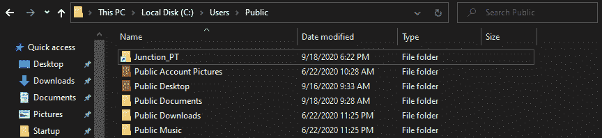

# 创建交叉点

> 原文:[https://www.geeksforgeeks.org/creating-junction-points/](https://www.geeksforgeeks.org/creating-junction-points/)

[连接点](https://www.geeksforgeeks.org/ntfs-junction-points/)(通常也称为 NTFS 连接点或目录连接点)是一种重解析点，它包含一个指向目录的链接，该目录充当该目录的别名。连接点是 Windows 独有的功能，在其他操作系统中是不存在的。与传统操作系统的兼容性和较低的权限要求使得连接点成为*符号链接*的一个很好的选择。在本文中，我们将了解在 Windows 操作系统上创建连接点的方法。

**命令描述:**

```
Mklink /J Link Target
```

命令描述如下。

```
/J      : Creates a Directory Junction
Link    : Specifies the new symbolic link name.
Target  : Specifies the path (relative or absolute) that the new link refers to.

```

**注意–**
上面的文字是 mklink 帮助页面中的剥离部分。

**创建交叉点:**
交叉点可以相对或绝对创建，但它们总是以绝对方式引用*目标路径*。因此，无论链接是使用相对路径还是绝对路径创建的，最终的目标路径都是绝对的。

在下面的例子中，我们将创建一个到目录的连接点，在我们的操作系统中有 *C:\suga* 路径。


要在不同的路径(C:\ user \ Public \)上创建交叉点，命令如下所示。

```
mklink /J "C:\Users\Public\Junction_PT" "C:\suga"

```

**注意–**
为了简单起见，我们提供了绝对的源路径和目标路径。

其中*C:\ user \ Public \ Junction _ PT*是我们新创建的 Junction 的完整路径。执行上述命令后，将在链接路径上创建目录交叉点，这可以通过在新创建的交叉点的父目录上的*目录*命令的输出中输入类型 **<【交叉点】>** 来确认。

```
Volume in drive C has no label.
Volume Serial Number is 2C7D-7820

Directory of C:\Users\Public

09/18/2020  06:22 PM    <DIR>          .
09/18/2020  06:22 PM    <DIR>          ..
09/18/2020  09:28 AM    <DIR>          Documents
06/22/2020  11:25 PM    <DIR>          Downloads
09/18/2020  06:22 PM    <JUNCTION>     Junction_PT [C:\suga]
06/22/2020  11:25 PM    <DIR>          Music
06/22/2020  11:37 PM    <DIR>          Pictures
06/22/2020  11:25 PM    <DIR>          Videos
              0 File(s)              0 bytes
              8 Dir(s)  36, 849, 307, 648 bytes free

```

**注–**
加粗我们感兴趣的领域。
交叉点*(交叉点 _PT* )将具有与此类似的外观。

