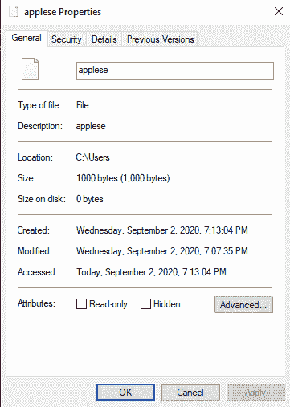

# 在 Windows/ Linux 上创建稀疏文件

> 原文:[https://www . geesforgeks . org/creating-sparse-files-on-windows-Linux/](https://www.geeksforgeeks.org/creating-sparse-files-on-windows-linux/)

**稀疏文件**是计算机文件的一种类型，它的文件大小(逻辑)一般高于分配的大小(分配给文件数据的簇)。大多数文件系统支持这种类型的文件，但是操作系统在命令解释器的命令或应用编程接口调用下禁止它们。

因此，不能使用通用的*复制/粘贴/创建*方法来访问它们，而是通过操作系统命令处理器中的专用命令或应用编程接口调用来公开它们。在本文中，我们将研究操作系统的命令处理器提供的创建稀疏文件的命令。

**Windows :**
Windows 提供名为 *fsutilI* (文件系统实用程序)的命令行程序，允许创建/分配/查询稀疏文件。要在 windows 上创建稀疏文件，请在命令解释器( *cmd* )上执行以下命令。

```
fsutil File CreateNew applese 1000

```

上述命令在 *applese* 下创建一个新文件(用零填充)。但是现在文件并不稀疏。要使此文件成为稀疏文件，请在前一个命令之后执行以下命令。

```
fsutil Sparse SetFlag applese
fsutil Sparse SetRange applese 0 1000

```

第一个命令在我们新创建的文件上启用稀疏标志。这允许执行第二个命令，该命令将文件的前 1000 字节(从 0–1000)设置为稀疏范围。因此，我们得到了一个完全稀疏的文件。其确认由布局命令提供。

```
   Stream              : 0x080  ::$DATA
   Attributes          : 0x00000200: Sparse
   Flags               : 0x00000018: No clusters allocated | Has Parsed Information
   Size                : 1, 000 (1.0 KB)
   Allocated Size      :     0 (0.0 KB)
   Vdl                 :     0 (0.0 KB)
   Extents             : 1 Extents   

```

从布局命令的上面部分可以清楚地看到，我们的文件有 0 个分配的大小，但是有 1000 字节的虚拟大小。这也可以在文件的属性中看到。



**Linux :**
在 Linux 上，创建稀疏文件的过程真的很琐碎，因为存在几个创建稀疏文件的命令。我们将使用*截断*命令来创建稀疏文件。命令如下。

```
truncate -s 5M temp

```

上面的命令创建了一个名为 *temp* 的稀疏文件，大小为 5mb(~ 500 万字节)。

Linux 操作系统变体为使用稀疏文件提供了广泛的支持，例如稀疏文件修改、复制、存档、调整大小、文件增长等。大部分都可以在这里找到。