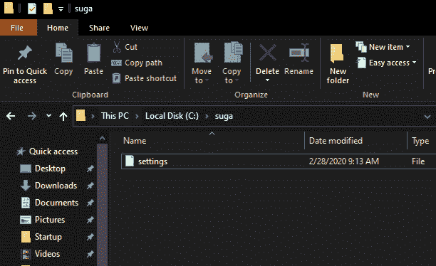
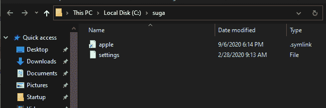
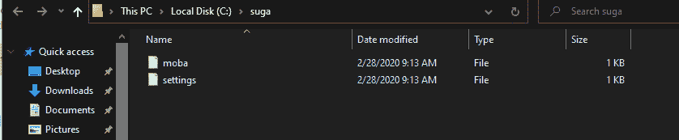

# 在窗口上创建符号链接

> 原文:[https://www . geesforgeks . org/creating-symbolic-link-on-windows/](https://www.geeksforgeeks.org/creating-symbolic-links-on-windows/)

符号链接用于描述不存储任何数据的文件。Windows 上的符号链接包含对另一个文件或目录的绝对引用，也可以说是对相对路径的引用。路径类型(*相对/绝对*)是在创建链接的过程中定义的。

大多数操作系统都以某种方式支持符号链接。Linux 和 Windows 都支持带有一些操作系统专有特性的通用符号链接，也就是说，Windows 允许创建连接点，这些连接点是工作方式略有不同的文件夹软链接。在本文中，我们将了解如何使用操作系统的命令处理器( *cmd)* 中的 **mklink** 命令在 Windows 上创建符号链接。

**注–**

该命令需要管理员权限才能执行。

**符号链接的类型:**

*   [硬链接](https://www.geeksforgeeks.org/soft-hard-links-unixlinux/)
*   [软链接](https://www.geeksforgeeks.org/soft-hard-links-unixlinux/)

**命令描述:**

```
MKLINK [[/D] | [/H] | [/J]] Link Target

       /D      Creates a directory symbolic link.  Default is a file
               symbolic link.
       /H      Creates a hard link instead of a symbolic link.
       /J      Creates a Directory Junction.
       Link    Specifies the new symbolic link name.
       Target  Specifies the path (relative or absolute) that the new link
               refers to.

```

附注 3

上面的文本可以通过执行 mklink 命令而无需任何参数来获得。

**创建文件的软链接:**

为了创建软链接，命令的语法是:

```
mklink Link_path Target_path

```

*   其中*链接路径*是要创建的符号链接的名称(或路径)。
*   *Target_path* 是新链接将引用的路径。

**示例–**

存在路径为 *C:\suga\settings* 的 a 文件



为了在同一路径上用不同的名称(例如。苹果)，命令将如下所示。

```
mklink "C:\suga\apple" "C:\suga\settings" 

```

附注 3

在上面的命令中，两条路径都是绝对的。

执行上述命令后，将创建一个指向文件的软链接，如下所示。



同样的方法也可以用于创建到目录的软链接，唯一的区别是需要将 */D* 开关添加到命令中。

**制作语法:**

```
mklink /D Link_path Target_path

```

**创建文件的硬链接:**

为了创建软链接，命令的语法如下。

```
mklink /H Link_path Target_path

```

**示例–**

在本例中，我们将使用与上例中相同的文件，位于 **C:\suga\settings** 。为了在同一路径上用不同的名称(例如。 *moba* 命令如下:

```
mklink /H "C:\suga\moba" "C:\suga\settings" 

```

执行上述命令后，将创建到文件的硬链接，如下所示:



**无法为目录创建硬链接，**因此与前面的示例不同，两个路径(链接&目标)都应该只指向一个文件。