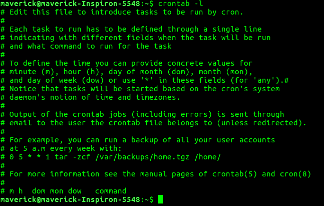
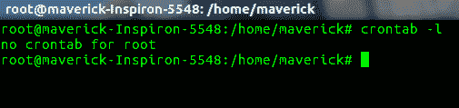
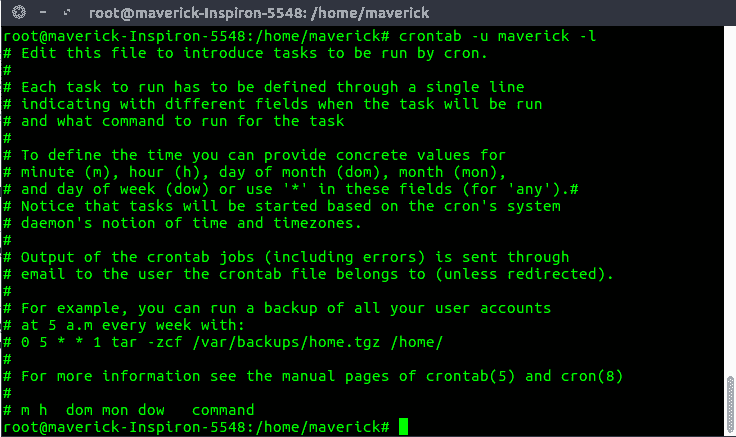
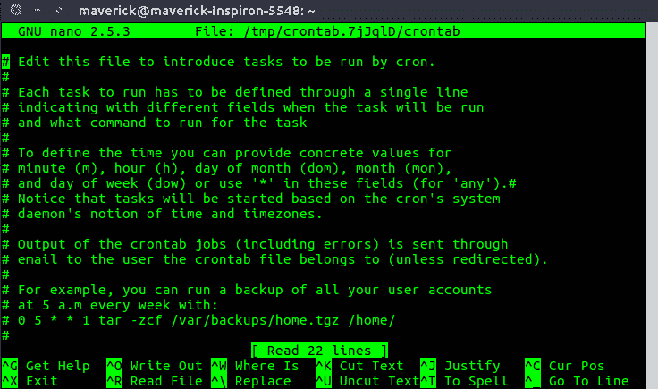

# 【示例】Linux 中的“crontab”

> 原文:[https://www . geeksforgeeks . org/crontab-in-Linux-with-examples/](https://www.geeksforgeeks.org/crontab-in-linux-with-examples/)

**crontab** 是您希望定期运行的命令列表，也是用于管理该列表的命令的名称。Crontab 代表“cron 表”，因为它使用作业调度器 *cron* 来执行任务； *cron* 本身就是以“chronos”命名的，这是希腊语中时间的意思。 *cron* 是系统进程，会根据设定的时间表自动为你执行任务。该计划称为 crontab，它也是用于编辑该计划的程序的名称。

**Linux Crontab Format**

```
MIN HOUR DOM MON DOW CMD

```

**Crontab 字段和允许范围(Linux Crontab 语法)**

```
Field    Description    Allowed Value
MIN      Minute field    0 to 59
HOUR     Hour field      0 to 23
DOM      Day of Month    1-31
MON      Month field     1-12
DOW      Day Of Week     0-6
CMD      Command         Any command to be executed.

```

**Cron jobs 的例子**
**1。为特定时间安排工作**

cron 的基本用法是在如下所示的特定时间执行作业。这将在 6 月 10 日上午 08:30 执行完整备份 shell 脚本(完整备份)。

时间字段使用 24 小时格式。所以，上午 8 点用 8，晚上 8 点用 20。

```
30 08 10 06 * /home/maverick/full-backup

```

30–30 分钟
08–上午 08
10–第 10 天
06–第 6 个月(6 月)
*–一周中的每一天

**2。要查看 Crontab 条目**

*   查看当前登录用户的 crontab 条目:要查看您的 Crontab 条目，请从您的 unix 帐户键入 crontab -l。
    
*   View Root Crontab entries : Login as root user (su – root) and do crontab -l.

    

*   查看其他 Linux 用户的 crontab 条目:登录 root，使用-u {username} -l.
    

**3。编辑 Crontab 条目**
编辑当前登录用户的 Crontab 条目。要编辑 crontab 条目，请使用 crontab -e。默认情况下，这将编辑当前登录用户的 crontab。

**4。使用 Cron 计划每分钟的作业。**
理想情况下，你可能没有要求每分钟都安排一项工作。但是理解这个例子会帮助你理解其他的例子。

```
* * * * * CMD

```

*表示所有可能的单位，即全年每小时的每一分钟。除了直接使用这个*之外，您会发现它在以下情况下非常有用。

当您在分钟字段中指定*/5 时，表示每 5 分钟。
当您在分钟字段中指定 0-10/2 时，表示在前 10 分钟内每 2 分钟。
因此，上述约定可用于所有其他 4 个字段。
T3【5。安排一项工作超过一次(如一天两次)

以下脚本每天执行两次增量备份。

本示例在每天的 11:00 和 16:00 执行指定的增量备份 shell 脚本(增量备份)。字段中逗号分隔的值指定命令需要在所有提到的时间内执行。

```
00 11, 16 * * * /home/maverick/bin/incremental-backup

```

00–第 0 分钟(最重要的时刻)
上午 11 点、16 点–11 点和下午 4 点
*–每天
*–每个月
*–一周中的每一天

**6。将作业安排在特定的时间范围内(例如，仅在工作日)**

如果您希望在特定的时间范围内每小时安排一项工作，请使用以下方法。

*   Cron Job everyday during working hours :
    This example checks the status of the database everyday (including weekends) during the working hours 9 a.m – 6 p.m

    ```
    00 09-18 * * * /home/maverick/bin/check-db-status

    ```

    00–第 0 分钟(最重要的时刻)
    09-18–上午 9 点、上午 10 点、上午 11 点、上午 12 点、下午 1 点、下午 2 点、下午 3 点、下午 4 点、下午 5 点、下午 6 点
    *–每天
    *–每个月
    *–一周的每一天

*   Cron Job every weekday during working hours :
    This example checks the status of the database every weekday (i.e excluding Sat and Sun) during the working hours 9 a.m – 6 p.m.

    ```
    00 09-18 * * 1-5 /home/maverick/bin/check-db-status

    ```

    00–第 0 分钟(一小时之最)
    09-18–上午 9 点、上午 10 点、上午 11 点、上午 12 点、下午 1 点、下午 2 点、下午 3 点、下午 4 点、下午 5 点、下午 6 点
    *–每天
    *–每月
    1-5 日-周一、周二、周三、周四和 Fri(每个工作日)

**7。每 10 分钟安排一次后台 Cron 作业。**
如果要每 10 分钟检查一次磁盘空间，请使用以下方法。

```
*/10 * * * * /home/maverick/check-disk-space

```

全年每 10 分钟执行一次指定的命令检查磁盘空间。但是您可能需要只在特定的时间执行命令，反之亦然。上面的例子说明了如何做这些事情。我们可以使用下面提到的单个关键字来指定它，而不是在 5 个字段中指定值。

在一些特殊情况下，除了上面的 5 个字段之外，您还可以使用@后跟一个关键字，例如重新启动、午夜、每年、每小时。

**Cron 特殊关键词及其含义**

```
Keyword    Equivalent
@yearly    0 0 1 1 *
@daily     0 0 * * *
@hourly    0 * * * *
@reboot    Run at startup.

```

**8。使用@yearly**
在每年的第一分钟安排一个作业，如果你想在每年的第一分钟执行一个作业，那么你可以使用@yearly cron 关键字，如下所示。这将在每年的 1 月 1 日 00:00 使用年度维护 shell 脚本执行系统年度维护。

```
@yearly /home/maverick/bin/annual-maintenance

```

**9。使用@monthly**
从每个月开始安排一个 Cron 作业，就像上面的@ yearly 一样。但是使用@monthly cron 关键字每月执行一次命令。这将在每月 1 日 00:00 执行 shell 脚本磁带备份。

```
@monthly /home/maverick/bin/tape-backup

```

**10。要使用@daily**
使用@daily cron 关键字安排每天的后台作业，这将使用 clean-logs shell 脚本在每天的 00:00 执行每日日志文件清理。

```
@daily /home/maverick/bin/cleanup-logs "day started"

```

**11 时。使用@reboot**
在每次重启后执行一个 linux 命令使用@reboot cron 关键字，这将在机器每次启动后执行一次指定的命令。

```
@reboot CMD

```

参考:[cron](http://man7.org/linux/man-pages/man8/cron.8.html)
Linux 手册页本文由 **[Kishlay 维尔马](https://www.linkedin.com/in/kishlayverma/)** 供稿。如果你喜欢 GeeksforGeeks 并想投稿，你也可以使用[contribute.geeksforgeeks.org](http://contribute.geeksforgeeks.org)写一篇文章或者把你的文章邮寄到 contribute@geeksforgeeks.org。看到你的文章出现在极客博客主页上，帮助其他极客。

如果你发现任何不正确的地方，或者你想分享更多关于上面讨论的话题的信息，请写评论。