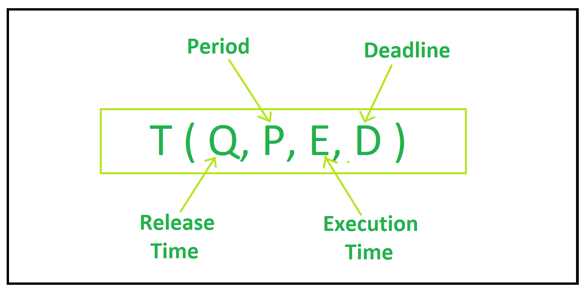
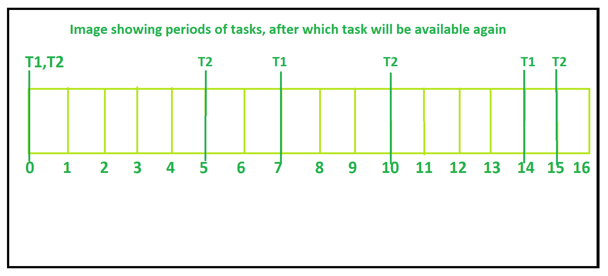
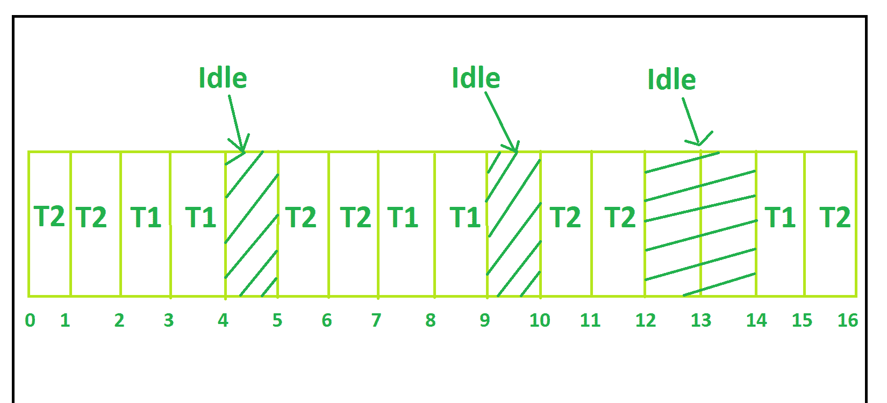

# 截止时间单调 CPU 调度

> 原文:[https://www . geesforgeks . org/deadline-单调-CPU-调度/](https://www.geeksforgeeks.org/deadline-monotonic-cpu-scheduling/)

先决条件–

*   [CPU 调度](https://www.geeksforgeeks.org/cpu-scheduling-in-operating-systems/)
*   [抢先调度](https://www.geeksforgeeks.org/preemptive-and-non-preemptive-scheduling/)
*   [优先 CPU 调度程序](https://www.geeksforgeeks.org/program-for-preemptive-priority-cpu-scheduling/)

**截止时间单调调度:**
这是一种基于固定优先级的算法，根据任务的相对截止时间为每个任务分配优先级。截止时间最短的任务被赋予最高优先级。这是一种抢占式调度算法，意味着如果有更高优先级的任务到来，正在运行的任务将被抢占，更高优先级的任务将被分配给中央处理器。

任务优先级与截止时间成反比，即截止时间最短的任务被赋予最高优先级。期限是必须完成任务的时间限制。

任务可以表示为如图:

**示例–**
假设有两个任务需要执行。
Task1 发布时间 0，周期 7 个单位，执行时间 2 个单位，截止时间 6 个单位(T1 ( 0，7，2，6))。任务 2 的发布时间为 0，周期为 5 个单位，执行时间为 2 个单位，截止时间为 4 个单位(T2 ( 0，5，2，4))。

**分步讲解–**

*   在 **T=0** 时，T1 和 T2 都可用，但截止日期(T2) <截止日期(T1)。所以 T2 得到了中央处理器，并被执行到 T=2。现在 T2 将在 t5 上市。
*   在 **T=2** 时，只有 T1 可用，因此 T1 执行到 T=4。现在 T1 将在 T=7 时可用。
*   在 **T=4 到 T=5** 时，由于没有任务可供执行，因此中央处理器保持空闲。
*   在 **T=5** 时，只有 T2 可用，所以 T2 会被处决，直到 T=7。现在 T2 将在 T7 上市。
*   在 **T=7** 时，只有 T1 可用，因此 T1 执行到 T=9。现在 T1 将在 T=14 时可用。
*   在 **T=9 到 T=10** 时，由于没有任务可供执行，因此中央处理器保持空闲。
*   在 **T=10** 只有 T2 可用，所以 T2 被处决直到 T=12。现在，T2 将在 T=15 时上市。
*   在 **T=12 到 T=14** 时，由于没有任务可供执行，因此中央处理器保持空闲。
*   在 **T=14** 时，只有 T1 可用，因此 T1 执行到 T=15。T1 还剩下 1 个工作单位。
*   在 **T=15** 时，T1 和 T2 都可用，但截止日期(T2) <截止日期(T1)。所以 T2 得到了中央处理器，并被执行到 T=17。现在 T2 将在 T=20 时上市。

完整的执行过程如下图所示

**优势:**

*   静态优先级调度的优化。
*   在任务周期较长但期限较短的情况下表现良好。
*   在霸王的情况下表现不错。

**缺点:**

*   实现是复杂的。
*   这是一个耗时的过程。