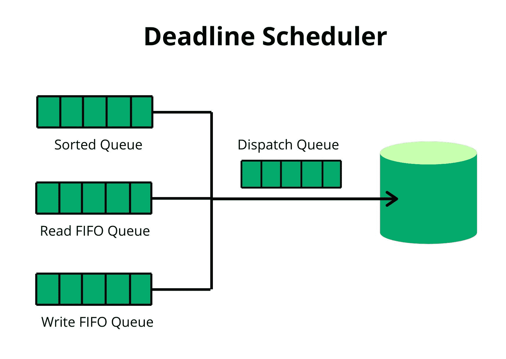

# 操作系统中的截止时间调度程序

> 原文:[https://www . geesforgeks . org/deadline-操作系统中的调度程序/](https://www.geeksforgeeks.org/deadline-scheduler-in-operating-system/)

**截止时间调度器**是 Linux 内核的 n 个 I/O 调度器，保证请求的启动服务时间。期限调度器对所有输入/输出操作施加期限，以防止想要的请求。维护两个截止日期读写队列(基本上按照截止日期排序)。对于每个新的请求，调度器选择哪个队列将为其服务。读队列被赋予比写队列更高的优先级，因为在读操作期间，进程通常会被阻塞。

现在，最后期限调度程序检查最后期限队列中的第一个请求是否已经过期，然后，来自排序队列的一批请求被处理。调度程序服务于排序队列中所选请求之后的一批请求。

默认情况下，读请求的到期时间为 500 毫秒，写请求为 5 秒。

**让我们用一个场景来理解:**
假设有三个进程 P1、P2 和 P3，分别有各自的截止日期。因此，截止日期时间表规定，如果 P1 在时间 **t** 提出请求。它不能在某个时间间隔再次发出请求。

**截止日期输入/输出调度器可调参数–**

**注意–**
当一个内核参数在运行时可以被改变的时候叫做可调参数。使用 sysctl 命令查看静态和可调内核参数。

*   **fifo_batch (integer) :**

    该可调参数决定了在单个批处理中发出的读或写请求的数量，按照扇区数量的增加进行排序。

*   **read_expire(integer) :**

    此可调参数确定应该为读取请求提供服务的时间(以毫秒为单位)。输入/输出调度程序中的读取请求被分配一个截止时间，即当前时间+读取到期值(毫秒)。

*   **write_expire(整数):**
    此可调参数确定应该为写请求提供服务的时间(以毫秒为单位)。它与 read_expire 相同，但用于写操作。
*   **writes _ shooting(整数):**
    此可调参数控制在处理单个写批处理之前要处理的读批处理的数量。写不足的值越高，读的偏好就越高。
*   **front_merges(bool 整数):**
    A **前合并**当我们将一个请求放在队列前面，并且后合并与前合并相反时完成。由于文件通常的布局方式，后合并比前合并更常见。在这里，输入/输出调度器将较小的请求合并到已经布局好的操作中。如果前置合并可调参数设置为零，它将禁用前置合并的功能。