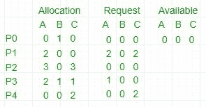

# 操作系统中的死锁检测算法

> 原文:[https://www . geesforgeks . org/死锁检测-操作系统中的算法/](https://www.geeksforgeeks.org/deadlock-detection-algorithm-in-operating-system/)

如果系统没有采用死锁预防或[死锁避免算法](https://www.geeksforgeeks.org/operating-system-bankers-algorithm-print-safe-state-safe-sequences/)，则可能出现死锁情况。在这种情况下-

*   应用一种算法来检查系统状态，以确定死锁是否已经发生。
*   应用算法从死锁中恢复。更多信息请参考- [死锁恢复](https://www.geeksforgeeks.org/deadlock-detection-recovery/)

**死锁避免算法/** [**银行家算法**](https://www.geeksforgeeks.org/operating-system-bankers-algorithm/) **:**
该算法采用了多次变化的数据结构:

*   **可用–**
    长度为 m 的向量表示每种类型的可用资源数量。
*   **分配–**
    一个 n*m 矩阵定义了当前分配给一个进程的每种类型的资源数量。列代表资源，行代表进程。
*   **请求–**
    一个 n*m 矩阵表示每个进程的当前请求。如果请求[i][j]等于 k，那么进程 PI正在请求 k 个更多的资源类型为 Rj的实例。

**这个算法已经讨论过** [**这里**](https://www.geeksforgeeks.org/operating-system-bankers-algorithm-print-safe-state-safe-sequences/)

现在，Bankers 算法包括一个**安全算法/死锁检测算法**
发现系统是否处于安全状态的算法可以描述如下:

**算法步骤:**

1.  让*工作*和*完成*分别是长度为 m 和 n 的向量。初始化*工作=可用*。对于 *i=0，1，…，n-1* ，如果*请求 i* = 0，则*完成【I】*=真；否则，*完成[i]* =假。
2.  找到一个索引 I，使得两者都
    a)*Finish【I】= = false*
    b)*RequestI<= Work*
    如果没有这样的 *i* 存在，请转到步骤 4。
3.  *工作=工作+分配 i*
    *完成【I】=真*
    转到步骤 2。
4.  如果*完成【I】= =假*对于一些 I，0 < =i < n，则系统处于死锁状态。而且如果*完成【我】= =假*过程 P i 就陷入僵局。

例如

1.  在此，Work = [0，0，0] &
    Finish = [false，false，false，false]

2.  *i=0* 选择为完成[0] =假和[0，0，0] < =[0，0，0]。

3.  Work =[0，0，0]+[0，1，0] =>[0，1，0] &
    Finish = [true，false，false，false，false]。

4.  *i=2* 被选择为完成[2] =假和[0，0，0] < =[0，1，0]。
5.  Work =[0，1，0]+[3，0，3] =>[3，1，3] &
    Finish = [true，false，true，false，false]。

6.  *i=1* 被选择为完成[1] =假和[2，0，2] < =[3，1，3]。
7.  Work =[3，1，3]+[2，0，0] =>[5，1，3] &
    Finish = [true，true，true，false，false]。

8.  *i=3* 被选择为完成[3] =假和[1，0，0] < =[5，1，3]。
9.  Work =[5，1，3]+[2，1，1] =>[7，2，4] &
    Finish = [true，true，true，true，false]。

10.  *i=4* 选择为完成[4] =假和[0，0，2] < =[7，2，4]。

11.  工作=[7，2，4]+[0，0，2] =>[7，2，6] &
    完成=[真，真，真，真，真]。

12.  因为 Finish 是所有真的向量，所以在这个例子中它意味着**不存在死锁**。