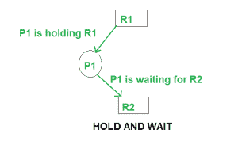

# 死锁预防和避免

> 原文:[https://www.geeksforgeeks.org/deadlock-prevention/](https://www.geeksforgeeks.org/deadlock-prevention/)

**死锁特征**
如前一篇文章所述，死锁有以下特征。

1.  互斥现象
2.  等待
3.  没有优先权
4.  循环等待

**死锁预防**
我们可以通过消除以上四个条件中的任何一个来防止死锁。

**消除互斥**
不可能消除互斥，因为有些资源，比如磁带机和打印机，本来就是不可共享的。

**消除保持并等待**

1.  在进程开始执行之前，将所有需要的资源分配给该进程，这样就消除了保持和等待条件，但这将导致设备利用率低。例如，如果一个进程稍后需要打印机，并且我们在它开始执行之前已经分配了打印机，那么打印机将一直被阻塞，直到它完成执行。

2.  该进程将在释放当前资源集后发出新的资源请求。这种解决方案可能会导致饥饿。



**消除无抢占**
当其他高优先级进程需要资源时，从进程中抢占资源。

**消除循环等待**
每个资源都会分配一个数字。进程可以请求增加/减少资源。编号顺序。
例如，如果 P1 进程被分配了 R5 资源，现在下一次如果 P1 请求 R4，R3 小于 R5 这样的请求将不会被批准，只有请求资源大于 R5 才会被批准。

**死锁避免**
死锁避免可以用庄家算法完成。

**银行家算法**
银行家算法是一种资源分配和死锁避免算法，它测试进程对资源的所有请求，它检查安全状态，如果授予请求后系统保持在安全状态，它允许请求，如果没有安全状态，它不允许进程发出请求。

**银行家算法的输入:**

1.  每个进程对资源的最大需求。
2.  目前，每个进程分配的资源。
3.  系统中最大可用资源。

**只有在以下条件下才会批准请求:**

1.  如果进程发出的请求小于或等于该进程所需的最大值。
2.  如果进程发出的请求小于或等于系统中的可用资源。

**示例:**

```
Total resources in system:
A B C D
6 5 7 6
```

```
Available system resources are:
A B C D
3 1 1 2
```

```
Processes (currently allocated resources):
    A B C D
P1  1 2 2 1
P2  1 0 3 3
P3  1 2 1 0
```

```
Processes (maximum resources):
    A B C D
P1  3 3 2 2
P2  1 2 3 4
P3  1 3 5 0
```

```
Need = maximum resources - currently allocated resources.
Processes (need resources):
    A B C D
P1  2 1 0 1
P2  0 2 0 1
P3  0 1 4 0
```

**注意:**死锁预防比死锁避免更严格。