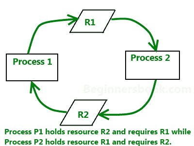

# 死锁、饥饿和活锁

> 原文:[https://www . geeksforgeeks . org/死锁-饥饿-活锁/](https://www.geeksforgeeks.org/deadlock-starvation-and-livelock/)

先决条件–[死锁和饥饿](https://www.geeksforgeeks.org/deadlock-starvation-java/)
**活锁**发生在两个或多个进程响应其他进程的变化而不断重复相同的交互，而不做任何有用的工作的时候。这些进程不处于等待状态，它们同时运行。这与死锁不同，因为在死锁中，所有进程都处于等待状态。



**示例:**
想象一对进程使用两种资源，如图所示:

```
void process_A(void)
{
    enter_reg(& resource_1);
    enter_reg(& resource_2);
    use_both_resources();
    leave_reg(& resource_2);
    leave_reg(& resource_1);
}
void process_B(void)
{
    enter_reg(& resource_1);
    enter_reg(& resource_2);
    use_both_resources();
    leave_reg(& resource_2);
    leave_reg(& resource_1);
}
```

这两个进程都需要这两种资源，它们使用轮询原语 enter_reg 来尝试获取它们所需的锁。万一尝试失败，这个过程只是再次尝试。

如果进程 A 先运行，获取资源 1，然后进程 B 运行，获取资源 2，无论下一个运行哪个，都不会有进一步的进展，但是两个进程都不会阻塞。实际上发生的是，它一次又一次地耗尽了它的 CPU 数量，没有取得任何进展，也没有任何阻塞。因此，这种情况不是死锁(因为没有进程被阻塞)，但是我们有一些功能上等同于死锁的东西:LIVELOCK。

**什么导致活锁？**
活锁的发生可能以最令人惊讶的方式发生。某些系统中允许的进程总数由进程表中的条目数决定。因此，进程表槽可以称为有限资源。如果一个分支由于表已满而失败，等待一个随机的时间并再次尝试将是程序执行分支的合理方法。

考虑一个有 100 个进程槽的 UNIX 系统。十个程序正在运行，每个程序必须创建 12 个(子)进程。在每个进程创建了 9 个进程之后，10 个原始进程和 90 个新进程已经耗尽了表。现在，10 个原始进程中的每一个都陷入了无休止的循环分叉和失败——这正是死锁的情况。这种情况发生的可能性很小，但它有可能发生。

**死锁、饥饿和活锁的区别:**
A **活锁**类似于**死锁**，除了活锁中涉及的进程的状态相对于彼此不断变化，没有任何进展。活锁是资源**饥饿**的特例；一般定义只说明特定的过程没有进展。

**Livelock:**

```
var l1 = .... // lock object like semaphore or mutex etc
var l2 = .... // lock object like semaphore or mutex etc

        // Thread1
        Thread.Start( ()=> {

    while (true) {

        if (!l1.Lock(1000)) {
            continue;
        }

        if (!l2.Lock(1000)) {
            continue;
        }

        /// do some work
    });

        // Thread2
        Thread.Start( ()=> {

        while (true) {

            if (!l2.Lock(1000)) {
                continue;
            }

            if (!l1.Lock(1000)) {
                continue;
            }

            // do some work
        });
```

**死锁:**

```
var p = new object();
lock(p)
{
    lock(p)
    {
        // deadlock. Since p is previously locked
        // we will never reach here...
    }
```

*死锁*是一组动作中的每个成员都在等待其他成员释放锁的状态。另一方面，一个*活锁*几乎类似于一个死锁，除了一个活锁中涉及的进程的状态相对于另一个不断地变化，没有任何进展。因此活锁是资源匮乏的一种特殊情况，从一般定义来说，这个过程没有进展。

**饥饿:**
饥饿是一个与活锁和死锁都密切相关的问题。在动态系统中，对资源的请求不断发生。因此，需要一些策略来决定谁在什么时候获得资源。这个过程，在合理的情况下，可能会导致一些进程永远得不到服务，即使它们没有死锁。

```
Queue q = .....

          while (q.Count & gt; 0)
{
    var c = q.Dequeue();
    .........

        // Some method in different thread accidentally
        // puts c back in queue twice within same time frame
        q.Enqueue(c);
    q.Enqueue(c);

    // leading to growth of queue twice then it
    // can consume, thus starving of computing
}
```

当“贪婪”的线程使共享资源长时间不可用时，就会发生饥饿。例如，假设一个对象提供了一个通常需要很长时间才能返回的同步方法。如果一个线程频繁调用这个方法，其他需要频繁同步访问同一个对象的线程通常会被阻塞。