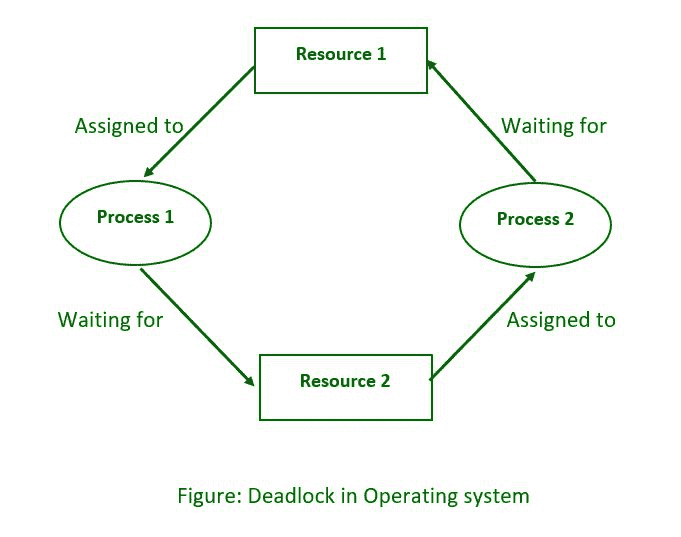

# 死锁系统模型

> 原文:[https://www.geeksforgeeks.org/deadlock-system-model/](https://www.geeksforgeeks.org/deadlock-system-model/)

**概述:**
当一组进程由于每个进程都持有一个资源并等待另一个进程获取另一个资源而停滞时，就会出现[死锁](https://www.geeksforgeeks.org/introduction-of-deadlock-in-operating-system/)。例如，在下图中，进程 1 持有资源 1，而进程 2 获取资源 2，进程 2 等待资源 1。

**系统型号:**

*   出于死锁讨论的目的，可以将系统建模为有限资源的集合，这些资源可以分为不同的类别，并分配给各种进程，每个进程都有不同的需求。
*   内存、打印机、中央处理器、打开的文件、磁带机、光盘和其他资源都是资源类别的示例。
*   根据定义，一个类别中的所有资源都是等价的，并且该类别中的任何资源都可以同等地满足来自该类别的请求。如果不是这种情况(即，如果一个类别中的资源之间存在一些差异)，则该类别必须进一步细分。例如，术语“打印机”可能需要细分为“激光打印机”和“彩色喷墨打印机”
*   某些类别可能只有一个资源。
*   内核跟踪哪些资源是空闲的，哪些资源被分配了，它们被分配给了哪个进程，以及一个等待该资源对所有内核管理的资源可用的进程队列。互斥或 wait()和 signal()调用可用于控制应用程序管理的资源(即二进制或计数信号量。)
*   当一个集合中的每个进程都在等待当前分配给该集合中另一个进程的资源时，这个集合就被称为死锁。

**操作:**
在正常操作中，进程在使用资源前必须请求资源，完成后释放资源，如下图所示。

1.  **请求–**
    如果不能立即批准请求，流程必须等到所需的资源可用。例如，系统使用函数 open()、malloc()、new()和 request()。
2.  **使用–**
    该过程利用资源，例如打印到打印机或读取文件。
3.  **Release–**
    进程放弃资源，允许其他进程使用。

**必要条件:**
要实现死锁，必须满足以下四个条件。

1.  **互斥**–
    至少有一个资源必须保持不可共享状态；如果另一个进程请求它，它必须等待它被释放。

2.  **保持并等待**–
    一个进程必须保持至少一个资源，同时也要等待另一个进程当前保持的至少一个资源。

3.  **不可抢占**–
    一旦一个进程持有一个资源(即在它的请求被批准之后)，在该进程主动释放它之前，该资源不能从该进程中被拿走。

4.  **循环等待**–
    必须有一组进程 P0、P1、P2、…、PN，这样每个 P[I]都在等待 P[(I + 1)百分比(N + 1)]。(需要注意的是，这个条件意味着等待等待条件，但是如果将这四个条件分开考虑，那么处理起来会更容易)。

**处理死锁的方法:**
一般来说，处理死锁有以下三种方法。

1.  通过避免让系统陷入循环来防止或避免死锁。
2.  死锁的检测和恢复，当检测到死锁时，中止进程或抢占一些资源。
3.  完全忽略这个问题。
4.  为了避免死锁，系统需要关于所有进程的更多信息。特别是，系统必须了解一个进程将来会或可能会请求什么资源。(根据算法的不同，这可以从简单的最坏情况最大值到每个流程的完整资源请求和发布计划。)
5.  死锁检测相对简单，但是死锁恢复需要中止进程或者抢占资源，这两种方式都不吸引人。
6.  如果死锁没有被避免或检测到，系统将逐渐变慢，因为更多的进程被阻塞，等待死锁已经阻塞的资源和其他等待的进程。不幸的是，当实时过程的计算要求很高时，这种减速可能会与一般的系统减速相混淆。

**死锁预防:**
死锁可以通过避免四个必要条件中的至少一个来避免:如下。

**条件-1 :**
**互斥:**

*   例如，只读文件不会导致死锁。
*   不幸的是，某些资源，如打印机和磁带机，需要一个进程才能独占访问它们。

**条件-2 :**
**等待并等待:**
为了避免这种情况，必须防止进程在等待一个或多个其他资源的同时，还持有一个或多个资源。这里有几种可能性:

*   要求所有进程同时请求所有资源。如果一个进程在其执行的早期需要一种资源，但在很久以后才需要另一种资源，那么这可能是对系统资源的浪费。
*   持有资源的进程必须在请求新资源之前释放它们，然后在单个新请求中，在新资源旁边重新获取释放的资源。如果一个进程使用一个资源来部分完成一个操作，然后在释放后无法重新分配它，这可能是一个问题。
*   如果一个过程需要使用一个或多个流行的资源，上述任何一种方法都可能导致饥饿。

**条件-3 :**
**无抢占:**
在可能的情况下，进程资源分配的抢占可以帮助避免死锁。

*   一种方法是，如果进程在请求新资源时被迫等待，则该进程先前持有的所有其他资源都被隐式释放(抢占)，从而迫使该进程在单个请求中重新获取旧资源和新资源，如前所述。
*   另一种方法是，当一个资源被请求，并且它不可用时，系统查看哪些其他进程当前正在使用这些资源，并且它们自己在等待另一个资源时被阻塞。如果发现这样的进程，它们的一些资源可能会被抢占，并被添加到该进程正在寻找的资源列表中。
*   这两种方法都适用于状态易于保存和恢复的资源，如寄存器和内存，但它们通常不适用于其他设备，如打印机和磁带机。

**条件-4 :**
**循环等待:**

*   为了避免循环等待，请对所有资源进行编号，并坚持要求资源进程严格按照递增(或递减)顺序进行。
*   换句话说，在请求资源 Rj 之前，进程必须首先释放所有 Ri，使得 I >= j。
*   在该方案中，各种资源的相对排序是一个重大挑战。

**避免死锁:**

*   避免死锁背后的一般思想是通过避免至少一个上述条件来避免死锁。
*   这需要更多关于每个过程的信息，并导致设备利用率低。(这是一种保守的方法。)
*   调度器只需要知道进程在某些算法中可能使用的每个资源的最大数量。在更复杂的算法中，调度器还可以使用调度来确定需要哪些资源以及以什么顺序。
*   当调度程序确定启动一个进程或授予资源请求将导致未来的死锁时，该进程将不会启动，或者该请求将被拒绝。
*   可用和分配的资源数量，以及系统中所有进程的最大需求，定义了资源分配状态。

**死锁检测:**

*   如果死锁无法避免，另一种方法是检测它们并以某种方式恢复。
*   除了不断检查死锁对性能的影响之外，从死锁中恢复的策略/算法必须到位，当进程必须中止或其资源被抢占时，就有可能丢失工作。

**从僵局中恢复:**
摆脱困境有三种基本方法:

1.  通知系统操作员，并允许他/她手动干预。
2.  停止死锁中涉及的一个或多个进程。
3.  阻止使用资源。

**从死锁中恢复的方法:**
这里，我们将讨论从死锁中恢复的方法如下。

**方法-1 :**
**进程终止:**
有两种基本方法可以恢复分配给终止进程的资源，如下所示。

1.  停止死锁中涉及的所有进程。这确实打破了僵局，但代价是终止了比绝对必要更多的进程。
2.  应该一次终止一个进程，直到死锁被打破。这种方法更加保守，但是它需要在每个步骤之后执行死锁检测。

在后一种情况下，许多因素会影响接下来终止哪些进程，如下所示。

1.  过程中的优先事项
2.  流程运行了多长时间，离完成还有多远。
3.  流程有多少种资源？(它们易于预测和恢复吗？)
4.  完成该流程还需要多少资源？
5.  需要杀死多少进程？
6.  流程是批处理还是交互。

**进场-2 :**
**资源抢占:**
分配资源打破僵局时，必须解决三个关键问题:

1.  **选择受害者–**
    上面概述的许多决策标准适用于确定从哪些进程抢占哪些资源。
2.  **回滚–**
    被抢占的进程应该理想地回滚到该资源最初分配给该进程之前的安全状态。不幸的是，确定这样的安全状态可能是困难的或不可能的，所以唯一安全的回滚是从头开始。(换句话说，停止并重新启动进程。)
3.  **饥饿–**
    如何确保进程不会因为资源不断被抢占而挨饿？一种选择是使用优先级系统，并在资源被抢占时提高进程的优先级。它应该最终获得足够高的优先级，从而不再被抢占。