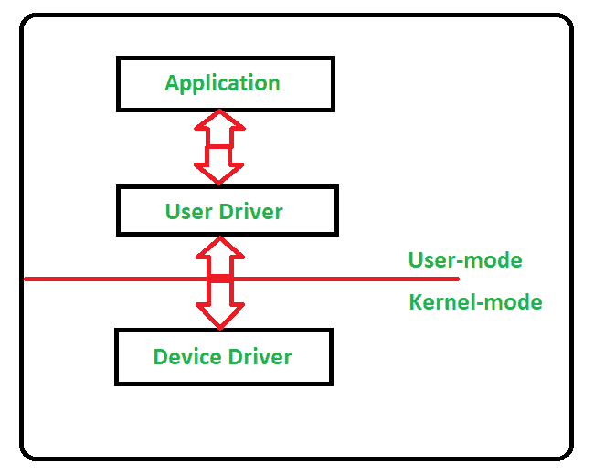
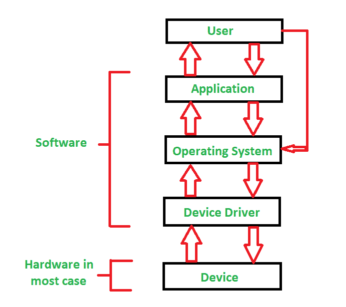

# 设备驱动程序及其用途

> 原文:[https://www . geesforgeks . org/device-driver-and-it-purpose/](https://www.geeksforgeeks.org/device-driver-and-its-purpose/)

**计算中的设备驱动程序**是指控制特定硬件设备的一种特殊软件程序或特定类型的软件应用程序，它使不同的硬件设备能够与计算机的操作系统进行通信
设备驱动程序通过连接到硬件的计算机子系统或计算机总线与计算机硬件进行通信。

**设备驱动程序**对于计算机系统正常工作非常重要，因为没有设备驱动程序，特定硬件无法正常工作，这意味着它无法完成为其创建的特定功能/操作。

在一个非常常见的方式中，当有人说**硬件驱动程序**也指这个**设备驱动程序时，大多数人称它为仅仅一个**驱动程序**。**

**设备驱动程序的工作:**
设备驱动程序依赖于操作系统的指令来访问设备和执行任何特定的操作。在动作之后，他们还通过将输出或状态/消息从硬件设备传递到操作系统来显示他们的反应。例如，打印机驱动程序在收到操作系统的指令后告诉打印机以哪种格式打印，类似地，声卡驱动程序也在那里，因为 MP3 文件的 1 和 0 数据被转换成音频信号，您可以欣赏音乐。读卡器、控制器、调制解调器、网卡、声卡、打印机、显卡、USB 设备、RAM、扬声器等都需要设备驱动程序来操作。

下图说明了用户、操作系统、设备驱动程序和设备之间的交互:

**设备驱动程序的类型:**
对于与计算机系统相关联的几乎每一个设备，都存在针对特定硬件的设备驱动程序。但是它可以大致分为两种类型，

1.  **内核模式设备驱动程序–**
    该内核模式设备驱动程序包括一些通用硬件，这些硬件作为操作系统的一部分加载操作系统。这些硬件是基本输入输出系统、主板、处理器和一些其他硬件，它们是内核软件的一部分。其中包括每个操作系统的最低系统要求设备驱动程序。
2.  **用户模式设备驱动程序–**
    除了内核为系统工作带来的设备之外，用户在使用系统时还会带来一些需要设备驱动程序来运行的设备，这些驱动程序属于用户模式设备驱动程序。例如，用户需要任何即插即用的动作。

**虚拟设备驱动:**
还有管理虚拟设备的虚拟设备驱动(VxD)。有时我们实际上使用相同的硬件，此时虚拟驱动程序控制/管理从不同用户使用的不同应用程序到相同硬件的数据流。

对于一台计算机来说，它的所有部件都必须有所需的设备驱动程序，以保持系统高效运行。许多设备驱动程序从一开始就由制造商提供，我们以后还可以为我们的系统提供任何所需的设备驱动程序。