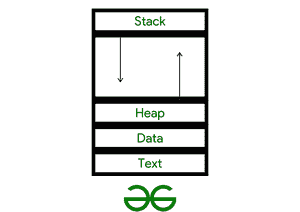

# 进程堆栈和中央处理器堆栈的区别

> 原文:[https://www . geesforgeks . org/进程堆栈和 cpu 堆栈的区别/](https://www.geeksforgeeks.org/difference-between-a-process-stack-and-a-cpu-stack/)

像方法/函数参数、返回地址和局部变量这样的临时数据存储在进程堆栈上，而另一方面，中央处理器堆栈由一组数据字组成。它采用[后进先出(LIFO)](https://www.geeksforgeeks.org/lifo-last-in-first-out-approach-in-programming/) 存取技术，这在大多数中央处理器中是最常见的。在本文中，我们将找出这两者之间的详细区别。

**1。流程堆栈示例:**

## C

```
#include <stdio.h>

int main() {
   printf("Geeks for Geeks \n");
   return 0;
}
```

**Output**

```
Geeks for Geeks 
```

**分析:**该代码只打印出一行，因为这仅限于一个进程，该进程在完成后终止。



**2。中央处理器堆栈示例:**

## C

```
#include <stdio.h>
int GeeksforGeeks(int parameter1, char parameter2)
{
    int local1 = 9;
    char local2 = 'Z';
    return 0;
}
int main(int argc, char* argv[])
{
    GeeksforGeeks(7, '9');
    return 0;
}
```

**输出:**

```
int main(int argc, char *argv[])
{
00401060   push        ebp
00401061   mov         ebp, esp
00401063   sub         esp, 40h
00401066   push        ebx
00401067   push        esi
00401068   push        edi
00401069   lea         edi, [ebp-40h
0040106C   mov         ecx, 10h
00401071   mov         eax, 0CCCCCCCCh
00401076   rep stos    dword ptr [edi]}
```

**分析:**正如你所看到的，这些都是运行这个时显示的不同的中央处理器寄存器，因为中央处理器堆栈是一个更大的进程。


**进程栈和 CPU 栈的区别:**

<figure class="table">

| 

进程堆栈

 | 

中央处理器堆栈

 |
| --- | --- |
| 每个进程都有自己的[进程控制块](https://www.geeksforgeeks.org/process-table-and-process-control-block-pcb/)(印刷电路板)，以将这些信息保存在上下文开关上，从而允许调度算法在基本进程标识上运行。 | 每个进程没有自己的[印刷电路板](https://www.geeksforgeeks.org/process-table-and-process-control-block-pcb/)，因此进程的状态也包含在寄存器中，以供驱逐时存储。 |
| 当进程获得中央处理器时，与该标识相关联的印刷电路板将被恢复。 | 与进程堆栈不同，与该标识关联的印刷电路板不会恢复。 |
| 堆栈只不过是一个内存块。 | 它由几个组合在一起的[存储块](https://www.geeksforgeeks.org/cache-memory-in-computer-organization/)组成。 |
| 每个处理器模式在一个进程中都有自己的堆栈。多线程中的每个线程都有自己的堆栈。 | 每个中央处理器模式通常拥有一个独特的堆栈。一个流程中可以有多个堆栈。 |
| 当一个上下文转换发生时，[内核](https://www.geeksforgeeks.org/kernel-i-o-subsystem-in-operating-system/)会“踢出”旧的进程，并引入一个新的进程。 | 当上下文转换发生时，它的先前状态被恢复，以便从它停止的地方恢复执行。 |
| 每个架构中都有有限数量的寄存器。 | 在堆栈上保存寄存器是为了提高效率，所以你现在要做的就是重新输入值。 |
| 局部变量存储在堆栈中。当局部变量被声明时，栈上的空间被留出给它们。 | 当一个新的数据项被插入或“推”到堆栈顶部，并且新的数据项被复制到该地址时，[堆栈指针](https://www.geeksforgeeks.org/introduction-of-stack-based-cpu-organization/)增加到下一个物理内存位置。 |

依靠以上所述，这些就是区别，希望这篇文章能帮助你识别它们，也请注意，虽然这两者听起来有些相似，但微小的变化使其无处不在。

</figure>